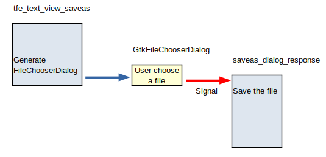
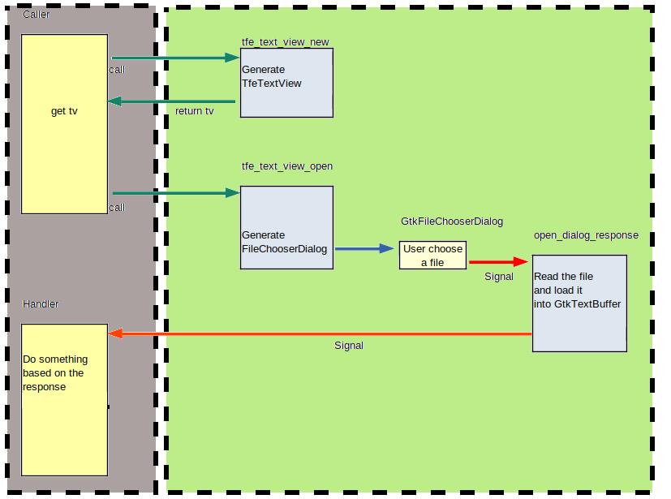

Up: [README.md](../README.md),  Prev: [Section 12](sec12.md), Next: [Section 14](sec14.md)

# Functions in TfeTextView

TfeTextView functions are described in this section.

## tfetextview.h

The header file `tfetextview.h` provides:

- The type of TfeTextView, which is `TFE_TYPE_TEXT_VIEW`.
- The expansion of `G_DECLARE_FINAL_TYPE` includes some useful macros.
- Constants for the `open-response` signal is defined..
- Public functions of `tfetextview.c` are declared.

Therefore, Any programs use TfeTextView needs to include `tfetextview.h`.

~~~C
 1 #ifndef __TFE_TEXT_VIEW_H__
 2 #define __TFE_TEXT_VIEW_H__
 3 
 4 #include <gtk/gtk.h>
 5 
 6 #define TFE_TYPE_TEXT_VIEW tfe_text_view_get_type ()
 7 G_DECLARE_FINAL_TYPE (TfeTextView, tfe_text_view, TFE, TEXT_VIEW, GtkTextView)
 8 
 9 /* "open-response" signal response */
10 enum TfeTextViewOpenResponseType
11 {
12   TFE_OPEN_RESPONSE_SUCCESS,
13   TFE_OPEN_RESPONSE_CANCEL,
14   TFE_OPEN_RESPONSE_ERROR
15 };
16 
17 GFile *
18 tfe_text_view_get_file (TfeTextView *tv);
19 
20 void
21 tfe_text_view_open (TfeTextView *tv, GtkWindow *win);
22 
23 void
24 tfe_text_view_save (TfeTextView *tv);
25 
26 void
27 tfe_text_view_saveas (TfeTextView *tv);
28 
29 GtkWidget *
30 tfe_text_view_new_with_file (GFile *file);
31 
32 GtkWidget *
33 tfe_text_view_new (void);
34 
35 #endif /* __TFE_TEXT_VIEW_H__ */
~~~

- 1,2,35: Thanks to these three lines, the following lines are included only once.
You can use `#pragma once` instead of them.
It is non-standard but widely used.
- 4: Includes gtk4 header files.
The header file `gtk4` also has the same mechanism to avoid including it multiple times.
- 6-7: These two lines define TfeTextView type, its class structure and some useful macros.
  - `TfeTextView` and `TfeTextViewClass` are declared as typedef of C structures.
  - You need to define a structure `_TfeTextView` later.
  - The class structure `_TfeTextViewClass` is defined here. You don't need to define it by yourself.
  - Convenience functions `TFE_TEXT_VIEW ()` for casting and `TFE_IS_TEXT_VIEW` for type check are defined.
- 9-15: A definition of the value of the parameter of "open-response" signal.
- 17-33: Declarations of public functions on TfeTextView.

## Instance creation Functions

A TfeTextView instance is created with `tfe_text_view_new` or `tfe_text_view_new_with_file`.

~~~C
GtkWidget *tfe_text_view_new (void);
~~~

`tfe_text_view_new` just creates a new TfeTextView instance and returns the pointer to the new instance.

~~~C
GtkWidget *tfe_text_view_new_with_file (GFile *file);
~~~

`tfe_text_view_new_with_file` is given a Gfile object as an argument and it loads the file into the GtkTextBuffer instance, then returns the pointer to the new instance.
If an error occurs during the creation process, NULL is returned.

Each function is defined as follows.

~~~C
 1 GtkWidget *
 2 tfe_text_view_new_with_file (GFile *file) {
 3   g_return_val_if_fail (G_IS_FILE (file), NULL);
 4 
 5   GtkWidget *tv;
 6   GtkTextBuffer *tb;
 7   char *contents;
 8   gsize length;
 9 
10   if (! g_file_load_contents (file, NULL, &contents, &length, NULL, NULL)) /* read error */
11     return NULL;
12 
13   if ((tv = tfe_text_view_new()) != NULL) {
14     tb = gtk_text_view_get_buffer (GTK_TEXT_VIEW (tv));
15     gtk_text_buffer_set_text (tb, contents, length);
16     TFE_TEXT_VIEW (tv)->file = g_file_dup (file);
17     gtk_text_buffer_set_modified (tb, FALSE);
18   }
19   g_free (contents);
20   return tv;
21 }
22 
23 GtkWidget *
24 tfe_text_view_new (void) {
25   return GTK_WIDGET (g_object_new (TFE_TYPE_TEXT_VIEW, "wrap-mode", GTK_WRAP_WORD_CHAR, NULL));
26 }
~~~

- 23-25: `tfe_text_view_new` function.
Just returns the value from the function `g_object_new` but casts it to the pointer to GtkWidget.
The function `g_object_new` creates any instances of its descendant class.
The arguments are the type of the class, property list and NULL.
Null is the end mark of the property list.
TfeTextView "wrap-mode" property has GTK\_WRAP\_WORD\_CHAR as the default value.
- 1-21: `tfe_text_view_new_with_file` function.
- 3: `g_return_val_if_fail` is described in [GLib API Reference -- g\_return\_val\_if\_fail](https://docs.gtk.org/glib/func.return_val_if_fail.html).
And also [GLib API Reference -- Message Logging](https://docs.gtk.org/glib/logging.html).
It tests whether the argument `file` is a pointer to GFile.
If it's true, then the program goes on to the next line.
If it's false, then it returns NULL (the second argument) immediately.
And at the same time it logs out the error message (usually the log is outputted to stderr or stdout).
This function is used to check the programmer's error.
If an error occurs, the solution is usually to change the (caller) program and fix the bug.
You need to distinguish programmer's errors and runtime errors.
You shouldn't use this function to find runtime errors.
- 10-11: If an error occurs when reading the file, then the function returns NULL.
- 13: Calls the function `tfe_text_view_new`.
The function creates TfeTextView instance and returns the pointer to the instance.
If an error happens in `tfe_text_view_new`, it returns NULL.
- 14: Gets the pointer to GtkTextBuffer corresponds to `tv`.
The pointer is assigned to `tb`
- 15: Assigns the contents read from the file to GtkTextBuffer pointed by `tb`.
- 16: Duplicates `file` and sets `tv->file` to point it.
- 17: The function `gtk_text_buffer_set_modified (tb, FALSE)` sets the modification flag of `tb` to FALSE.
The modification flag indicates that the contents of the buffer has been modified.
It is used when the contents are saved.
If the modification flag is FALSE, it doesn't need to save the contents.
- 19: Frees the memories pointed by `contents`.
- 20: Returns `tv`, which is a pointer to the newly created TfeTextView instance.
If an error happens, NULL is returned.

## Save related functions

Save and saveas functions write the contents in the GtkTextBuffer to a file.

~~~C
void tfe_text_view_save (TfeTextView *tv)
~~~

The function `tfe_text_view_save` writes the contents in the GtkTextBuffer to a file specified by `tv->file`.
If `tv->file` is NULL, then it shows GtkFileChooserDialog and prompts the user to choose a file to save.
Then it saves the contents to the file and sets `tv->file` to point the GFile instance for the file.

~~~C
void tfe_text_view_saveas (TfeTextView *tv)
~~~

The function `saveas` uses GtkFileChooserDialog and prompts the user to select a existed file or specify a new file to save.
Then, the function changes `tv->file` and save the contents to the specified file.
If an error occurs, it is shown to the user through the message dialog.
The error is managed only in the TfeTextView and no information is notified to the caller.

### save\_file function

~~~C
 1 static gboolean
 2 save_file (GFile *file, GtkTextBuffer *tb, GtkWindow *win) {
 3   GtkTextIter start_iter;
 4   GtkTextIter end_iter;
 5   char *contents;
 6   gboolean stat;
 7   GtkWidget *message_dialog;
 8   GError *err = NULL;
 9 
10   gtk_text_buffer_get_bounds (tb, &start_iter, &end_iter);
11   contents = gtk_text_buffer_get_text (tb, &start_iter, &end_iter, FALSE);
12   stat = g_file_replace_contents (file, contents, strlen (contents), NULL, TRUE, G_FILE_CREATE_NONE, NULL, NULL, &err);
13   if (stat)
14     gtk_text_buffer_set_modified (tb, FALSE);
15   else {
16     // Because error message is displayed here, the caller of 'save_file' doesn't need to do anything about error.
17     message_dialog = gtk_message_dialog_new (win, GTK_DIALOG_MODAL,
18                         GTK_MESSAGE_ERROR, GTK_BUTTONS_CLOSE, "%s.", err->message);
19     g_signal_connect (message_dialog, "response", G_CALLBACK (gtk_window_destroy), NULL);
20     gtk_widget_show (message_dialog);
21     g_error_free (err);
22   }
23   g_free (contents);
24   return stat;
25 }
~~~

- The function `save_file` is called from `saveas_dialog_response` and `tfe_text_view_save`.
This function saves the contents of the buffer to the file given as an argument.
If error happens, it displays an error message.
So, a caller of this function don't need to take care of errors.
The class of this function is `static`.
Therefore, only functions in this file (`tfetextview.c`) call this function.
Such static functions usually don't have `g_return_val_if_fail` function.
- 10-11: Gets the text contents from the buffer.
- 12: The function `g_file_replace_contents` writes the contents to the file and returns the status (true = success/ false = fail).
It has many parameters, but some of them are almost always given the same values.
  - GFile* file: GFile to which the contents are saved.
  - const char* contents: contents to be saved. The string is owned by the caller.
  - gsize length: the length of the contents
  - const char* etag: entity tag. It is usually NULL.
  - gboolean make_backup: true to make a backup if the file exists. false not to make it. the file will be overwritten.
  - GFileCreateFlags flags: usually `G_FILE_CREATE_NONE` is fine.
  - char** new_etag: new entity tag. It is usually NULL.
  - GCancellable* cancellable: If a cancellable instance is set, the other thread can cancel this operation. it is usually NULL.
  - GError** error: If error happens, GError will be set.
- 13,14: If no error happens, set the modified flag to be FALSE.
This means that the buffer is not modified since it has been saved.
- 15-22: If it fails to save the contents, an error message will be displayed.
- 17-18: Creates a message dialog. The parameters are:
  - GtkWindow* parent: transient parent window.
This allows window managers to keep the dialog on top of the parent window, or center the dialog over the parent window.
It is possible to give no parent window to the dialog.
However, it is encouraged to give parents to dialogs.
  - GtkDialogFlags flags: GTK\_DIALOG\_MODAL for modal dialog. A modal dialog is usually fine.
  - GtkMessageType type: GTK\_MESSAGE\_ERROR for error message. Other options are GTK\_MESSAGE\_INFO, GTK\_MESSAGE\_WARNING and so on.
  - GtkButtonsType buttons: GTK\_BUTTON\_OK is used most often. Other option is GTK\_BUTTON\_YES\_NO, GTK\_BUTTON\_CANCEL and so on.
  - const gchar* message_format: gchar is the same as char. This format is the same as printf. Arguments for the message format follow.
- 19: Connects the "response" signal  to `gtk_window_destroy`, so that the dialog disappears when the user clicks on the button.
- 20: Shows the message dialog.
- 21: Frees `err` with `g_error_free` function.
- 23: Frees `contents`.
- 24: Returns to the caller.

### saveas\_dialog\_response function

~~~C
 1 static void
 2 saveas_dialog_response (GtkWidget *dialog, gint response, TfeTextView *tv) {
 3   GtkTextBuffer *tb = gtk_text_view_get_buffer (GTK_TEXT_VIEW (tv));
 4   GFile *file;
 5   GtkWidget *win = gtk_widget_get_ancestor (GTK_WIDGET (tv), GTK_TYPE_WINDOW);
 6 
 7   if (response == GTK_RESPONSE_ACCEPT) {
 8     file = gtk_file_chooser_get_file (GTK_FILE_CHOOSER (dialog));
 9     if (! G_IS_FILE (file))
10       g_warning ("TfeTextView: gtk_file_chooser_get_file returns non GFile.\n");
11     else if (save_file(file, tb, GTK_WINDOW (win))) {
12       // The following is complicated. The comments here will help your understanding
13       // G_IS_FILE(tv->file) && tv->file == file  => nothing to do
14       // G_IS_FILE(tv->file) && tv->file != file  => unref(tv->file), tv->file=file, signal emit
15       // tv->file==NULL                           =>                  tv->file=file, signal emit
16       if (G_IS_FILE (tv->file) && (! g_file_equal (tv->file, file)))
17         g_object_unref (tv->file);
18       if (! (G_IS_FILE (tv->file) && g_file_equal (tv->file, file))) {
19         tv->file = file; // The ownership of 'file' moves to TfeTextView.
20         g_signal_emit (tv, tfe_text_view_signals[CHANGE_FILE], 0);
21       }
22       g_object_unref (file);
23     } else
24       g_object_unref (file);
25   }
26   gtk_window_destroy (GTK_WINDOW (dialog));
27 }
~~~

- The function `saveas_dialog_response` is a signal handler for the "response" signal on GtkFileChooserDialog.
This handler analyzes the response and determines whether to save the contents or not.
- 7-25: If the response is `GTK_RESPONSE_ACCEPT`, the user has clicked on the `Save` button and the contents will be saved.
- 8: Gets the GFile `file` from the GtkFileChooserDialog.
- 9-10: If it doesn't point GFile, a warning message will be output to the log. This is not expected.
- 11: Otherwise, it calls `save_file` to save the contents to the file.
- 12-22: If `save_file` has successfully saved the contents, the following will be done.
  - If `tv->file` is GFile and `file` is a different file, unref `tv->file`.
  - If `tv->file` is GFile and  `file` points the same file as `tv->file`, nothing needs to do.
Otherwise, `tv->file` is set to `file` and "change-file" signal is emitted.
- 22, 24: Unref `file`.
- 26: destroys the file chooser dialog.

### tfe\_text\_view\_save function

~~~C
 1 void
 2 tfe_text_view_save (TfeTextView *tv) {
 3   g_return_if_fail (TFE_IS_TEXT_VIEW (tv));
 4 
 5   GtkTextBuffer *tb = gtk_text_view_get_buffer (GTK_TEXT_VIEW (tv));
 6   GtkWidget *win = gtk_widget_get_ancestor (GTK_WIDGET (tv), GTK_TYPE_WINDOW);
 7 
 8   if (! gtk_text_buffer_get_modified (tb))
 9     return; /* no need to save it */
10   else if (tv->file == NULL)
11     tfe_text_view_saveas (tv);
12   else if (! G_IS_FILE (tv->file)) // Unexpected error
13     g_error ("TfeTextView: The pointer tv->file isn't NULL nor GFile.\n");
14   else
15     save_file (tv->file, tb, GTK_WINDOW (win));
16 }
~~~

- The function `tfe_text_view_save` writes the contents to the `tv->file` file.
It calls `tfe_text_view_saveas` or `save_file`.
- 1-3: The function is public, i.e. it is open to the other objects.
So, it doesn't have `static` class.
Public functions should check the parameter type with `g_return_if_fail` function.
If `tv` is not a pointer to a TfeTextView instance, then it logs an error message and immediately returns.
This function is similar to `g_return_val_if_fail`, but no value is returned because `tfe_text_view_save` doesn't return a value (void).
- 5-6: GtkTextBuffer `tb` and GtkWidget (GtkWindow) `win` are set.
The function `gtk_widget_get_ancestor (widget, type)` returns the first ancestor of the widget with type.
The type is a GType.
For example, the type of GtkWindow is `GTK_TYPE_WINDOW` and the one of TfeTextView is `TFE_TYPE_TEXT_VIEW`.
Be careful. The parent-child relationship here is the one for widgets, not classes.
The top level window may be a GtkApplicationWindow, but it depends on the application.
Because TfeTextView is a library, it can't determine the top level window type (GtkWindow or GtkApplicationWindow).
GtkWindow is a parent class of GtkApplication window so it is more general.
Therefore, TfeTextView takes GtkWindow as a top level window so that it can be used by any application.
- 8-9: If the buffer hasn't modified, it doesn't need to be saved.
- 10-11: If `tv->file` is NULL, which means no file has given yet, it calls `tfe_text_view_saveas` to prompt a user to select a file and save the contents.
- 12-13: If `tv->file` doesn't point GFile, an error message is logged out. It is not expected.
- 14-15: Otherwise, it calls `save_file` to save the contents to the file `tv->file`.

### tfe\_text\_view\_saveas function

~~~C
 1 void
 2 tfe_text_view_saveas (TfeTextView *tv) {
 3   g_return_if_fail (TFE_IS_TEXT_VIEW (tv));
 4 
 5   GtkWidget *dialog;
 6   GtkWidget *win = gtk_widget_get_ancestor (GTK_WIDGET (tv), GTK_TYPE_WINDOW);
 7 
 8   dialog = gtk_file_chooser_dialog_new ("Save file", GTK_WINDOW (win), GTK_FILE_CHOOSER_ACTION_SAVE,
 9                                       "Cancel", GTK_RESPONSE_CANCEL,
10                                       "Save", GTK_RESPONSE_ACCEPT,
11                                       NULL);
12   g_signal_connect (dialog, "response", G_CALLBACK (saveas_dialog_response), tv);
13   gtk_widget_show (dialog);
14 }
~~~

- The function `tfe_text_view_saveas` shows GtkFileChooserDialog and prompts the user to choose a file and save the contents.
- 1-3: Check the type of `tv` because the caller may be other object. This function is public.
- 6: GtkWidget `win` is set to the top level window.
- 8-11: Creates GtkFileChooserDialog. It has at least four parameters.
  - const char* title: title of the dialog shown at the bar.
  - GtkWindow* parent: transient parent window.
  - GtkFileChooserAction action: action is one of `GTK_FILE_CHOOSER_ACTION_OPEN`, `GTK_FILE_CHOOSER_ACTION_SAVE`
and `GTK_FILE_CHOOSER_ACTION_SELECT_FOLDER`.
When you want to save a file, `GTK_FILE_CHOOSER_ACTION_SAVE` is the action.
  - const char* first_button_text: the label text of the first button.
  - type: response ID for the sirst button. response ID is one of the GtkReponseType.
See [GtkResponseType](https://docs.gtk.org/gtk4/enum.ResponseType.html).
  - followed by pairs of button text and response ID...
  - NULL is put at the end of the list.
- The GtkFileChooserDialog will have the title "Save file", transient parent `win`, save mode action, cancel and save button.
- 12: connects the "response" signal and `saveas_dialog_response` handler.
- 13: Shows the dialog.

When you use GtkFileChooserDialog, you need to divide the program into two parts.
One is a function which creates GtkFileChooserDialog and the other is a signal handler.
The function just creates and shows GtkFileChooserDialog.
The rest is done by the handler.
It gets Gfile from GtkFileChooserDialog and saves the buffer to the file by calling `save_file`.

## Open related functions

Open function shows GtkFileChooserDialog to a user and prompts them to choose a file.
Then it reads the file and puts the text into GtkTextBuffer.

~~~C
void tfe_text_view_open (TfeTextView *tv, GtkWindow *win);
~~~

The parameter `win` is the top-level window.
It will be a transient parent window of GtkFileChooserDialog when the dialog is created.

This function may be called just after `tv` has been created.
In that case, `tv` has not been incorporated into the widget hierarchy.
Therefore it is impossible to get the top-level window from `tv`.
That's why the function needs `win` parameter.

This function is usually called when the buffer of `tv` is empty.
However, even if the buffer is not empty, `tfe_text_view_open` doesn't treat it as an error.
If you want to revert the buffer, calling this function is appropriate.

Open and read process is divided into two phases.
One is showing GtkFileChooserDialog and the other is its response handler.
The response handler gets the filename, reads the contents of the file and puts it into the GtkTextBuffer.

### open\_dialog\_response function

~~~C
 1 static void
 2 open_dialog_response(GtkWidget *dialog, gint response, TfeTextView *tv) {
 3   GtkTextBuffer *tb = gtk_text_view_get_buffer (GTK_TEXT_VIEW (tv));
 4   GFile *file;
 5   char *contents;
 6   gsize length;
 7   GtkWidget *message_dialog;
 8   GError *err = NULL;
 9 
10   if (response != GTK_RESPONSE_ACCEPT)
11     g_signal_emit (tv, tfe_text_view_signals[OPEN_RESPONSE], 0, TFE_OPEN_RESPONSE_CANCEL);
12   else if (! G_IS_FILE (file = gtk_file_chooser_get_file (GTK_FILE_CHOOSER (dialog)))) {
13     g_warning ("TfeTextView: gtk_file_chooser_get_file returns non GFile.\n");
14     g_signal_emit (tv, tfe_text_view_signals[OPEN_RESPONSE], 0, TFE_OPEN_RESPONSE_ERROR);
15   } else if (! g_file_load_contents (file, NULL, &contents, &length, NULL, &err)) { /* read error */
16     g_object_unref (file);
17     message_dialog = gtk_message_dialog_new (GTK_WINDOW (dialog), GTK_DIALOG_MODAL,
18                         GTK_MESSAGE_ERROR, GTK_BUTTONS_CLOSE, "%s", err->message);
19     g_signal_connect (message_dialog, "response", G_CALLBACK (gtk_window_destroy), NULL);
20     gtk_widget_show (message_dialog);
21     g_error_free (err);
22     g_signal_emit (tv, tfe_text_view_signals[OPEN_RESPONSE], 0, TFE_OPEN_RESPONSE_ERROR);
23   } else {
24     gtk_text_buffer_set_text (tb, contents, length);
25     g_free (contents);
26     gtk_text_buffer_set_modified (tb, FALSE);
27     // G_IS_FILE(tv->file) && tv->file == file => unref(tv->file), tv->file=file, emit response with SUCCESS
28     // G_IS_FILE(tv->file) && tv->file != file => unref(tv->file), tv->file=file, emit response with SUCCESS, emit change-file
29     // tv->file==NULL =>                                           tv->file=file, emit response with SUCCESS, emit change-file
30     // The order is important. If you unref tv->file first, you can't compare tv->file and file anymore.
31     // And open-response signal is emitted after new tv->file is set. Or the handler can't catch the new file.
32     if (! (G_IS_FILE (tv->file) && g_file_equal (tv->file, file)))
33       g_signal_emit (tv, tfe_text_view_signals[CHANGE_FILE], 0);
34     if (G_IS_FILE (tv->file))
35       g_object_unref (tv->file);
36     tv->file = file; // The ownership of 'file' moves to TfeTextView
37     g_signal_emit (tv, tfe_text_view_signals[OPEN_RESPONSE], 0, TFE_OPEN_RESPONSE_SUCCESS);
38   }
39   gtk_window_destroy (GTK_WINDOW (dialog));
40 }
~~~

- 2: The handler `open_dialog_response` has three parameters.
  - GtkWidget *dialog: FileChooserDialog on which the "response" signal is emitted.
  - gint response: response ID
  - TfeTextView *tv: textview to put the contents to
- 10-11: If the response is not `GTK_RESPONSE_ACCEPT`, the user has clicked on the "Cancel" button or close button on the header bar.
Then, "open-response" signal is emitted.
The parameter of the signal is `TFE_OPEN_RESPONSE_CANCEL`.
- 12-14: Gets the pointer to the GFile by `gtk_file_chooser_get_file`.
If it doesn't point GFile, maybe an error has occurred.
It is not expected, though.
Then it emits "open-response" signal with the parameter `TFE_OPEN_RESPONSE_ERROR`.
- 15-22: If an error occurs when file reading, then it decreases the reference count of the GFile, shows a message dialog to report the error to the user and emits "open-response" signal with the parameter `TFE_OPEN_RESPONSE_ERROR`.
- 23-38: If the file has been successfully read, the following is carried out. (It is not simple.)
  - the text is inserted to GtkTextBuffer
  - the temporary buffer `contents` is freed
  - modify-bit is set to FALSE
  - open-response signal is emitted with `TFE_OPEN_REPONSE_SUCCESS`
  - If the file are changed, change-file signal is emitted
  - If `tv->file` isn't NULL, `g_object_unref(tv->file)` is called
  - `tv->file` is assigned with `file`
- 39: destroys GtkFileChooserDialog.

### tfe\_text\_view\_open function

~~~C
 1 void
 2 tfe_text_view_open (TfeTextView *tv, GtkWindow *win) {
 3   g_return_if_fail (TFE_IS_TEXT_VIEW (tv));
 4   // 'win' is used for a transient window of the GtkFileChooserDialog.
 5   // It can be NULL.
 6   g_return_if_fail (GTK_IS_WINDOW (win) || win == NULL);
 7 
 8   GtkWidget *dialog;
 9 
10   dialog = gtk_file_chooser_dialog_new ("Open file", win, GTK_FILE_CHOOSER_ACTION_OPEN,
11             "Cancel", GTK_RESPONSE_CANCEL, "Open", GTK_RESPONSE_ACCEPT, NULL);
12   g_signal_connect (dialog, "response", G_CALLBACK (open_dialog_response), tv);
13   gtk_widget_show (dialog);
14 }
~~~

- 3-4: Check the type of the arguments `tv` and `win`.
Public functions always need to check the arguments.
- 10-11: Creates GtkFileChooserDialog.
  - The title is "Open file".
  - Transient parent window is the top-level window `win`.
  - The action is open mode.
  - The buttons are Cancel and Open.
- 12: connects the "response" signal and the handler.
- 13: Shows the dialog.

The whole process between the caller and TfeTextView is shown in the following diagram.
It is really complicated.
Because signal is the only way for GtkFileChooserDialog to communicate with others.

1. A caller gets a pointer `tv` to a TfeTextView instance by calling `tfe_text_view_new`.
2. The caller connects the handler (left bottom in the diagram) and the signal "open-response".
3. It calls `tfe_text_view_open` to prompt the user to select a file from GtkFileChooserDialog.
4. The dialog emits a signal and it invokes the handler `open_dialog_response`.
5. The handler reads the file and inserts the text into GtkTextBuffer and emits a signal to inform the status as a response code.
6. The handler out of the TfeTextView receives the signal.

## Getting GFile in TfeTextView

You can get the GFile in a TfeTextView instance with `tfe_text_view_get_file`.
It is very simple.

~~~C
1 GFile *
2 tfe_text_view_get_file (TfeTextView *tv) {
3   g_return_val_if_fail (TFE_IS_TEXT_VIEW (tv), NULL);
4 
5   if (G_IS_FILE (tv->file))
6     return g_file_dup (tv->file);
7   else
8     return NULL;
9 }
~~~

The important thing is to duplicate `tv->file`.
Otherwise, if the caller frees the GFile object, `tv->file` is no more guaranteed to point the GFile.
Another reason to use `g_file_dup` is that GFile isn't thread-safe.
If you use GFile in the different thread, the duplication is necessary.
See [Gio API Reference -- g\_file\_dup](https://docs.gtk.org/gio/method.File.dup.html).

## The API document and source file of tfetextview.c

Refer [API document of TfeTextView](tfetextview_doc.md).
It is under the directory `src/tfetextview`.

You can find all the TfeTextView source codes under [src/tfetextview](../src/tfetextview) directories.

Up: [README.md](../README.md),  Prev: [Section 12](sec12.md), Next: [Section 14](sec14.md)
