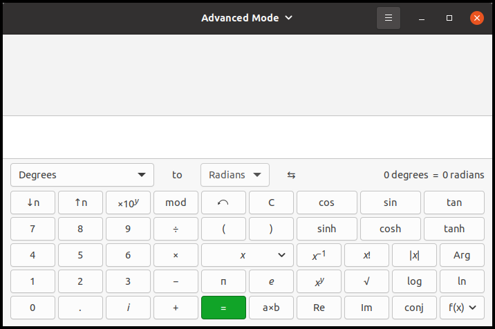

Up: [README.md](../README.md),  Prev: [Section 19](sec19.md), Next: [Section 21](sec21.md)

# GtkMenuButton, accelerators, font, pango and gsettings

Tfe text editor will be restructured in this section.

- Open, save and close buttons are placed on the toolbar.
In addition, GtkMenuButton is added to the toolbar.
This button shows a popup menu when clicked on.
Here, popup means widely, including pull-down menu.
- New, save-as, preference and quit items are put into the menu.

This makes the most frequently used operation bound to the tool bar buttons.
And the others are stored in behind the menus.
So, it is more practical.

In addition, the following features are added.

- Accelerators. For example, Ctrl-O reads a file and creates a new page.
- Preference dialog for font selection.
- Alert dialog to confirm closing or quitting without saving contents.
- GSettings to keep the font selection.

## Static variables shared by functions in tfeapplication.c

The next version of `tfe` has static variables in `tfeapplication.c`.
Static variables are convenient but not good for maintenance.
So, the final version will remove them and take another way to cover the static variables.

Anyway, the following is the code with regard to the static variables.

~~~C
static GtkDialog *pref; // preference dialog
static GtkFontButton *fontbtn; // font button
static GSettings *settings; // GSetting
static GtkDialog *alert; // alert dialog
static GtkLabel *lb_alert;  // label in the alert dialog
static GtkButton *btn_accept; // accept button in the alert dialog
static GtkCssProvider *provider0; //CSS provider for textview padding
static GtkCssProvider *provider; // CSS provider for fonts

static gulong pref_close_request_handler_id = 0;
static gulong alert_close_request_handler_id = 0;
static gboolean is_quit; // flag whether to quit or close
~~~

These variables can be referred by any functions in the file.

## Signal tags in ui files 

The four buttons are included in the ui file `tfe.ui`.
A difference from prior sections is signal tags.
The following is extracted from `tfe.ui` and it describes the open button.

~~~xml
<object class="GtkButton" id="btno">
  <property name="label">Open</property>
  <signal name="clicked" handler="open_cb" swapped="TRUE" object="nb"></signal>
</object>
~~~

Signal tag specifies the name of the signal, handler and user_data object.

- The signal name is "clicked".
- The handler is "open\_cb".
- The user data object is "nb" (GtkNoteBook instance).

Swapped attribute has the same effect as `g_signal_connect_swapped` function.
So, the signal tag above works the same as:

~~~C
g_signal_connect_swapped (btno, "clicked", G_CALLBACK (open_cb), nb);
~~~

This function swaps the button and the forth argument (`btno` and `nb`) in the handler.
If `g_signal_connect` is used, the handler is like this:

~~~C
/* The parameter user_data is assigned with nb */
static void
open_cb (GtkButton *btno, gpointer user_data) { ... ... }
~~~

If `g_signal_connect_swapped` is used, the button and the user data are swapped.

~~~C
/* btno and user_data (nb) are exchanged */
static void
open_cb (GtkNoteBook *nb) { ... ... }
~~~

It is good if the button instance is useless in the handler.

When you use a signal tag in your ui file, you need "-WI, --export-dynamic" options to compile.
You can achieve this by adding "export_dynamic: true" argument to executable function in `meson.build`.
And remove static class from the handler.

~~~C
void
open_cb (GtkNotebook *nb) {
  notebook_page_open (nb);
}
~~~
If you add static, the function is in the scope of the file and it can't be seen from outside.
Then the signal tag can't find the function.

## Menu and GkMenuButton

Traditional menu structure is fine.
However, We don't use all the menus or buttons so often.
Some mightn't be clicked at all.
Therefore, it's a good idea to put some frequently used buttons on the toolbar and the rest into the menu.
Such menu are often connected to GtkMenuButton.

Menus are described in `menu.ui` file.

~~~xml
 1 <?xml version="1.0" encoding="UTF-8"?>
 2 <interface>
 3   <menu id="menu">
 4     <section>
 5       <item>
 6         <attribute name="label">New</attribute>
 7         <attribute name="action">win.new</attribute>
 8       </item>
 9       <item>
10         <attribute name="label">Save As…</attribute>
11         <attribute name="action">win.saveas</attribute>
12       </item>
13     </section>
14     <section>
15       <item>
16         <attribute name="label">Preference</attribute>
17         <attribute name="action">win.pref</attribute>
18       </item>
19     </section>
20     <section>
21       <item>
22         <attribute name="label">Quit</attribute>
23         <attribute name="action">win.close-all</attribute>
24       </item>
25     </section>
26   </menu>
27 </interface>
~~~

There are four items, "New", "Saveas", "Preference" and "Quit".

- "New" menu creates a new empty page.
- "Saveas" menu saves the current page as a different filename from the original one.
- "Preference" menu sets preference items.
This version of `tfe` has only font preference.
- "Quit" menu quits the application.

These four menus are not used so often.
That's why they are put into the menu behind the menu button.

All the actions above have "win" scope.
Tfe has only one window even if the second application runs.
So, the scope "app" and "win" have very little difference in this application.

The menus and the menu button are connected with `gtk_menu_button_set_menu_model` function.
The variable `btnm` below points a GtkMenuButton object.

~~~C
  build = gtk_builder_new_from_resource ("/com/github/ToshioCP/tfe/menu.ui");
  menu = G_MENU_MODEL (gtk_builder_get_object (build, "menu"));
  gtk_menu_button_set_menu_model (btnm, menu);
~~~

## Actions and Accelerators

Menus are connected to actions.
Actions are defined with an array and `g_action_map_add_action_entries` function.

~~~C
  const GActionEntry win_entries[] = {
    { "open", open_activated, NULL, NULL, NULL },
    { "save", save_activated, NULL, NULL, NULL },
    { "close", close_activated, NULL, NULL, NULL },
    { "new", new_activated, NULL, NULL, NULL },
    { "saveas", saveas_activated, NULL, NULL, NULL },
    { "pref", pref_activated, NULL, NULL, NULL },
    { "close-all", close_all_activated, NULL, NULL, NULL }
  };
  g_action_map_add_action_entries (G_ACTION_MAP (win), win_entries, G_N_ELEMENTS (win_entries), nb);
~~~

There are seven actions, open, save, close, new, saveas, pref and close-all.
But there were only four menus.
New, saveas, pref and close-all actions correspond to new, saveas, preference and quit menu respectively.
The three actions open, save and close doesn't have corresponding menus.
Are they necessary?
Yes, because they correspond to accelerators.

Accelerators are kinds of short cut key functions.
They are defined with arrays and `gtk_application_set_accels_for_action` function.

~~~C
  struct {
    const char *action;
    const char *accels[2];
  } action_accels[] = {
    { "win.open", { "<Control>o", NULL } },
    { "win.save", { "<Control>s", NULL } },
    { "win.close", { "<Control>w", NULL } },
    { "win.new", { "<Control>n", NULL } },
    { "win.saveas", { "<Shift><Control>s", NULL } },
    { "win.close-all", { "<Control>q", NULL } },
  };

  for (i = 0; i < G_N_ELEMENTS(action_accels); i++)
    gtk_application_set_accels_for_action(GTK_APPLICATION(app), action_accels[i].action, action_accels[i].accels);
~~~

This code is a bit complicated.
The array `action-accels[]` is an array of structures.
The structure is:

~~~C
  struct {
    const char *action;
    const char *accels[2];
  }
~~~

The member `action` is a string.
The member `accels` is an array of two strings.
For example,

~~~C
{ "win.open", { "<Control>o", NULL } },
~~~

This is the first element of the array `action_accels`.

- The member `action` is "win.open". This specifies the action "open" belongs to the window object.
- The member `accels` is an array of two strings, "\<Control\>o" and NULL.
The first string specifies a key combination.
Control key and 'o'.
If you keep pressing the control key and push 'o' key, then it activates the action `win.open`.
The second string NULL (or zero) means the end of the list (array).
You can define more than one accelerator keys and the list must ends with NULL (zero).
If you want to do so, the array length needs to be three or more.
The parser recognizes "\<control\>o", "\<Shift\>\<Alt\>F2", "\<Ctrl\>minus" and so on.
If you want to use symbol key like "\<Ctrl\>-", use "\<Ctrl\>minus" instead.
Such relation between lower case and symbol (character code) is specified in [`gdkkeysyms.h`](https://gitlab.gnome.org/GNOME/gtk/-/blob/master/gdk/gdkkeysyms.h) in the GTK 4 source code.

### Open, save and close handlers

There are two open handlers.
One is a handler for the clicked signal on the button.
The other is for the activate signal on the action.

~~~
Open button ==(clicked)==> open.cb handler
Ctrl-o key (accerelator) ==(key down)==> open action activated ==> open_activated handler
~~~

But the behavior of the two handlers are the same.
So, `open_activate` just call `open.cb`.

~~~C
 1 void
 2 open_cb (GtkNotebook *nb) {
 3   notebook_page_open (nb);
 4 }
 5 
 6 static void
 7 open_activated (GSimpleAction *action, GVariant *parameter, gpointer user_data) {
 8   GtkNotebook *nb = GTK_NOTEBOOK (user_data);
 9   open_cb (nb);
10 }
~~~

The same goes on with the save and close handlers.

## Saveas handler

TfeTextView has a saveas function.
So we just write a wrapper function in `tfenotebook.c`.

~~~C
 1 static TfeTextView *
 2 get_current_textview (GtkNotebook *nb) {
 3   int i;
 4   GtkWidget *scr;
 5   GtkWidget *tv;
 6 
 7   i = gtk_notebook_get_current_page (nb);
 8   scr = gtk_notebook_get_nth_page (nb, i);
 9   tv = gtk_scrolled_window_get_child (GTK_SCROLLED_WINDOW (scr));
10   return TFE_TEXT_VIEW (tv);
11 }
12 
13 void
14 notebook_page_saveas (GtkNotebook *nb) {
15   g_return_if_fail(GTK_IS_NOTEBOOK (nb));
16 
17   TfeTextView *tv;
18 
19   tv = get_current_textview (nb);
20   tfe_text_view_saveas (TFE_TEXT_VIEW (tv));
21 }
~~~

The function `get_current_textview` is the same as before.
The function `notebook_page_saveas` simply calls `tfe_text_view_saveas`.

In `tfeapplication.c`, saveas handler just call `notebook_page_saveas`.

~~~C
1 static void
2 saveas_activated (GSimpleAction *action, GVariant *parameter, gpointer user_data) {
3   GtkNotebook *nb = GTK_NOTEBOOK (user_data);
4   notebook_page_saveas (nb);
5 }
~~~

## Preference and alert dialog

### Preference dialog

Preference dialog xml definition is added to `tfe.ui`.

~~~xml
<object class="GtkDialog" id="pref">
  <property name="title">Preferences</property>
  <property name="resizable">FALSE</property>
  <property name="modal">TRUE</property>
  <property name="transient-for">win</property>
  <child internal-child="content_area">
    <object class="GtkBox" id="content_area">
      <child>
        <object class="GtkBox" id="pref_boxh">
          <property name="orientation">GTK_ORIENTATION_HORIZONTAL</property>
          <property name="spacing">12</property>
          <property name="margin-start">12</property>
          <property name="margin-end">12</property>
          <property name="margin-top">12</property>
          <property name="margin-bottom">12</property>
          <child>
            <object class="GtkLabel" id="fontlabel">
              <property name="label">Font:</property>
              <property name="xalign">1</property>
            </object>
          </child>
          <child>
            <object class="GtkFontButton" id="fontbtn">
            </object>
          </child>
        </object>
      </child>
    </object>
  </child>
</object>
~~~

- Preference dialog is an independent dialog.
It is not a descendant widget of the top-level GtkApplicationwindow.
Therefore, There's no child tag that surrounds the dialog object.
- There are four properties of the dialog.
GtkDialog is a child object (not child widget) of GtkWindow, so it inherits all the properties from GtkWindow.
Title, resizable, modal and transient-for properties are inherited from GtkWindow.
Transient-for specifies a temporary parent window, which the dialog's location is based on.
- The tag `<child internal-child="content_area">` is put at the top of the contents of the dialog.
You need to specify a GtkBox object tag with content\_area id.
This object is defined in `gtkdialog.ui` (composite widget) but you need to define it again in the child tag.
Composite widget will be explained in the next section.
For further information about GtkDialog ui tags, see:
  - [GTK 4 API reference -- GtkBuilder](https://docs.gtk.org/gtk4/class.Builder.html#gtkbuilder-ui-definitions)
  - [GTK 4 API reference -- GtkDialog](https://docs.gtk.org/gtk4/class.Dialog.html#gtkdialog-as-gtkbuildable)
  - [GtkDialog ui file](https://gitlab.gnome.org/GNOME/gtk/-/blob/main/gtk/ui/gtkdialog.ui)
- There is a horizontal GtkBox in the content area.
- GtkLabel and GtkFontButton are in the GtkBox.

I want the preference dialog to keep alive during the application lives.
So, it is necessary to catch "close-request" signal from the dialog and stop the signal propagation.
(This signal is emitted when the close button, right upper x button of the window, is clicked.)
This is accomplished by returning TRUE by the signal handler.

~~~C
static gboolean
dialog_close_cb (GtkDialog *dialog) {
  gtk_widget_set_visible (GTK_WIDGET (dialog), false);
  return TRUE;
}
... ...
( in app_startup function )
pref_close_request_handler_id = g_signal_connect (GTK_DIALOG (pref), "close-request", G_CALLBACK (dialog_close_cb), NULL);
... ...
~~~

Generally, signal emission consists of five stages.

1. Default handler is invoked if the signal's flag is `G_SIGNAL_RUN_FIRST`.
Default handler is set when a signal is registered.
It is different from user signal handler, simply called signal handler, connected by `g_signal_connect`series function.
Default handler can be invoked in either stage 1, 3 or 5.
Most of the default handlers are `G_SIGNAL_RUN_FIRST` or `G_SIGNAL_RUN_LAST`.
1. Signal handlers are invoked, unless it is connected by `g_signal_connect_after`.
2. Default handler is invoked if the signal's flag is `G_SIGNAL_RUN_LAST`.
3. Signal handlers are invoked, if it is connected by `g_signal_connect_after`.
4. Default handler is invoked if the signal's flag is `G_SIGNAL_RUN_CLEANUP`.

The "close-request" signal is `G_SIGNAL_RUN_LAST`.
So, the order of the invocation is:

1. Signal handler `dialog_close_cb`
2. Default handler

And If the user signal handler returns TRUE, then other handlers will be stopped being invoked.
Therefore, the program above prevents the invocation of the default handler and stop the closing process of the dialog.

The following codes are extracted from `tfeapplication.c`.

~~~C
static gulong pref_close_request_handler_id = 0;
static gulong alert_close_request_handler_id = 0;
... ...
static gboolean
dialog_close_cb (GtkDialog *dialog, gpointer user_data) {
  gtk_widget_set_visible (GTK_WIDGET (dialog), false);
  return TRUE;
}
... ...
static void
pref_activated (GSimpleAction *action, GVariant *parameter, gpointer nb) {
  gtk_window_present (GTK_WINDOW (pref));
}
... ...
void
app_shutdown (GApplication *application) {
   ... ... ...
  if (pref_close_request_handler_id > 0)
    g_signal_handler_disconnect (pref, pref_close_request_handler_id);
  gtk_window_destroy (GTK_WINDOW (pref));
   ... ... ...
}
... ...
static void
tfe_startup (GApplication *application) {
  ... ...
  pref = GTK_DIALOG (gtk_builder_get_object (build, "pref"));
  pref_close_request_handler_id = g_signal_connect (GTK_DIALOG (pref), "close-request", G_CALLBACK (dialog_close_cb), NULL);
  ... ... 
}
~~~

- The close-requiest signal on the preference dialog is connected to the handler `dialog_close_cb`.
It changes the close behavior of the dialog.
When the signal is emitted, the visibility is set to false and the default handler is canceled.
So, the dialog just disappears but exists.
- A handler `pref_activate` shows the preference dialog.
- The shutdown handler `app_shutdown` disconnects the handlers from the "close-request"signal and destroys `pref` window.

### Alert dialog

If a user closes a page without saving, it is advisable to show an alert for a user to confirm it.
Alert dialog is used in such a situation.

~~~xml
  <object class="GtkDialog" id="alert">
    <property name="title">Are you sure?</property>
    <property name="resizable">FALSE</property>
    <property name="modal">TRUE</property>
    <property name="transient-for">win</property>
    <child internal-child="content_area">
      <object class="GtkBox">
        <child>
          <object class="GtkBox">
            <property name="orientation">GTK_ORIENTATION_HORIZONTAL</property>
            <property name="spacing">12</property>
            <property name="margin-start">12</property>
            <property name="margin-end">12</property>
            <property name="margin-top">12</property>
            <property name="margin-bottom">12</property>
            <child>
              <object class="GtkImage">
                <property name="icon-name">dialog-warning</property>
                <property name="icon-size">GTK_ICON_SIZE_LARGE</property>
              </object>
            </child>
            <child>
              <object class="GtkLabel" id="lb_alert">
              </object>
            </child>
          </object>
        </child>
      </object>
    </child>
    <child type="action">
      <object class="GtkButton" id="btn_cancel">
        <property name="label">Cancel</property>
      </object>
    </child>
    <child type="action">
      <object class="GtkButton" id="btn_accept">
        <property name="label">Close</property>
      </object>
    </child>
    <action-widgets>
      <action-widget response="cancel" default="true">btn_cancel</action-widget>
      <action-widget response="accept">btn_accept</action-widget>
    </action-widgets>
    <signal name="response" handler="alert_response_cb" swapped="NO" object="nb"></signal>
  </object>
~~~

This ui file describes the alert dialog.
Some part are the same as preference dialog.
There are two objects in the content area, GtkImage and GtkLabel.

GtkImage shows an image.
The image can comes from files, resources, icon theme and so on.
The image above displays an icon from the current icon theme.
You can see icons in the theme by `gtk4-icon-browser`.

~~~
$ gtk4-icon-browser
~~~

The "dialog-warning" icon is something like this.

These are made by my hand.
The real image on the alert dialog is nicer.

The GtkLabel `lb_alert` has no text yet.
An alert message will be inserted in the program.

There are two child tags which have "action" type.
They are button objects located in the action area.
Action-widgets tag describes the actions of the buttons.
The button `btn_cancel` emits response signal with cancel response (`GTK_RESPONSE_CANCEL`) if it is clicked on.
The button `btn_accept` emits response signal with accept response (`GTK_RESPONSE_ACCEPT`) if it is clicked on.
The response signal is connected to `alert_response_cb` handler.

The alert dialog keeps alive while the application lives.
The "close-request" signal is stopped by the handler `dialog_close_cb` like the preference dialog.

### Alert dialog and close handlers

If a user closes a page or quits the application without saving the contents, the alert dialog appears.
There are four handlers, close\_cb, close\_activated, win\_close\_request\_cb and close\_all\_activated.
The first two are called when a notebook page is closed.
The others are called when the main window is closed --- so, all the notebooks are closed.

- close button => close\_cb (=> alert dialog)
- Ctrl-W => close\_activated => close\_cb (=> alert dialog)
- Close button (x button at the right top of the main window) => win\_close\_request\_cb (=> alert dialog)
- Quit menu or Ctrl-Q => close\_all\_activated => win\_close\_request\_cb (=> alert dialog)

~~~C
static gboolean is_quit;
... ...
static gboolean
win_close_request_cb (GtkWindow *win, GtkNotebook *nb) {
  is_quit = true;
  if (has_saved_all (nb))
    return false;
  else {
    gtk_label_set_text (lb_alert, "Contents aren't saved yet.\nAre you sure to quit?");
    gtk_button_set_label (btn_accept, "Quit");
    gtk_window_present (GTK_WINDOW (alert));
    return true;
  }
}
... ...
void
close_cb (GtkNotebook *nb) {
  is_quit = false;
  if (has_saved (GTK_NOTEBOOK (nb)))
    notebook_page_close (GTK_NOTEBOOK (nb));
  else {
    gtk_label_set_text (lb_alert, "Contents aren't saved yet.\nAre you sure to close?");
    gtk_button_set_label (btn_accept, "Close");
    gtk_window_present (GTK_WINDOW (alert));
  }
}
... ...
static void
close_activated (GSimpleAction *action, GVariant *parameter, gpointer user_data) {
  GtkNotebook *nb = GTK_NOTEBOOK (user_data);
  close_cb (nb);
}
... ...
static void
close_all_activated (GSimpleAction *action, GVariant *parameter, gpointer user_data) {
  GtkNotebook *nb = GTK_NOTEBOOK (user_data);
  GtkWidget *win = gtk_widget_get_ancestor (GTK_WIDGET (nb), GTK_TYPE_WINDOW);

  if (! win_close_request_cb (GTK_WINDOW (win), nb)) // checks whether contents are saved
    gtk_window_destroy (GTK_WINDOW (win));
}
... ...
void
alert_response_cb (GtkDialog *alert, int response_id, gpointer user_data) {
  GtkNotebook *nb = GTK_NOTEBOOK (user_data);
  GtkWidget *win = gtk_widget_get_ancestor (GTK_WIDGET (nb), GTK_TYPE_WINDOW);

  gtk_widget_set_visible (GTK_WIDGET (alert), false);
  if (response_id == GTK_RESPONSE_ACCEPT) {
    if (is_quit)
      gtk_window_destroy (GTK_WINDOW (win));
    else
      notebook_page_close (nb);
  }
}
... ...
static void
app_startup (GApplication *application) {
  ... ...
  build = gtk_builder_new_from_resource ("/com/github/ToshioCP/tfe/tfe.ui");
  win = GTK_APPLICATION_WINDOW (gtk_builder_get_object (build, "win"));
  ... ...
  g_signal_connect (GTK_WINDOW (win), "close-request", G_CALLBACK (win_close_request_cb), nb);
  ... ...
}
~~~

The static variable `is_quit` is true when user tries to quit the application and false otherwise.

- When a user clicks on the close button, `close_cb` handler is invoked.
The handler sets `is_quit` to false.
The function `has_saved` returns true if the current page has been saved.
If it is true, it calls `notebook_page_close` to close the current page.
Otherwise, it shows the alert dialog.
The response signal of the dialog is connected to the handler `alert_response_cb`.
It hides the dialog first.
Then checks the `response_id`.
If it is `GTK_RESPONSE_ACCEPT`, which means the user has clicked on the close button, then it closes the current page.
Otherwise it does nothing.
- When a user presses "Ctrl-w", `close_activated` handler is invoked.
It just calls `close_cb`.
- When a user clicks the close button of the main window, "close-request" signal is emitted on the window.
The signal has been connected to the `win_close_request_cb` handler in advance.
The connection is done in the start up handler on the application.
The `win_close_request_cb` handler sets `is_quit` to be true.
If `has_save_all` returns true, it returns false, which means the signal moves to the default handler and the main window will close.
Otherwise, It shows the alert dialog and returns true.
So, the signal stops and the default handler won't be called.
But if the user clicked accept button in the alert dialog,
the response handler `alert_response_cb` calls `gtk_window_destroy` and the main window will be closed.
- When a user clicked on the quit menu or presses "Ctrl-q", then `close_all_activated` handler is invoked.
It calls `win_close_request_cb`.
If the return value is false, it destroys the main window.
Otherwise it does nothing, but `win_close_request_cb` has shown the alert dialog.

### Has\_saved and has\_saved\_all functions

The two functions are defined in the file `tfenotebook.c`.
They are public functions.

~~~C
 1 gboolean
 2 has_saved (GtkNotebook *nb) {
 3   g_return_val_if_fail (GTK_IS_NOTEBOOK (nb), false);
 4 
 5   TfeTextView *tv;
 6   GtkTextBuffer *tb;
 7 
 8   tv = get_current_textview (nb);
 9   tb = gtk_text_view_get_buffer (GTK_TEXT_VIEW (tv));
10   if (gtk_text_buffer_get_modified (tb))
11     return false;
12   else
13     return true;
14 }
15 
16 gboolean
17 has_saved_all (GtkNotebook *nb) {
18   g_return_val_if_fail (GTK_IS_NOTEBOOK (nb), false);
19 
20   int i, n;
21   GtkWidget *scr;
22   GtkWidget *tv;
23   GtkTextBuffer *tb;
24 
25   n = gtk_notebook_get_n_pages (nb);
26   for (i = 0; i < n; ++i) {
27     scr = gtk_notebook_get_nth_page (nb, i);
28     tv = gtk_scrolled_window_get_child (GTK_SCROLLED_WINDOW (scr));
29     tb = gtk_text_view_get_buffer (GTK_TEXT_VIEW (tv));
30     if (gtk_text_buffer_get_modified (tb))
31       return false;
32   }
33   return true;
34 }
~~~

- 1-14: `has_saved` function.
- 10: The function `gtk_text_buffer_get_modified` returns true if the content of the buffer has been modified since the modified flag had set false.
The flag is set to false when:
  - the buffer is created.
  - the contents of the buffer is replaced
  - the contents of the buffer is saved to a file.
- 10-13: This function returns true if the contents of the current page has been saved and no modification has been made.
It returns false, if the current page has been modified and hasn't been saved.
- 16-34: `has_saved_all` function.
This function is similar to `has_saved` function.
It returns true if all the pages have been saved.
It returns false if at least one page has been modified since it last had been saved.

## Notebook page tab

If you have some pages and edit them together, you might be confused which file needs to be saved.
Common file editors changes the tab when the contents are modified.
GtkTextBuffer provides "modified-changed" signal to notify the modification.

~~~C
static void
notebook_page_build (GtkNotebook *nb, GtkWidget *tv, char *filename) {
  ... ...
  g_signal_connect (GTK_TEXT_VIEW (tv), "change-file", G_CALLBACK (file_changed_cb), NULL);
  g_signal_connect (tb, "modified-changed", G_CALLBACK (modified_changed_cb), tv);
}
~~~

When a page is built, connect "change-file" and "modified-changed" signals to `file_changed_cb` and `modified_changed_cb` handlers respectively.

~~~C
 1 static void
 2 file_changed_cb (TfeTextView *tv) {
 3   GtkWidget *nb =  gtk_widget_get_ancestor (GTK_WIDGET (tv), GTK_TYPE_NOTEBOOK);
 4   GtkWidget *scr;
 5   GtkWidget *label;
 6   GFile *file;
 7   char *filename;
 8 
 9   if (! GTK_IS_NOTEBOOK (nb)) /* tv not connected to nb yet */
10     return;
11   file = tfe_text_view_get_file (tv);
12   scr = gtk_widget_get_parent (GTK_WIDGET (tv));
13   if (G_IS_FILE (file)) {
14     filename = g_file_get_basename (file);
15     g_object_unref (file);
16   } else
17     filename = get_untitled ();
18   label = gtk_label_new (filename);
19   gtk_notebook_set_tab_label (GTK_NOTEBOOK (nb), scr, label);
20 }
21 
22 static void
23 modified_changed_cb (GtkTextBuffer *tb, gpointer user_data) {
24   TfeTextView *tv = TFE_TEXT_VIEW (user_data);
25   GtkWidget *scr = gtk_widget_get_parent (GTK_WIDGET (tv));
26   GtkWidget *nb =  gtk_widget_get_ancestor (GTK_WIDGET (tv), GTK_TYPE_NOTEBOOK);
27   GtkWidget *label;
28   const char *filename;
29   char *text;
30 
31   if (! GTK_IS_NOTEBOOK (nb)) /* tv not connected to nb yet */
32     return;
33   else if (gtk_text_buffer_get_modified (tb)) {
34     filename = gtk_notebook_get_tab_label_text (GTK_NOTEBOOK (nb), scr);
35     text = g_strdup_printf ("*%s", filename);
36     label = gtk_label_new (text);
37     g_free (text);
38     gtk_notebook_set_tab_label (GTK_NOTEBOOK (nb), scr, label);
39   } else
40     file_changed_cb (tv);
41 }
~~~

The `file_changed_cb` handler gives a new file name to the notebook page tag.
The `modified_changed_cb` handler inserts an asterisk at the beginning of the filename.
It is a sign that indicates the file has been modified but not saved yet.

- 1-20: `file_changed_cb` handler.
- 9-10: If the signal emits during the page is being built, it is possible that `tv` isn't a descendant of `nb`.
That is to say, there's no page corresponds to `tv`.
Then, it is unnecessary to change the name of the tab because no tab exists.
- 13-15: If `file` is GFile, then it gets the filename and release the reference to `file`.
- 16-17: Otherwise, it assigns "Untitled" (+ a number) to `filename`
- 18-19: Creates GtkLabel with `filename` and sets the tab of the page with the GtkLabel.
- 22-41: `modified_changed_cb` handler.
- 31-32: If `tv` isn't a descendant of `nb`, then nothing needs to be done.
- 33-35: If the content is modified, then it gets the text of the tab and adds asterisk at the beginning of the text.
- 36-38: Sets the tab with the filename with the asterisk
- 39-40: Otherwise it calls `file_changed_cb` and updates the filename (without an asterisk).

## Font

### GtkFontButton and GtkFontChooser

GtkFontButton is a button class which displays the current font and a user can change the font with the button.
It opens a font chooser dialog if a user clicked on the button.
A user can change the font (family, style, weight and size) with the dialog.
Then the button keeps the new font and displays it.

The button is set with a builder in the application startup process.
And the signal "font-set" is connected to the handler `font_set_cb`.
The signal "font-set" is emitted when the user selects a font.

~~~C
static void
font_set_cb (GtkFontButton *fontbtn) {
  PangoFontDescription *pango_font_desc;
  char *s, *css;

  pango_font_desc = gtk_font_chooser_get_font_desc (GTK_FONT_CHOOSER (fontbtn));
  s = pfd2css (pango_font_desc); // converts Pango Font Description into CSS style string
  css = g_strdup_printf ("textview {%s}", s);
  gtk_css_provider_load_from_data (provider, css, -1);
  g_free (s);
  g_free (css);
}
... ...
static void
app_startup (GApplication *application) {
  ... ...
  fontbtn = GTK_FONT_BUTTON (gtk_builder_get_object (build, "fontbtn"));
  ... ...
  g_signal_connect (fontbtn, "font-set", G_CALLBACK (font_set_cb), NULL);
  ... ...
}
~~~

GtkFontChooser is an interface implemented by GtkFontButton.
The function `gtk_font_chooser_get_font_desc` gets the PangoFontDescription of the currently selected font.
PangoFontDescription includes font family, style, weight and size in it.
The function `pfd2css` converts them to CSS style string.
The following shows the conversion.

~~~
PangoFontDescription:
  font-family: Monospace
  font-style: normal
  font-weight: normal
  font-size: 12pt
=>
"font-family: Monospace; font-style: normal; font-weight: 400; font-size: 12pt;"
~~~

Then, `font_set_cb` creates a CSS string and put it into the `provider` instance.
The provider has been added to the default display in advance.
So, the handler effects the font for the contents of the textview immediately.  

### CSS and Pango

Convertors from PangoFontDescription to CSS are packed in `pfd2css.c`.
The filename means:

- pfd => PangoFontDescripter
- 2 => to
- css => CSS (Cascade Style Sheet)

All the public functions in the file have "pdf2css" prefix.

~~~C
 1 #include <pango/pango.h>
 2 #include "pfd2css.h"
 3 
 4 // Pango font description to CSS style string
 5 // Returned string is owned by caller. The caller should free it when it is useless.
 6 
 7 char*
 8 pfd2css (PangoFontDescription *pango_font_desc) {
 9   char *fontsize;
10 
11   fontsize = pfd2css_size (pango_font_desc);
12   return g_strdup_printf ("font-family: \"%s\"; font-style: %s; font-weight: %d; font-size: %s;",
13               pfd2css_family (pango_font_desc), pfd2css_style (pango_font_desc),
14               pfd2css_weight (pango_font_desc), fontsize);
15   g_free (fontsize); 
16 }
17 
18 // Each element (family, style, weight and size)
19 
20 const char*
21 pfd2css_family (PangoFontDescription *pango_font_desc) {
22   return pango_font_description_get_family (pango_font_desc);
23 }
24 
25 const char*
26 pfd2css_style (PangoFontDescription *pango_font_desc) {
27   PangoStyle pango_style = pango_font_description_get_style (pango_font_desc);
28   switch (pango_style) {
29   case PANGO_STYLE_NORMAL:
30     return "normal";
31   case PANGO_STYLE_ITALIC:
32     return "italic";
33   case PANGO_STYLE_OBLIQUE:
34     return "oblique";
35   default:
36     return "normal";
37   }
38 }
39 
40 int
41 pfd2css_weight (PangoFontDescription *pango_font_desc) {
42   PangoWeight pango_weight = pango_font_description_get_weight (pango_font_desc);
43   switch (pango_weight) {
44   case PANGO_WEIGHT_THIN:
45     return 100;
46   case PANGO_WEIGHT_ULTRALIGHT:
47     return 200;
48   case PANGO_WEIGHT_LIGHT:
49     return 300;
50   case PANGO_WEIGHT_SEMILIGHT:
51     return 350;
52   case PANGO_WEIGHT_BOOK:
53     return 380;
54   case PANGO_WEIGHT_NORMAL:
55     return 400; /* or "normal" */
56   case PANGO_WEIGHT_MEDIUM:
57     return 500;
58   case PANGO_WEIGHT_SEMIBOLD:
59     return 600;
60   case PANGO_WEIGHT_BOLD:
61     return 700; /* or "bold" */
62   case PANGO_WEIGHT_ULTRABOLD:
63     return 800;
64   case PANGO_WEIGHT_HEAVY:
65     return 900;
66   case PANGO_WEIGHT_ULTRAHEAVY:
67     return 900; /* In PangoWeight definition, the weight is 1000. But CSS allows the weight below 900. */
68   default:
69     return 400; /* "normal" */
70   }
71 }
72 
73 char *
74 pfd2css_size (PangoFontDescription *pango_font_desc) {
75   if (pango_font_description_get_size_is_absolute (pango_font_desc))
76     return g_strdup_printf ("%dpx", pango_font_description_get_size (pango_font_desc) / PANGO_SCALE);
77   else
78     return g_strdup_printf ("%dpt", pango_font_description_get_size (pango_font_desc) / PANGO_SCALE);
79 }
~~~

- 1: Public functions, constants and structures for Pango is defined in `pango/pango.h`.
- 2: Including `pdf2css.h` makes it possible to call public functions anywhere in the file `pdf2css.c`.
Because the header file includes declarations of all the public functions.
- 7-16: `pdf2css` function.
This function gets font family, style, weight and size from a PangoFontDescription instance given as an argument.
And it builds them to a string.
The returned string is owned by caller.
The caller should free the string when it is useless.
- 20-23: `pfd2css_famili` function.
This function gets font-family string from a PangoFontDescription instance.
The string is owned by the PFD instance so caller can't modify or free the string.
- 25-38: `pdf2css_style` function.
This function gets font-style string from a PangoFontDescription instance.
The string is static and caller can't modify or free it.
- 40-71: `pfd2css_weight` function.
This function gets font-weight integer value from a PangoFontDescription instance.
The value is in between 100 to 900.
It is defined in [CSS Fonts Module Level 3](../src/CSS Fonts Module Level 3) specification.
  - 100 - Thin
  - 200 - Extra Light (Ultra Light)
  - 300 - Light
  - 400 - Normal
  - 500 - Medium
  - 600 - Semi Bold (Demi Bold)
  - 700 - Bold
  - 800 - Extra Bold (Ultra Bold)
  - 900 - Black (Heavy)
- 73-79: `pdf2css_size` function.
This function gets font-size string from a PangoFontDescription instance.
The string is owned by caller, so the caller should free it when it is useless.
PangoFontDescription has absolute or non-absolute size.
  - If it is absolute, the size is in device units.
  - If it is non-absolute, the size is in points.
- The definition of device units is dependent on the output device. It will typically be pixels for a screen, and points for a printer.
- Pango holds the size as its own dimensions.
The constant `PANGO_SCALE` is the scale between dimensions used for Pango distances and device units.
`PANGO_SCALE` is currently 1024, but this may be changed in the future.
When setting font sizes, device units are always considered to be points rather than pixels.
If the font size is 12pt, the size in pango is `12*PANGO_SCALE=12*1024=12288`.

For further information, see [Pango API Reference](https://docs.gtk.org/Pango/).

## GSettings

We want to maintain the font data after the application quits.
There are some ways to implement it.

- Make a configuration file.
For example, a text file "~/.config/tfe/font.cfg" keeps font information.
- Use GSettings object.
The basic idea of GSettings are similar to configuration file.
Configuration information data is put into a database file.

GSettings is simple and easy to use but a bit hard to understand the concept.
This subsection describes the concept first and then how to program it.

### GSettings schema

GSettings schema describes a set of keys, value types and some other information.
GSettings object uses this schema and it writes/reads the value of a key to/from the right place in the database.

- A schema has an id.
The id must be unique.
We often use the same string as application id, but schema id and application id are different.
You can use different name from application id.
Schema id is a string delimited by periods.
For example, "com.github.ToshioCP.tfe" is a correct schema id.
- A schema usually has a path.
The path is a location in the database.
Each key is stored under the path.
For example, if a key `font` is defined with a path `/com/github/ToshioCP/tfe/`, the key's location in the database is `/com/github/ToshioCP/tfe/font`.
Path is a string begins with and ends with a slash (`/`).
And it is delimited by slashes.
- GSettings save information as key-value style.
Key is a string begins with lower case characters followed by lower case, digit or dash (`-`) and ends with lower case or digit.
No consecutive dashes are allowed.
Values can be any type.
GSettings stores values as GVariant type, which can be, for example, integer, double, boolean, string or complex types like an array.
The type of values needs to be defined in the schema.
- A default value needs to be set for each key.
- A summery and description can be set for each key optionally.

Schemas are described in an XML format.
For example,

~~~xml
 1 <?xml version="1.0" encoding="UTF-8"?>
 2 <schemalist>
 3   <schema path="/com/github/ToshioCP/tfe/" id="com.github.ToshioCP.tfe">
 4     <key name="font" type="s">
 5       <default>'Monospace 12'</default>
 6       
Font

 7       <description>A font to be used for textview.</description>
 8     </key>
 9   </schema>
10 </schemalist>
~~~

- 4: The type attribute is "s".
It is GVariant type string.
For GVariant type string, see [GLib API Reference -- GVariant Type Strings](https://docs.gtk.org/glib/struct.VariantType.html#gvariant-type-strings).
Other common types are:
  - "b": gboolean
  - "i": gint32.
  - "d": double.

Further information is in:

- [GLib API Reference -- GVariant Format Strings](https://docs.gtk.org/glib/gvariant-format-strings.html)
- [GLib API Reference -- GVariant Text Format](https://docs.gtk.org/glib/gvariant-text.html)
- [GLib API Reference -- GVariant](https://docs.gtk.org/glib/struct.Variant.html)
- [GLib API Reference -- VariantType](https://docs.gtk.org/glib/struct.VariantType.html)

### gsettings

First, let's try `gsettings` application.
It is a configuration tool for GSettings.

~~~
$ gsettings help
Usage:
  gsettings --version
  gsettings [--schemadir SCHEMADIR] COMMAND [ARGS?]

Commands:
  help                      Show this information
  list-schemas              List installed schemas
  list-relocatable-schemas  List relocatable schemas
  list-keys                 List keys in a schema
  list-children             List children of a schema
  list-recursively          List keys and values, recursively
  range                     Queries the range of a key
  describe                  Queries the description of a key
  get                       Get the value of a key
  set                       Set the value of a key
  reset                     Reset the value of a key
  reset-recursively         Reset all values in a given schema
  writable                  Check if a key is writable
  monitor                   Watch for changes

Use "gsettings help COMMAND" to get detailed help.
~~~

List schemas.

~~~
$ gsettings list-schemas
org.gnome.rhythmbox.podcast
ca.desrt.dconf-editor.Demo.Empty
org.gnome.gedit.preferences.ui
org.gnome.evolution-data-server.calendar
org.gnome.rhythmbox.plugins.generic-player

... ...

~~~

Each line is an id of a schema.
Each schema has a key-value configuration data.
You can see them with list-recursively command.
Let's look at the keys and values of `org.gnome.calculator` schema.

~~~
$ gsettings list-recursively org.gnome.calculator
org.gnome.calculator source-currency ''
org.gnome.calculator source-units 'degree'
org.gnome.calculator button-mode 'basic'
org.gnome.calculator target-currency ''
org.gnome.calculator base 10
org.gnome.calculator angle-units 'degrees'
org.gnome.calculator word-size 64
org.gnome.calculator accuracy 9
org.gnome.calculator show-thousands false
org.gnome.calculator window-position (122, 77)
org.gnome.calculator refresh-interval 604800
org.gnome.calculator target-units 'radian'
org.gnome.calculator precision 2000
org.gnome.calculator number-format 'automatic'
org.gnome.calculator show-zeroes false
~~~

This schema is used by GNOME Calculator.
Run the calculator and change the mode, then check the schema again.

~~~
$ gnome-calculator
~~~

Change the mode to advanced and quit.

Run gsettings and check the value of `button-mode`.

~~~
$ gsettings list-recursively org.gnome.calculator

... ...

org.gnome.calculator button-mode 'advanced'

... ...

~~~

Now we know that GNOME Calculator used gsettings and it has set `button-mode` key to "advanced".
The value remains even the calculator quits.
So when the calculator runs again, it will appear as an advanced mode.

### glib-compile-schemas

GSettings schemas are specified with an XML format.
The XML schema files must have the filename extension `.gschema.xml`.
The following is the XML schema file for the application `tfe`.

~~~xml
 1 <?xml version="1.0" encoding="UTF-8"?>
 2 <schemalist>
 3   <schema path="/com/github/ToshioCP/tfe/" id="com.github.ToshioCP.tfe">
 4     <key name="font" type="s">
 5       <default>'Monospace 12'</default>
 6       
Font

 7       <description>A font to be used for textview.</description>
 8     </key>
 9   </schema>
10 </schemalist>
~~~

The filename is "com.github.ToshioCP.tfe.gschema.xml".
Schema XML filenames are usually the schema id followed by ".gschema.xml" suffix.
You can use different name from schema id, but it is not recommended.

- 2: The top level element is `<schemalist>`.
- 3: schema tag has `path` and `id` attributes.
A path determines where the settings are stored in the conceptual global tree of settings.
An id identifies the schema.
- 4: Key tag has two attributes.
Name is the name of the key.
Type is the type of the value of the key and it is a GVariant Format String.
- 5: default value of the key `font` is `Monospace 12`.
- 6: Summery and description elements describes the key.
They are optional, but it is recommended to add them in the XML file.

The XML file is compiled by glib-compile-schemas.
When compiling, `glib-compile-schemas` compiles all the XML files which have ".gschema.xml" file extension in the directory given as an argument.
It converts the XML file into a binary file `gschemas.compiled`.
Suppose the XML file above is under `tfe6` directory.

~~~
$ glib-compile-schemas tfe6
~~~

Then, `gschemas.compiled` is generated under `tfe6`.
When you test your application, set `GSETTINGS_SCHEMA_DIR` environment variable so that GSettings objet can find `gschemas.compiled`.

~~~
$ GSETTINGS_SCHEMA_DIR=(the directory gschemas.compiled is located):$GSETTINGS_SCHEMA_DIR (your application name)
~~~

GSettings object looks for this file by the following process.

- It searches `glib-2.0/schemas` subdirectories of all the directories specified in the environment variable `XDG_DATA_DIRS`.
Common directores are `/usr/share/glib-2.0/schemas` and ``/usr/local/share/glib-2.0/schemas`. 
- If `GSETTINGS_SCHEMA_DIR` environment variable is defined, it searches all the directories specified in the variable.
`GSETTINGS_SCHEMA_DIR` can specify multiple directories delimited by colon (:).

In the directories above, all the `.gschema.xml` files are stored.
Therefore, when you install your application, follow the instruction below to install your schemas.

1. Make `.gschema.xml` file.
2. Copy it to one of the directories above. For example, `/usr/local/share/glib-2.0/schemas`.
3. Run `glib-compile-schemas` on the directory above.
You maybe need `sudo`.

### GSettings object and g\_settings\_bind

Now, we go on to the next topic --- how to program GSettings.

~~~C
... ...
static GSettings *settings;
... ...
void
app_shutdown (GApplication *application) {
  ... ...
  g_clear_object (&settings);
  ... ...
}
... ...
static void
app_startup (GApplication *application) {
  ... ...
  settings = g_settings_new ("com.github.ToshioCP.tfe");
  g_settings_bind (settings, "font", fontbtn, "font", G_SETTINGS_BIND_DEFAULT);
  ... ...
}
~~~

Static variable `settings` keeps a pointer to a GSettings instance.
Before application quits, the application releases the GSettings instance.
The function `g_clear_object` decreases the reference count of the GSettings instance and assigns NULL to the variable `settings`.

Startup handler creates GSettings instance with the schema id "com.github.ToshioCP.tfe" and assigns the pointer to `settings`.
The function `g_settings_bind` connects the settings keys (key and value) and the "font" property of `fontbtn`.
Then the two values will be always the same.
If one value changes then the other will automatically change.

For further information, refer to [GIO API rference -- GSettings](https://docs.gtk.org/gio/class.Settings.html).

## Build with Meson

### Build and test

Meson provides `gnome.compile_schemas` method to compile XML file in the build directory.
This is used to test the application.
Write the following to the `meson.build` file.

~~~meson
gnome.compile_schemas(build_by_default: true, depend_files: 'com.github.ToshioCP.tfe.gschema.xml')
~~~

- `build_by_default`: If it is true, the target will be build by default.
- `depend_files`: XML files to be compiled.

In the example above, this method runs `glib-compile-schemas` to generate `gschemas.compiled` from the XML file `com.github.ToshioCP.tfe.gschema.xml`.
The file `gschemas.compiled` is located under the build directory.
If you run meson as `meson _build` and ninja as `ninja -C _build`, then it is under `_build` directory.

After compilation, you can test your application like this:

~~~
$ GSETTINGS_SCHEMA_DIR=_build:$GSETTINGS_SCHEMA_DIR _build/tfe
~~~

### installation

It is a good idea to install your application in `$HOME/bin` or `$HOME/.local/bin` directory.
They are local bin directories and work like system bin directories such as `/bin`, `/usr/bin` or `usr/local/bin`.
You need to put `--prefix=$HOME` or `--prefix=$HOME/.local` option to meson.

~~~
$ meson --prefix=$HOME/.local _build
~~~

If you want to install your application to a system bin directory, for example `/usr/local/bin`, `--prefix` option isn't necessary.

Meson recognizes options like this:

|options|values (default)|values (--prefix=\$HOME/.local)|
|:---|:---|:---|
|prefix|/usr/local|\$HOME/.local|
|bindir|bin|bin|
|datadir|share|share|
|install directory|/usr/local/bin|\$HOME/.local/bin|

The function `executable` needs `install: true` to install your program.

~~~meson
executable('tfe', sourcefiles, resources, dependencies: gtkdep, export_dynamic: true, install: true)
~~~

However, you need to do one more thing.
Copy your XML file to your schema directory and execute `glib-compile-schemas` on the directory.

- `install_data` function copies a file into a target directory.
- `gnome.post_install` function executes 'glib-compile-schemas' with an argument `schema_dir` as post installation.
This  function is available since Meson 0.57.0.
If the version is earlier than that, use `meson.add_install_script` instead.

~~~meson
schema_dir = get_option('prefix') / get_option('datadir') / 'glib-2.0/schemas/'
install_data('com.github.ToshioCP.tfe.gschema.xml', install_dir: schema_dir)
gnome.post_install (glib_compile_schemas: true)
~~~

The function `get_option` returns the value of build options.
See [Meson Reference Manual](https://mesonbuild.com/Reference-manual_functions.html#get_option).
The operator '/' connects the strings with '/' separator.

|options|values (default)|values (--prefix=\$HOME/.local)|
|:---|:---|:---|
|prefix|/usr/local|\$HOME/.local|
|datadir|share|share|
|schema\_dir|/usr/local/share/glib-2.0/schemas|\$HOME/.local/share/glib-2.0/schemas|

The source code of `meson.build` is as follows.

~~~meson
 1 project('tfe', 'c')
 2 
 3 gtkdep = dependency('gtk4')
 4 
 5 gnome=import('gnome')
 6 resources = gnome.compile_resources('resources','tfe.gresource.xml')
 7 gnome.compile_schemas(build_by_default: true, depend_files: 'com.github.ToshioCP.tfe.gschema.xml')
 8 
 9 sourcefiles=files('tfeapplication.c', 'tfenotebook.c', 'pfd2css.c', '../tfetextview/tfetextview.c')
10 
11 executable('tfe', sourcefiles, resources, dependencies: gtkdep, export_dynamic: true, install: true)
12 
13 schema_dir = get_option('prefix') / get_option('datadir') / 'glib-2.0/schemas/'
14 install_data('com.github.ToshioCP.tfe.gschema.xml', install_dir: schema_dir)
15 gnome.post_install (glib_compile_schemas: true)
~~~

Source files of `tfe` is under [src/tfe6](../src/tfe6) directory.
Copy them to your temporary directory and compile and install it.

~~~
$ meson --prefix=$HOME/.local _build
$ ninja -C _build
$ GSETTINGS_SCHEMA_DIR=_build:$GSETTINGS_SCHEMA_DIR _build/tfe # test
$ ninja -C _build install
$ ls $HOME/.local/bin
... ...
... tfe
... ...
$ ls $HOME/.local/share/glib-2.0/schemas
com.github.ToshioCP.tfe.gschema.xml
gschema.dtd
gschemas.compiled
... ...
$ tfe
~~~

The screenshot is as follows.

Up: [README.md](../README.md),  Prev: [Section 19](sec19.md), Next: [Section 21](sec21.md)
