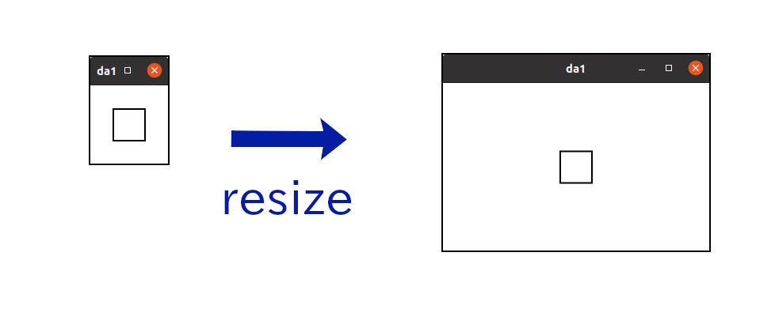

Up: [README.md](../README.md),  Prev: [Section 21](sec21.md), Next: [Section 23](sec23.md)

# GtkDrawingArea and Cairo

If you want to draw dynamically on the screen, like an image window of gimp graphics editor, the GtkDrawingArea widget is the most suitable widget.
You can freely draw or redraw an image in this widget.
This is called custom drawing.

GtkDrawingArea provides a cairo drawing context so users can draw images by using cairo functions.
In this section, I will explain:

1. Cairo, but only briefly; and
2. GtkDrawingArea, with a very simple example.

## Cairo

Cairo is a set of two dimensional graphical drawing functions (or graphics library).
There is a lot of documentation on [Cairo's website](https://www.cairographics.org/).
If you aren't familiar with Cairo, it is worth reading their [tutorial](https://www.cairographics.org/tutorial/).

The following is a gentle introduction to the Cairo library and how to use it.
Firstly, in order to use Cairo you need to know about surfaces, sources, masks, destinations, cairo context and transformations.

- A surface represents an image.
It is like a canvas.
We can draw shapes and images with different colors on surfaces.
- The source pattern, or simply source, is like paint, which will be transferred to destination surface by cairo functions.
- The mask describes the area to be used in the copy;
- The destination is a target surface;
- The cairo context manages the transfer from source to destination, through mask with its functions;
For example, `cairo_stroke` is a function to draw a path to the destination by the transfer.
- A transformation can be applied before the transfer completes.
The transformation which is applied is called affine, which is a mathematical term meaning transofrmations
that preserve straight lines.
Scaling, rotating, reflecting, shearing and translating are all examples of affine transformations.
They are mathematically represented by matrix multiplication and vector addition.
In this section we don't use it, instead we will only use the identity transformation.
This means that the coordinates in the source and mask are the same as the coordinates in destination.

The instruction is as follows:

1. Create a surface.
This will be the destination.
2. Create a cairo context with the surface, the surface will be the destination of the context.
3. Create a source pattern within the context.
4. Create paths, which are lines, rectangles, arcs, texts or more complicated shapes in the mask.
5. Use a drawing operator such as `cairo_stroke` to transfer the paint in the source to the destination.
6. Save the destination surface to a file if necessary.

Here's a simple example program that draws a small square and saves it as a png file.

~~~C
 1 #include <cairo.h>
 2 
 3 int
 4 main (int argc, char **argv)
 5 {
 6   cairo_surface_t *surface;
 7   cairo_t *cr;
 8   int width = 100;
 9   int height = 100;
10   int square_size = 40.0;
11 
12   /* Create surface and cairo */
13   surface = cairo_image_surface_create (CAIRO_FORMAT_RGB24, width, height);
14   cr = cairo_create (surface);
15 
16   /* Drawing starts here. */
17   /* Paint the background white */
18   cairo_set_source_rgb (cr, 1.0, 1.0, 1.0);
19   cairo_paint (cr);
20   /* Draw a black rectangle */
21   cairo_set_source_rgb (cr, 0.0, 0.0, 0.0);
22   cairo_set_line_width (cr, 2.0);
23   cairo_rectangle (cr,
24                    width/2.0 - square_size/2,
25                    height/2.0 - square_size/2,
26                    square_size,
27                    square_size);
28   cairo_stroke (cr);
29 
30   /* Write the surface to a png file and clean up cairo and surface. */
31   cairo_surface_write_to_png (surface, "rectangle.png");
32   cairo_destroy (cr);
33   cairo_surface_destroy (surface);
34 
35   return 0;
36 }
~~~

- 1: Includes the header file of Cairo.
- 6: `cairo_surface_t` is the type of a surface.
- 7: `cairo_t` is the type of a cairo context.
- 8-10: `width` and `height` are the size of `surface`.
`square_size` is the size of a square to be drawn on the surface.
- 13: `cairo_image_surface_create` creates an image surface.
`CAIRO_FORMAT_RGB24` is a constant which means that each pixel has red, green and blue data,
and each data point is an 8 bits number (for 24 bits in total).
Modern displays have this type of color depth.
Width and height are in pixels and given as integers.
- 14: Creates cairo context.
The surface given as an argument will be the destination of the context.
- 18: `cairo_set_source_rgb` creates a source pattern, which in this case is a solid white paint.
The second to fourth argument are red, green and blue color values respectively, and they are
of type float. The values are between zero (0.0) and one (1.0), with
black being given by (0.0,0.0,0.0) and white by (1.0,1.0,1.0).
- 19: `cairo_paint` copies everywhere in the source to destination.
The destination is filled with white pixels with this command.
- 21: Sets the source color to black.
- 22: `cairo_set_line_width` set the width of lines.
In this case, the line width is set to be two pixels and will end up that same size.
(It is because the transformation is identity.
If the transformation isn't identity, for example scaling with the factor three, the actual width in destination will be six (2x3=6) pixels.)
- 23: Draws a rectangle (square) on the mask.
The square is located at the center.
- 24: `cairo_stroke` transfer the source to destination through the rectangle in the mask.
- 27: Outputs the image to a png file `rectangle.png`.
- 28: Destroys the context. At the same time the source is destroyed.
- 29: Destroys the surface.

To compile this, type the following.

    $ gcc `pkg-config --cflags cairo` cairo.c `pkg-config --libs cairo`

See the [Cairo's website](https://www.cairographics.org/) for more details.

## GtkDrawingArea

The following is a very simple example.

~~~C
 1 #include <gtk/gtk.h>
 2 
 3 static void
 4 draw_function (GtkDrawingArea *area, cairo_t *cr, int width, int height, gpointer user_data) {
 5   int square_size = 40.0;
 6 
 7   cairo_set_source_rgb (cr, 1.0, 1.0, 1.0); /* white */
 8   cairo_paint (cr);
 9   cairo_set_line_width (cr, 2.0);
10   cairo_set_source_rgb (cr, 0.0, 0.0, 0.0); /* black */
11   cairo_rectangle (cr,
12                    width/2.0 - square_size/2,
13                    height/2.0 - square_size/2,
14                    square_size,
15                    square_size);
16   cairo_stroke (cr);
17 }
18 
19 static void
20 app_activate (GApplication *app, gpointer user_data) {
21   GtkWidget *win = gtk_application_window_new (GTK_APPLICATION (app));
22   GtkWidget *area = gtk_drawing_area_new ();
23 
24   gtk_window_set_title (GTK_WINDOW (win), "da1");
25   gtk_drawing_area_set_draw_func (GTK_DRAWING_AREA (area), draw_function, NULL, NULL);
26   gtk_window_set_child (GTK_WINDOW (win), area);
27 
28   gtk_window_present (GTK_WINDOW (win));
29 }
30 
31 #define APPLICATION_ID "com.github.ToshioCP.da1"
32 
33 int
34 main (int argc, char **argv) {
35   GtkApplication *app;
36   int stat;
37 
38   app = gtk_application_new (APPLICATION_ID, G_APPLICATION_DEFAULT_FLAGS);
39   g_signal_connect (app, "activate", G_CALLBACK (app_activate), NULL);
40   stat =g_application_run (G_APPLICATION (app), argc, argv);
41   g_object_unref (app);
42   return stat;
43 }
~~~

The function `main` is almost same as before.
The two functions `app_activate` and `draw_function` are important in this example.

- 18: Creates a GtkDrawingArea instance; and
- 21: Sets a drawing function of the widget.
GtkDrawingArea widget uses the function to draw the contents of itself whenever its necessary.
For example, when a user drag a mouse pointer and resize a top-level window, GtkDrawingArea also changes the size.
Then, the whole window needs to be redrawn.
For the information of `gtk_drawing_area_set_draw_func`, see [Gtk API Reference, gtk\_drawing\_area\_set\_draw\_func](https://docs.gtk.org/gtk4/method.DrawingArea.set_draw_func.html).

The drawing function has five parameters.

~~~C
void drawing_function (GtkDrawingArea *drawing_area, cairo_t *cr, int width, int height,
                       gpointer user_data);
~~~

The first parameter is the GtkDrawingArea widget.
You can't change any properties, for example `content-width` or `content-height`, in this function.
The second parameter is a cairo context given by the widget.
The destination surface of the context is connected to the contents of the widget.
What you draw to this surface will appear in the widget on the screen.
The third and fourth parameters are the size of the destination surface.
Now, look at the program example again.

- 3-13: The drawing function.
- 7-8: Sets the source to be white and paint the destination white.
- 9: Sets the line width to be 2.
- 10: Sets the source to be black.
- 11: Adds a rectangle to the mask.
- 12: Draws the rectangle with black color to the destination.

Compile and run it, then a window with a black rectangle (square) appears.
Try resizing the window.
The square always appears at the center of the window because the drawing function is invoked each time the window is resized.

Up: [README.md](../README.md),  Prev: [Section 21](sec21.md), Next: [Section 23](sec23.md)
