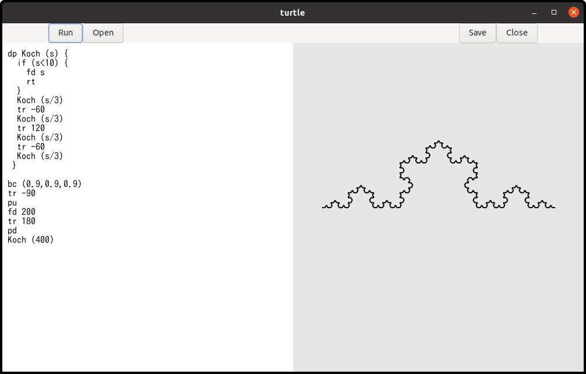
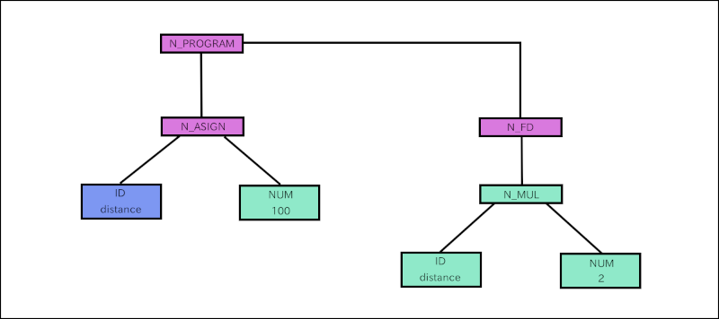
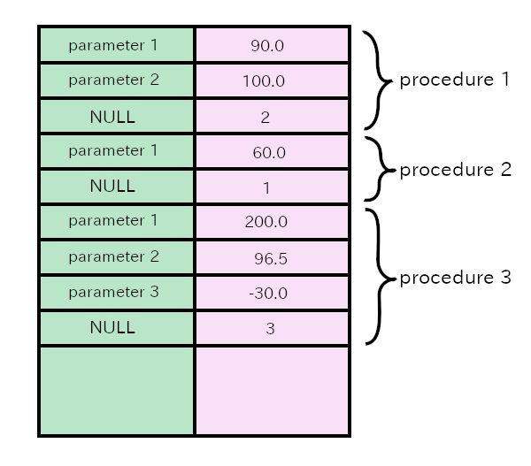
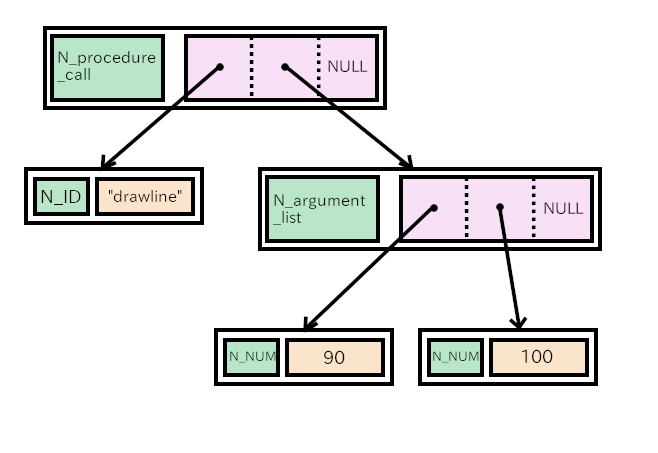

Up: [Readme.md](../Readme.md),  Prev: [Section 24](sec24.md), Next: [Section 26](sec26.md)

# Tiny turtle graphics interpreter

A program `turtle` is an example with the combination of TfeTextView and GtkDrawingArea objects.
It is a very small interpreter but it provides a tool to draw fractal curves.
The following diagram is a Koch curve, which is a famous example of fractal curves.

This program uses flex and bison.
Flex is a lexical analyzer.
Bison is a parser generator.
These two programs are similar to lex and yacc which are proprietary software developed in Bell Laboratory.
However, flex and bison are open source software.
I will write about how to use those software, but they are not topics about gtk.
So, readers can skip that part of this sections.

## How to use turtle

The documentation of turtle is [here](turtle_doc.md).
I'll show you a simple example.

~~~
fc (1,0,0) # Foreground color is red, rgb = (1,0,0).
pd         # Pen down.
fd 100     # Go forward by 100 pixels.
tr 90      # Turn right by 90 degrees.
fd 100
tr 90
fd 100
tr 90
fd 100
tr 90
~~~

1. Compile and install `turtle` (See the documentation above).
Then, run `turtle`.
2. Type the program above in the editor (left part of the window).
3. Click on the `Run` button, then a red square appears on the right part of the window.
The side of the square is 100 pixels long.

In the same way, you can draw other curves.
The documentation above shows some fractal curves such as tree, snow and square-koch.
The source code in turtle language is located at [src/turtle/example](../src/turtle/example) directory.
You can read these files into `turtle` editor by clicking on the `Open` button.

## Combination of TfeTextView and GtkDrawingArea objects

Turtle uses TfeTextView and GtkDrawingArea.
It is similar to `color` program in the previous section.

1. A user inputs/reads a turtle program into the buffer in the TfeTextView instance.
2. The user clicks on the "Run" button.
3. The parser reads the program and generates tree-structured data.
4. The interpriter reads the data and executes it step by step.
And it draws shapes on a surface.
The surface is different from the surface of the GtkDrawingArea widget.
5. The widget is added to the queue.
It will be redrawn with the drawing function.
The function just copies the surface, which is drawn by the interpreter, into the surface of the GtkDrawingArea.

The body of the interpreter is written with flex and bison.
The codes are not thread safe.
So the handler of "clicked" signal of the `Run` button prevents from reentering.

~~~C
 1 void
 2 run_cb (GtkWidget *btnr) {
 3   GtkTextBuffer *tb = gtk_text_view_get_buffer (GTK_TEXT_VIEW (tv));
 4   GtkTextIter start_iter;
 5   GtkTextIter end_iter;
 6   char *contents;
 7   int stat;
 8   static gboolean busy = FALSE;
 9 
10   /* yyparse() and run() are NOT thread safe. */
11   /* The variable busy avoids reentry. */
12   if (busy)
13     return;
14   busy = TRUE;
15   gtk_text_buffer_get_bounds (tb, &start_iter, &end_iter);
16   contents = gtk_text_buffer_get_text (tb, &start_iter, &end_iter, FALSE);
17   if (surface) {
18     init_flex (contents);
19     stat = yyparse ();
20     if (stat == 0) /* No error */ {
21       run ();
22     }
23     finalize_flex ();
24   }
25   g_free (contents);
26   gtk_widget_queue_draw (GTK_WIDGET (da));
27   busy = FALSE;
28 }
29 
30 static void
31 resize_cb (GtkDrawingArea *drawing_area, int width, int height, gpointer user_data) {
32   if (surface)
33     cairo_surface_destroy (surface);
34   surface = cairo_image_surface_create (CAIRO_FORMAT_ARGB32, width, height);
35 }
~~~

- 8-13: The static value `busy` holds a status of the interpreter.
If it is `TRUE`, the interpreter is running and it is not possible to call the interpreter again because it's not a re-entrant program.
If it is `FALSE`, it is safe to call the interpreter.
- 14: Now it is about to call the interpreter so it changes `busy` to TRUE.
- 15-16: Gets the contents of `tb`.
- 17: The variable `surface` is a static variable.
It points to a `cairo_surface_t` instance.
It is created when the GtkDrawingArea instance is realized and whenever it is resized.
Therefore, `surface` isn't NULL usually.
But if it is NULL, the interpreter won't be called.
- 18: Initializes lexical analyzer.
- 19: Calls parser.
Parser analyzes the program codes syntactically and generate a tree structured data.
- 20-22: If the parser successfully parsed, it calls `run` (runtime routine).
- 23: finalizes the lexical analyzer.
- 25: frees `contents`.
- 26: Adds the drawing area widget to the queue to draw.
- 27: The interpreter program has finished so `busy` is now changed to FALSE.
- 29-34: A handler of "resized" signal.
If `surface` isn't NULL, it destroys the old surface.
Then it creates a new surface.
Its size is the same as the surface of the GtkDrawingArea instance.

Other part of `turtleapplication.c` is almost same as the codes of `colorapplication.c` in the previous section.
The codes of `turtleapplication.c` is in the [turtle directory](../src/turtle).

## What does the interpreter do?

Suppose that the turtle runs with the following program.

~~~
distance = 100
fd distance*2
~~~

The turtle recognizes the program above and works as follows.

- Generally, a program consists of tokens.
Tokens are "distance", "=", "100", "fd", "*" and "2" in the above example..
- The parser calls a function `yylex` to read a token in the source file.
`yylex` returns a code which is called "token kind" and sets a global variable `yylval` with a value, which is called a semantic value.
The type of `yylval` is union and `yylval.ID` is string and `yylval.NUM` is double.
There are seven tokens in the program so `yylex` is called seven times.

|   |token kind|yylval.ID|yylval.NUM|
|:-:|:--------:|:-------:|:--------:|
| 1 |    ID    |distance |          |
| 2 |    =     |         |          |
| 3 |   NUM    |         |   100    |
| 4 |    FD    |         |          |
| 5 |    ID    |distance |          |
| 6 |    *     |         |          |
| 7 |   NUM    |         |    2     |

- `yylex` returns a token kind every time, but it doesn't set `yylval.ID` or `yylval.NUM` every time.
It is because keywords (`FD`) and symbols (`=` and `*`) don't have any semantic values.
The function `yylex` is called lexical analyzer or scanner.
- `turtle` makes a tree structured data.
This part of `turtle` is called parser.

- `turtle` analyzes the tree and executes it.
This part of `turtle` is called runtime routine or interpreter.
The tree consists of rectangles and line segments between the rectangles.
The rectangles are called nodes.
For example, N\_PROGRAM, N\_ASSIGN, N\_FD and N\_MUL are nodes.
  1. Goes down from N\_PROGRAM to N\_ASSIGN.
  2. N_ASSIGN node has two children, ID and NUM.
This node comes from "distance = 100" which is "ID = NUM" syntactically.
First, `turtle` checks if the first child is ID.
If it's ID, then `turtle` looks for the variable in the variable table.
If it doesn't exist, it registers the ID (`distance`) to the table.
Then go back to the N\_ASSIGN node.
  3. `turtle` calculates the second child.
In this case its a number 100.
Saves 100 to the variable table at the `distance` record.
  4. `turtle` goes back to N\_PROGRAM then go to the next node N\_FD.
It has only one child.
Goes down to the child N\_MUL.
  5. The first child is ID (distance).
Searches the variable table for the variable `distance` and gets the value 100.
The second child is a number 2.
Multiplies 100 by 2 and gets 200.
Then `turtle` goes back to N_FD.
  6. Now `turtle` knows the distance is 200.
It moves the cursor forward by 200 pixels.
The segment is drawn on the surface (`surface`).
  8. There are no node follows.
Runtime routine returns to the function `run_cb`.

- `run_cb` calls `gtk_widget_queue_draw` and put the GtkDrawingArea widget to the queue.
- The system redraws the widget.
At that time drawing function `draw_func` is called.
The function copies the surface (`surface`) to the surface in the GtkDrawingArea.

Actual turtle program is more complicated than the example above.
However, what turtle does is basically the same.
Interpretation consists of three parts.

- Lexical analysis
- Syntax Parsing and tree generation
- Interpretation and execution of the tree.

## Compilation flow

The source files are:

- flex source file => `turtle.lex`
- bison source file => `turtle.y`
- C header file => `turtle.h`, `turtle_lex.h`
- C source file => `turtleapplication.c`
- other files => `turtle.ui`, `turtle.gresources.xml` and `meson.build`

The compilation process is a bit complicated.

1. glib-compile-resources compiles `turtle.ui` to `resources.c` according to `turtle.gresource.xml`.
It also generates `resources.h`.
2. bison compiles `turtle.y` to `turtle_parser.c` and generates `turtle_parser.h`
3. flex compiles `turtle.lex` to `turtle_lex.c`.
4. gcc compiles `application.c`, `resources.c`, `turtle_parser.c` and `turtle_lex.c` with `turtle.h`, `turtle_lex.h`, `resources.h` and `turtle_parser.h`.
It generates an executable file `turtle`.

Meson controls the process and the instruction is described in `meson.build`.

~~~meson
 1 project('turtle', 'c')
 2 
 3 compiler = meson.get_compiler('c')
 4 mathdep = compiler.find_library('m', required : true)
 5 
 6 gtkdep = dependency('gtk4')
 7 
 8 gnome=import('gnome')
 9 resources = gnome.compile_resources('resources','turtle.gresource.xml')
10 
11 flex = find_program('flex')
12 bison = find_program('bison')
13 turtleparser = custom_target('turtleparser', input: 'turtle.y', output: ['turtle_parser.c', 'turtle_parser.h'], command: [bison, '-d', '-o', 'turtle_parser.c', '@INPUT@'])
14 turtlelexer = custom_target('turtlelexer', input: 'turtle.lex', output: 'turtle_lex.c', command: [flex, '-o', '@OUTPUT@', '@INPUT@'])
15 
16 sourcefiles=files('turtleapplication.c', '../tfetextview/tfetextview.c')
17 
18 executable('turtle', sourcefiles, resources, turtleparser, turtlelexer, turtleparser[1], dependencies: [mathdep, gtkdep], export_dynamic: true, install: true)
19 
~~~

- 3: Gets C compiler.
It is usually `gcc` in linux.
- 4: Gets math library.
This program uses trigonometric functions.
They are defined in the math library, but the library is optional.
So, it is necessary to include it by `#include <math.h>` and also link the library with the linker.
- 6: Gets gtk4 library.
- 8: Gets gnome module.
Module is a system provided by meson.
See [Meson build system website, GNUME module](https://mesonbuild.com/Gnome-module.html#gnome-module) for further information.
- 9: Compiles ui file to C source file according to the XML file `turtle.gresource.xml`.
- 11: Gets flex.
- 12: Gets bison.
- 13: Compiles `turtle.y` to `turtle_parser.c` and `turtle_parser.h` by bison.
The function `custom_target` creates a custom top level target.
See [Meson build system website, custom target](https://mesonbuild.com/Reference-manual.html#custom_target) for further information.
- 14: Compiles `turtle.lex` to `turtle_lex.c` by flex.
- 16: Specifies C source files.
- 18: Compiles C source files including generated files by glib-compile-resources, bison and flex.
The argument `turtleparser[1]` refers to `tirtle_parser.h` which is the second output in the line 13.

## Turtle.lex

### What does flex do?

Flex creates lexical analyzer from flex source file.
Flex source file is a text file.
Its syntactic rule will be explained later.
Generated lexical analyzer is a C source file.
It is also called scanner.
It reads a text file, which is a source file of a program language, and gets variable names, numbers and symbols.
Suppose here is a turtle source file.

~~~
fc (1,0,0) # Foreground color is red, rgb = (1,0,0).
pd         # Pen down.
distance = 100
angle = 90
fd distance    # Go forward by distance (100) pixels.
tr angle     # Turn right by angle (90) degrees.
~~~

The content of the text file is separated into `fc`, `(`, `1` and so on.
The words `fc`, `pd`, `distance`, `angle`, `tr`, `1`, `0`, `100` and `90` are called tokens.
The characters '`(`' (left parenthesis), '`,`' (comma), '`)`' (right parenthesis) and '`=`' (equal sign) are called symbols.
( Sometimes those symbols called tokens, too.)

Flex reads `turtle.lex` and generates the C source file of a scanner.
The file `turtle.lex` specifies tokens, symbols and the behavior which corresponds to each token or symbol.
Turtle.lex isn't a big program.

~~~lex
 1 %top{
 2 #include <string.h>
 3 #include <stdlib.h>
 4 #include "turtle.h"
 5 
 6   static int nline = 1;
 7   static int ncolumn = 1;
 8   static void get_location (char *text);
 9 
10   /* Dinamically allocated memories are added to the single list. They will be freed in the finalize function. */
11   extern GSList *list;
12 }
13 
14 %option noyywrap
15 
16 REAL_NUMBER (0|[1-9][0-9]*)(\.[0-9]+)?
17 IDENTIFIER [a-zA-Z][a-zA-Z0-9]*
18 %%
19   /* rules */
20 #.*               ; /* comment. Be careful. Dot symbol (.) matches any character but new line. */
21 [ ]               ncolumn++;
22 \t                ncolumn += 8; /* assume that tab is 8 spaces. */
23 \n                nline++; ncolumn = 1;
24   /* reserved keywords */
25 pu                get_location (yytext); return PU; /* pen up */
26 pd                get_location (yytext); return PD; /* pen down */
27 pw                get_location (yytext); return PW; /* pen width = line width */
28 fd                get_location (yytext); return FD; /* forward */
29 tr                get_location (yytext); return TR; /* turn right */
30 bc                get_location (yytext); return BC; /* background color */
31 fc                get_location (yytext); return FC; /* foreground color */
32 dp                get_location (yytext); return DP; /* define procedure */
33 if                get_location (yytext); return IF; /* if statement */
34 rt                get_location (yytext); return RT; /* return statement */
35 rs                get_location (yytext); return RS; /* reset the status */
36   /* constant */
37 {REAL_NUMBER}     get_location (yytext); yylval.NUM = atof (yytext); return NUM;
38   /* identifier */
39 {IDENTIFIER}      { get_location (yytext); yylval.ID = g_strdup(yytext);
40                     list = g_slist_prepend (list, yylval.ID);
41                     return ID;
42                   }
43 "="               get_location (yytext); return '=';
44 ">"               get_location (yytext); return '>';
45 "<"               get_location (yytext); return '<';
46 "+"               get_location (yytext); return '+';
47 "-"               get_location (yytext); return '-';
48 "*"               get_location (yytext); return '*';
49 "/"               get_location (yytext); return '/';
50 "("               get_location (yytext); return '(';
51 ")"               get_location (yytext); return ')';
52 "{"               get_location (yytext); return '{';
53 "}"               get_location (yytext); return '}';
54 ","               get_location (yytext); return ',';
55 .                 ncolumn++;             return YYUNDEF;
56 %%
57 
58 static void
59 get_location (char *text) {
60   yylloc.first_line = yylloc.last_line = nline;
61   yylloc.first_column = ncolumn;
62   yylloc.last_column = (ncolumn += strlen(text)) - 1;
63 }
64 
65 static YY_BUFFER_STATE state;
66 
67 void
68 init_flex (const char *text) {
69   state = yy_scan_string (text);
70 }
71 
72 void
73 finalize_flex (void) {
74   yy_delete_buffer (state);
75 }
76 
~~~

The file consists of three sections which are separated by "%%" (line 18 and 56).
They are definitions, rules and user code sections.

### Definitions section

- 1-12: Lines between "%top{" and "}" are C source codes.
They will be copied to the top of the generated C source file.
- 2-3: The function `strlen`, in line 62, is defined in `string.h`
The function `atof`, in line 37, is defined in `stdlib.h`.
- 6-8: The current input position is pointed by `nline` and `ncolumn`.
The function `get_location` (line 58-63) sets `yylloc`to point the start and end point of `yytext` in the buffer.
This function is declared here so that it can be called before the function is defined.
- 11: GSlist is used to keep allocated memories.
- 14: This option (`%option noyywrap`) must be specified when you have only single source file to the scanner. Refer to "9 The Generated Scanner" in the flex documentation in your distribution for further information.
(The documentation is not on the internet.)
- 16-17: `REAL_NUMBER` and `IDENTIFIER` are names.
A name begins with a letter or an underscore followed by zero or more letters, digits, underscores (`_`) or dashes (`-`).
They are followed by regular expressions which are their definition.
They will be used in rules section and will expand to the definition.
You can leave out such definitions here and use regular expressions in rules section directly.

### Rules section

This section is the most important part.
Rules consist of patterns and actions.
The patterns are regular expressions or names surrounded by braces.
The names must be defined in the definitions section.
The definition of the regular expression is written in the flex documentation.

For example, line 37 is a rule.

- `{REAL_NUMBER}` is a pattern
- `get_location (yytext); yylval.NUM = atof (yytext); return NUM;` is an action.

`{REAL_NUMBER}` is defined in the 16th line, so it expands to `(0|[1-9][0-9]*)(\.[0-9]+)?`.
This regular expression matches numbers like `0`, `12` and `1.5`.
If the input is a number, it matches the pattern in line 37.
Then the matched text is assigned to `yytext` and corresponding action is executed.
A function `get_location` changes the location variables.
It assigns `atof (yytext)`, which is double sized number converted from `yytext`, to `yylval.NUM` and return `NUM`.
`NUM` is an integer defined by `turtle.y`.

The scanner generated by flex and C compiler has `yylex` function.
If `yylex` is called and the input is "123.4", then it works as follows.

1. A string "123.4" matches `{REAL_NUMBER}`.
2. Update the location variable `ncolumn` and `yylloc`with `get_location`.
3. `atof` converts the string "123.4" to double type number 123.4.
4. It is assigned to `yylval.NUM`.
5. `yylex` returns `NUM` to the caller.

Then the caller knows the input is `NUM` (number), and its value is 123.4.

- 19-55: Rules section.
- 20: The symbol `.` (dot) matches any character except newline.
Therefore, a comment begins `#` followed by any characters except newline.
No action happens.
- 21: White space just increases a variable `ncolumn` by one.
- 22: Tab is assumed to be equal to eight spaces.
- 23: New line increases a variable `nline` by one and resets `ncolumn`.
- 25-35: Keywords just updates the location variables `ncolumn` and `yylloc`, and return the codes of the keywords.
- 37: Real number constant.
- 38: `IDENTIFIER` is defined in line 17.
The location variables are updated and the name of the identifier is assigned to `yylval.ID`.
The memory of the name is allocated by the function `g_strdup`.
The memory is registered to the list (GSlist type list).
The memory will be freed after the runtime routine finishes.
Returns `ID`.
- 43-54: Symbols just update the location variable and return the codes.
The code is the same as the symbol itself.
- 55: If the input doesn't match above patterns, then it is error.
Returns `YYUNDEF`.

### User code section

This section is just copied to C source file.

- 58-63: A function `get_location`.
The location of the input is recorded to `nline` and `ncolumn`.
A variable `yylloc` is referred by the parser.
It is a C structure and has four members, `first_line`, `first_column`, `last_line` and `last_column`.
They point the start and end of the current input text.
- 65: `YY_BUFFER_STATE` is a pointer points the input buffer.
- 67-70: `init_flex` is called by `run_cb` signal handler, which is called when `Run` button is clicked on.
`run_cb` calls `init_flex` with one argument which is the copy of the content of GtkTextBuffer.
`yy_scan_string` sets the input buffer to read from the text.
- 72-75: `finalize_flex` is called after runtime routine finishes.
It deletes the input buffer.

## Turtle.y

Turtle.y has more than 800 lines so it is difficult to explain all the source code.
So I will explain the key points and leave out other less important parts.

### What does bison do?

Bison creates C source file from bison source file.
Bison source file is a text file.
A parser analyzes a program source code according to its grammar.
Suppose here is a turtle source file.

~~~
fc (1,0,0) # Foreground color is red, rgb = (1,0,0).
pd         # Pen down.
distance = 100
angle = 90
fd distance    # Go forward by distance (100) pixels.
tr angle     # Turn right by angle (90) degrees.
~~~

The parser calls `yylex` to get a token.
The token consists of its type (token kind) and value (semantic value).
So, the parser gets items in the following table whenever it calls `yylex`.

|   |token kind|yylval.ID|yylval.NUM|
|:-:|:--------:|:-------:|:--------:|
| 1 |    FC    |         |          |
| 2 |    (     |         |          |
| 3 |   NUM    |         |   1.0    |
| 4 |    ,     |         |          |
| 5 |   NUM    |         |   0.0    |
| 6 |    ,     |         |          |
| 7 |   NUM    |         |   0.0    |
| 8 |    )     |         |          |
| 9 |    PD    |         |          |
|10 |    ID    |distance |          |
|11 |    =     |         |          |
|12 |   NUM    |         |  100.0   |
|13 |    ID    |  angle  |          |
|14 |    =     |         |          |
|15 |   NUM    |         |   90.0   |
|16 |    FD    |         |          |
|17 |    ID    |distance |          |
|18 |    TR    |         |          |
|19 |    ID    |  angle  |          |

Bison source code specifies the grammar rules  of turtle language.
For example, `fc (1,0,0)` is called primary procedure.
A procedure is like a void type function in C source code.
It doesn't return any values.
Programmers can define their own procedures.
On the other hand, `fc` is a built-in procedure.
Such procedures are called primary procedures.
It is described in bison source code like:

~~~
primary_procedure: FC '(' expression ',' expression ',' expression ')';
expression: ID | NUM;
~~~

This means:

- Primary procedure is FC followed by '(', expression, ',', expression, ',', expression and ')'.
- expression is ID or NUM.

The description above is called BNF (Backus-Naur form).
More precisely, it is similar to BNF.

The first line is:

~~~
FC '(' NUM ',' NUM ',' NUM ')';
~~~

The parser analyzes the turtle source code and if the input matches the definition above, the parser recognizes it as a primary procedure.

The grammar of turtle is described in the [document](turtle_doc.md).
The following is an extract from the document.

~~~
program:
  statement
| program statement
;

statement:
  primary_procedure
| procedure_definition
;

primary_procedure:
  PU
| PD
| PW expression
| FD expression
| TR expression
| BC '(' expression ',' expression ',' expression ')'
| FC '(' expression ',' expression ',' expression ')'
| ID '=' expression
| IF '(' expression ')' '{' primary_procedure_list '}'
| RT
| RS
| ID '(' ')'
| ID '(' argument_list ')'
;

procedure_definition:
  DP ID '('  ')' '{' primary_procedure_list '}'
| DP ID '(' parameter_list ')' '{' primary_procedure_list '}'
;

parameter_list:
  ID
| parameter_list ',' ID
;

argument_list:
  expression
| argument_list ',' expression
;

primary_procedure_list:
  primary_procedure
| primary_procedure_list primary_procedure
;

expression:
  expression '=' expression
| expression '>' expression
| expression '<' expression
| expression '+' expression
| expression '-' expression
| expression '*' expression
| expression '/' expression
| '-' expression %prec UMINUS
| '(' expression ')'
| ID
| NUM
;
~~~

The grammar rule defines `program` first.

- program is a statement or a program followed by a statement.

The definition is recursive.

- `statement` is program.
- `statement statement` is `program statemet`.
Therefore, it is program.
- `statement statement statement` is `program statemet`.
Therefore, it is program.

You can find that a list of statements is program like this.

`program` and `statement` aren't tokens.
They don't appear in the input.
They are called non terminal symbols.
On the other hand, tokens are called terminal symbols.
The word "token" used here has wide meaning, it includes tokens and symbols which appear in the input.
Non terminal symbols are often shortened to nterm.

Let's analyze the program above as bison does.

|   |token kind|yylval.ID|yylval.NUM|parse                               |S/R|
|:-:|:--------:|:-------:|:--------:|:-----------------------------------|:-:|
| 1 |    FC    |         |          |FC                                  | S |
| 2 |    (     |         |          |FC(                                 | S |
| 3 |   NUM    |         |   1.0    |FC(NUM                              | S |
|   |          |         |          |FC(expression                       | R |
| 4 |    ,     |         |          |FC(expression,                      | S |
| 5 |   NUM    |         |   0.0    |FC(expression,NUM                   | S |
|   |          |         |          |FC(expression,expression            | R |
| 6 |    ,     |         |          |FC(expression,expression,           | S |
| 7 |   NUM    |         |   0.0    |FC(expression,expression,NUM        | S |
|   |          |         |          |FC(expression,expression,expression | R |
| 8 |    )     |         |          |FC(expression,expression,expression)| S |
|   |          |         |          |primary_procedure                   | R |
|   |          |         |          |statement                           | R |
|   |          |         |          |program                             | R |
| 9 |    PD    |         |          |program PD                          | S |
|   |          |         |          |program primary_procedure           | R |
|   |          |         |          |program statement                   | R |
|   |          |         |          |program                             | R |
|10 |    ID    |distance |          |program ID                          | S |
|11 |    =     |         |          |program ID=                         | S |
|12 |   NUM    |         |  100.0   |program ID=NUM                      | S |
|   |          |         |          |program ID=expression               | R |
|   |          |         |          |program primary_procedure           | R |
|   |          |         |          |program statement                   | R |
|   |          |         |          |program                             | R |
|13 |    ID    |  angle  |          |program ID                          | S |
|14 |    =     |         |          |program ID=                         | S |
|15 |   NUM    |         |   90.0   |program ID=NUM                      | S |
|   |          |         |          |program ID=expression               | R |
|   |          |         |          |program primary_procedure           | R |
|   |          |         |          |program statement                   | R |
|   |          |         |          |program                             | R |
|16 |    FD    |         |          |program FD                          | S |
|17 |    ID    |distance |          |program FD ID                       | S |
|   |          |         |          |program FD expression               | R |
|   |          |         |          |program primary_procedure           | R |
|   |          |         |          |program statement                   | R |
|   |          |         |          |program                             | R |
|18 |    TR    |         |          |program TR                          | S |
|19 |    ID    |  angle  |          |program TR ID                       | S |
|   |          |         |          |program TR expression               | R |
|   |          |         |          |program primary_procedure           | R |
|   |          |         |          |program statement                   | R |
|   |          |         |          |program                             | R |

The right most column shows shift/reduce.
Shift is appending an input to the buffer.
Reduce is substituting a higher nterm for the pattern in the buffer.
For example, NUM is replaced by expression in the forth row.
This substitution is "reduce".

Bison repeats shift and reduction until the end of the input.
If the result is reduced to `program`, the input is syntactically valid.
Bison executes an action whenever reduction occurs.
Actions build a tree.
The tree is analyzed and executed by runtime routine later.

Bison source files are called bison grammar files.
A bison grammar file consists of four sections, prologue, declarations, rules and epilogue.
The format is as follows.

~~~
%{
prologue
%}
declarations
%%
rules
%%
epilogue
~~~

### Prologue

Prologue section consists of C codes and the codes are copied to the parser implementation file.
You can use `%code` directives to qualify the prologue and identifies the purpose explicitly.
The following is an extract from `turtle.y`.

~~~bison
%code top{
  #include <stdarg.h>
  #include <setjmp.h>
  #include <math.h>
  #include "turtle.h"

  /* error reporting */
  static void yyerror (char const *s) { /* for syntax error */
    g_print ("%s from line %d, column %d to line %d, column %d\n",s, yylloc.first_line, yylloc.first_column, yylloc.last_line, yylloc.last_column);
  }
  /* Node type */
  enum {
    N_PU,
    N_PD,
    N_PW,
 ... ... ...
  };
}
~~~

The directive `%code top` copies its contents to the top of the parser implementation file.
It usually includes `#include` directives, declarations of functions and definitions of constants.
A function `yyerror` reports a syntax error and is called by the parser.
Node type identifies a node in the tree.

Another directive `%code requires` copies its contents to both the parser implementation file and header file.
The header file is read by the scanner C source file and other files.

~~~bison
%code requires {
  int yylex (void);
  int yyparse (void);
  void run (void);

  /* semantic value type */
  typedef struct _node_t node_t;
  struct _node_t {
    int type;
    union {
      struct {
        node_t *child1, *child2, *child3;
      } child;
      char *name;
      double value;
    } content;
  };
}
~~~

- `yylex` is shared by parser implementation file and scanner file.
- `yyparse` and `run` is called by `run_cb` in `turtleapplication.c`.
- `node_t` is the type of the semantic value of nterms.
The header file defines `YYSTYPE`, which is the semantic value type, with all the token and nterm value types.
The following is extracted from the header file.

~~~
/* Value type.  */
#if ! defined YYSTYPE && ! defined YYSTYPE_IS_DECLARED
union YYSTYPE
{
  char * ID;                               /* ID  */
  double NUM;                              /* NUM  */
  node_t * program;                        /* program  */
  node_t * statement;                      /* statement  */
  node_t * primary_procedure;              /* primary_procedure  */
  node_t * primary_procedure_list;         /* primary_procedure_list  */
  node_t * procedure_definition;           /* procedure_definition  */
  node_t * parameter_list;                 /* parameter_list  */
  node_t * argument_list;                  /* argument_list  */
  node_t * expression;                     /* expression  */
};
~~~

Other useful macros and declarations are put into the `%code` directive.

~~~
%code {
/* The following macro is convenient to get the member of the node. */
  #define child1(n) (n)->content.child.child1
  #define child2(n) (n)->content.child.child2
  #define child3(n) (n)->content.child.child3
  #define name(n) (n)->content.name
  #define value(n) (n)->content.value

  /* start of nodes */
  static node_t *node_top = NULL;
  /* functions to generate trees */
  static node_t *tree1 (int type, node_t *child1, node_t *child2, node_t *child3);
  static node_t *tree2 (int type, double value);
  static node_t *tree3 (int type, char *name);
}
~~~

### Bison declarations

Bison declarations defines terminal and non-terminal symbols.
It also specifies some directives.

~~~
%locations
%define api.value.type union /* YYSTYPE, the type of semantic values, is union of following types */
 /* key words */
%token PU
%token PD
%token PW
%token FD
%token TR
%token BC
%token FC
%token DP
%token IF
%token RT
%token RS
 /* constant */
%token <double> NUM
 /* identirier */
%token <char *> ID
 /* non terminal symbol */
%nterm <node_t *> program
%nterm <node_t *> statement
%nterm <node_t *> primary_procedure
%nterm <node_t *> primary_procedure_list
%nterm <node_t *> procedure_definition
%nterm <node_t *> parameter_list
%nterm <node_t *> argument_list
%nterm <node_t *> expression
 /* logical relation symbol */
%left '=' '<' '>'
 /* arithmetic symbol */
%left '+' '-'
%left '*' '/'
%precedence UMINUS /* unary minus */
~~~

`%locations` directive inserts the location structure into the header file.
It is like this.

~~~
typedef struct YYLTYPE YYLTYPE;
struct YYLTYPE
{
  int first_line;
  int first_column;
  int last_line;
  int last_column;
};
~~~

This type is shared by the scanner file and the parser implementation file.
The error report function `yyerror` uses it so that it can inform the location that error occurs.

`%define api.value.type union` generates semantic value type with tokens and nterms and inserts it to the header file.
The inserted part is shown in the previous subsection as the extracts that shows the value type (YYSTYPE).

`%token` and `%nterm` directives define tokens and non terminal symbols respectively.

~~~
%token PU
... ...
%token <double> NUM
~~~

These directives define a token `PU` and `NUM`.
The values of token kinds `PU` and `NUM` are defined as an enumeration constant in the header file.

~~~
  enum yytokentype
  {
  ... ... ...
    PU = 258,                      /* PU  */
  ... ... ...
    NUM = 269,                     /* NUM  */
  ... ... ...
  };
  typedef enum yytokentype yytoken_kind_t;
~~~

In addition, the type of the semantic value of `NUM` is defined as double in the header file because of `<double>` tag.

~~~
union YYSTYPE
{
  char * ID;                               /* ID  */
  double NUM;                              /* NUM  */
  ... ...
}
~~~

All the nterm symbols have the same type `* node_t` of the semantic value.

`%left` and `%precedence` directives define the precedence of operation symbols.

~~~
 /* logical relation symbol */
%left '=' '<' '>'
 /* arithmetic symbol */
%left '+' '-'
%left '*' '/'
%precedence UMINUS /* unary minus */
~~~

`%left` directive defines the following symbols as left-associated operators.
If an operator `+` is left-associated, then

~~~
A + B + C = (A + B) + C
~~~

That is, the calculation is carried out the left operator first, then the right operator.
If an operator `*` is right-associated, then:

~~~
A * B * C = A * (B * C)
~~~

The definition above decides the behavior of the parser.
Addition and multiplication hold associative law so the result of `(A+B)+C` and `A+(B+C)` are equal in terms of mathematics.
However, the parser will be confused if left (or right) associativity is not specified.

`%left` and `%precedence` directives show the precedence of operators.
Later declared operators have higher precedence than former declared ones.
The declaration above says, for example,

~~~
v=w+z*5+7 is the same as v=((w+(z*5))+7)
~~~

Be careful.
The operator `=` above is an assignment.
Assignment is not expression in turtle language.
It is primary_procedure.
But if `=` appears in an expression, it is a logical operater, not an assignment.
The logical equal '`=`' usually used in the conditional expression, for example, in `if` statement.

### Grammar rules

Grammar rules section defines the syntactic grammar of the language.
It is similar to BNF form.

~~~
result: components { action };
~~~

- result is a nterm.
- components are list of tokens or nterms.
- action is C codes. It is executed whenever the components are reduced to the result.
Action can be left out.

The following is a part of the grammar rule in `turtle.y`.

~~~
program:
  statement { node_top = $$ = $1; }
;
statement:
  primary_procedure
;
primary_procedure:
  FD expression    { $$ = tree1 (N_FD, $2, NULL, NULL); }
;
expression:
  NUM   { $$ = tree2 (N_NUM, $1); }
;
~~~

- `program` is `statement`.
- Whenever `statement` is reduced to `program`, an action `node_top=$$=$1;` is executed.
- `node_top` is a static variable.
It points the top node of the tree.
- `$$` is a semantic value of the result, which is `program` in the second line of the example above.
The semantic value of `program` is a pointer to `node_t` type structure.
It was defined in the declaration section.
- `$1` is a semantic value of the first component, which is `statement`.
The semantic value of `statement` is also a pointer to `node_t`.
- `statement` is `primary_procedure`.
There's no action specified.
Then, the default action is executed.
It is ` $$ = $1`.
- `primary_procedure` is `FD` followed by expression.
The action calls `tree1` and assigns its return value to `$$`.
`tree1` makes a tree node.
The tree node has type and union of three pointers to children nodes, string or double.
~~~
node --+-- type
       +-- union contents
                    +---struct {node_t *child1, *child2, *child3;};
                    +---char *name
                    +---double value
~~~
- `tree1` assigns the four arguments to type, child1, child2 and child3 members.
- `expression` is `NUM`.
- `tree2` makes a tree node. The paremeters of `tree2` are a type and a semantic value.

Suppose the parser reads the following program.

~~~
fd 100
~~~

What does the parser do?

1. The parser recognizes the input is `FD`.
Maybe it is the start of `primary_procedure`, but parser needs to read the next token.
2. `yylex` returns the token kind `NUM` and sets `yylval.NUM` to 100.0 (the type is double). The parser reduces `NUM` to `expression`.
At the same time, it sets the semantic value of the `expression` to point a new node.
The node has an type `N_NUM` and a semantic value 100.0.
3. After the reduction, the buffer has `FD` and `expression`.
The parser reduces it to `primary_procedure`.
And it sets the semantic value of the `primary_procedure` to point a new node.
The node has an type `N_FD` and its member child1 points the node of `expression`, whose type is `N_NUM`.
4. The parser reduces `primary_procedure` to `statement`.
The semantic value of `statement` is the same as the one of `primary_procedure`,
which points to the node `N_FD`.
5. The parser reduces `statement` to `program`.
The semantic value of `statement` is assigned to the one of `program` and the static variable `node_top`.
6. Finally `node_top` points the node `N_FD` and the node `N_FD` points the node `N_NUM`.

The following is the grammar rule extracted from `turtle.y`.
The rules there are based on the same idea above.
I don't want to explain the whole rules below.
Please look into each line carefully so that you will understand all the rules and actions.

~~~bison
program:
  statement { node_top = $$ = $1; }
| program statement {
        node_top = $$ = tree1 (N_program, $1, $2, NULL);
        }
;

statement:
  primary_procedure
| procedure_definition
;

primary_procedure:
  PU    { $$ = tree1 (N_PU, NULL, NULL, NULL); }
| PD    { $$ = tree1 (N_PD, NULL, NULL, NULL); }
| PW expression    { $$ = tree1 (N_PW, $2, NULL, NULL); }
| FD expression    { $$ = tree1 (N_FD, $2, NULL, NULL); }
| TR expression    { $$ = tree1 (N_TR, $2, NULL, NULL); }
| BC '(' expression ',' expression ',' expression ')' { $$ = tree1 (N_BC, $3, $5, $7); }
| FC '(' expression ',' expression ',' expression ')' { $$ = tree1 (N_FC, $3, $5, $7); }
 /* assignment */
| ID '=' expression   { $$ = tree1 (N_ASSIGN, tree3 (N_ID, $1), $3, NULL); }
 /* control flow */
| IF '(' expression ')' '{' primary_procedure_list '}' { $$ = tree1 (N_IF, $3, $6, NULL); }
| RT    { $$ = tree1 (N_RT, NULL, NULL, NULL); }
| RS    { $$ = tree1 (N_RS, NULL, NULL, NULL); }
 /* user defined procedure call */
| ID '(' ')'  { $$ = tree1 (N_procedure_call, tree3 (N_ID, $1), NULL, NULL); }
| ID '(' argument_list ')'  { $$ = tree1 (N_procedure_call, tree3 (N_ID, $1), $3, NULL); }
;

procedure_definition:
  DP ID '('  ')' '{' primary_procedure_list '}'  {
         $$ = tree1 (N_procedure_definition, tree3 (N_ID, $2), NULL, $6);
        }
| DP ID '(' parameter_list ')' '{' primary_procedure_list '}'  {
         $$ = tree1 (N_procedure_definition, tree3 (N_ID, $2), $4, $7);
        }
;

parameter_list:
  ID { $$ = tree3 (N_ID, $1); }
| parameter_list ',' ID  { $$ = tree1 (N_parameter_list, $1, tree3 (N_ID, $3), NULL); }
;

argument_list:
  expression
| argument_list ',' expression { $$ = tree1 (N_argument_list, $1, $3, NULL); }
;

primary_procedure_list:
  primary_procedure
| primary_procedure_list primary_procedure {
         $$ = tree1 (N_primary_procedure_list, $1, $2, NULL);
        }
;

expression:
  expression '=' expression { $$ = tree1 (N_EQ, $1, $3, NULL); }
| expression '>' expression { $$ = tree1 (N_GT, $1, $3, NULL); }
| expression '<' expression { $$ = tree1 (N_LT, $1, $3, NULL); }
| expression '+' expression { $$ = tree1 (N_ADD, $1, $3, NULL); }
| expression '-' expression { $$ = tree1 (N_SUB, $1, $3, NULL); }
| expression '*' expression { $$ = tree1 (N_MUL, $1, $3, NULL); }
| expression '/' expression { $$ = tree1 (N_DIV, $1, $3, NULL); }
| '-' expression %prec UMINUS { $$ = tree1 (N_UMINUS, $2, NULL, NULL); }
| '(' expression ')' { $$ = $2; }
| ID    { $$ = tree3 (N_ID, $1); }
| NUM   { $$ = tree2 (N_NUM, $1); }
;
~~~

### Epilogue

The epilogue is written in C language and copied to the parser implementation file.
Generally, you can put anything into the epilogue.
In the case of turtle interpreter, the runtime routine and some other functions are in the epilogue.

#### Functions to create tree nodes

There are three functions, `tree1`, `tree2` and `tree3`.

- `tree1` creates a node and sets the node type and pointers to its three children (NULL is possible).
- `tree2` creates a node and sets the node type and a value (double).
- `tree3` creates a node and sets the node type and a pointer to a string.

Each function gets memories first and build a node on them.
The memories are inserted to the list.
They will be freed when runtime routine finishes.

The three functions are called in the actions in the rules section.

~~~C
/* Dynamically allocated memories are added to the single list. They will be freed in the finalize function. */
GSList *list = NULL;

node_t *
tree1 (int type, node_t *child1, node_t *child2, node_t *child3) {
  node_t *new_node;

  list = g_slist_prepend (list, g_malloc (sizeof (node_t)));
  new_node = (node_t *) list->data;
  new_node->type = type;
  child1(new_node) = child1;
  child2(new_node) = child2;
  child3(new_node) = child3;
  return new_node;
}

node_t *
tree2 (int type, double value) {
  node_t *new_node;

  list = g_slist_prepend (list, g_malloc (sizeof (node_t)));
  new_node = (node_t *) list->data;
  new_node->type = type;
  value(new_node) = value;
  return new_node;
}

node_t *
tree3 (int type, char *name) {
  node_t *new_node;

  list = g_slist_prepend (list, g_malloc (sizeof (node_t)));
  new_node = (node_t *) list->data;
  new_node->type = type;
  name(new_node) = name;
  return new_node;
}
~~~

#### Symbol table

Variables and user defined procedures are registered in a symbol table.
This table is a C array.
It should be replaced by more appropriate data structure with memory allocation in the future version

- Variables are registered with its name and value.
- Procedures are registered with its name and a pointer to the node of the procedure.

Therefore the table has the following fields.

- type to identify variable or procedure
- name
- value or pointer to a node

~~~C
#define MAX_TABLE_SIZE 100
enum {
  PROC,
  VAR
};

typedef union _object_t object_t;
union _object_t {
  node_t *node;
  double value;
};

struct {
  int type;
  char *name;
  object_t object;
} table[MAX_TABLE_SIZE];
int tp;

void
init_table (void) {
  tp = 0;
}

~~~

`init_table` initializes the table.
This must be called before any registrations.

There are five functions to access the table,

- `proc_install` installs a procedure.
- `var_install` installs a variable.
- `proc_lookup` looks up a procedure. If the procedure is found, it returns a pointer to the node. Otherwise it returns NULL.
- `var_lookup` looks up a variable. If the variable is found, it returns TRUE and sets the pointer (argument) to point the value. Otherwise it returns FALSE.
- `var_replace` replaces the value of a variable. If the variable hasn't registered yet, it installs the variable.

~~~C
int
tbl_lookup (int type, char *name) {
  int i;

  if (tp == 0)
    return -1;
  for (i=0; i<tp; ++i)
    if (type == table[i].type && strcmp(name, table[i].name) == 0)
      return i;
  return -1;
}

void
tbl_install (int type, char *name, object_t object) {
  if (tp >= MAX_TABLE_SIZE)
    runtime_error ("Symbol table overflow.\n");
  else if (tbl_lookup (type, name) >= 0)
    runtime_error ("Name %s is already registered.\n", name);
  else {
    table[tp].type = type;
    table[tp].name = name;
    if (type == PROC)
      table[tp++].object.node = object.node;
    else
      table[tp++].object.value = object.value;
  }
}

void
proc_install (char *name, node_t *node) {
  object_t object;
  object.node = node;
  tbl_install (PROC, name, object);
}

void
var_install (char *name, double value) {
  object_t object;
  object.value = value;
  tbl_install (VAR, name, object);
}

void
var_replace (char *name, double value) {
  int i;
  if ((i = tbl_lookup (VAR, name)) >= 0)
    table[i].object.value = value;
  else
    var_install (name, value);
}

node_t *
proc_lookup (char *name) {
  int i;
  if ((i = tbl_lookup (PROC, name)) < 0)
    return NULL;
  else
    return table[i].object.node;
}

gboolean
var_lookup (char *name, double *value) {
  int i;
  if ((i = tbl_lookup (VAR, name)) < 0)
    return FALSE;
  else {
    *value = table[i].object.value;
    return TRUE;
  }
}
~~~

#### Stack for parameters and arguments

Stack is a last-in first-out data structure.
It is shortened to  LIFO.
Turtle uses a stack to keep parameters and arguments.
They are like `auto` class variables in C language.
They are pushed to the stack whenever the procedure is called.
LIFO structure is useful for recursive calls.

Each element of the stack has name and value.

~~~C
#define MAX_STACK_SIZE 500
struct {
  char *name;
  double value;
} stack[MAX_STACK_SIZE];
int sp, sp_biggest;

void
init_stack (void) {
  sp = sp_biggest = 0;
}
~~~

`sp` is a stack pointer.
It is an index of the array `stack` and it always points an element of the array to store the next data.
`sp_biggest` is the biggest number assigned to `sp`.
We can know the amount of elements used in the array during the runtime.
The purpose of the variable is to find appropriate `MAX_STACK_SIZE`.
It will be unnecessary in the future version if the stack is implemented with better data structure and memory allocation.

The runtime routine push data to the stack when it executes a node of a procedure call.
(The type of the node is `N_procedure_call`.)

~~~
dp drawline (angle, distance) { ... ... ... }
drawline (90, 100)
~~~

- The first line defines a procedure `drawline`.
The runtime routine stores the name `drawline` and the node of the procedure to the symbol table.
- The second line calls the procedure.
First, it looks for the procedure in the symbol table and gets its node.
Then it searches the node for the parameters and gets `angle` and `distance`.
- It pushes ("distance", 100.0) to the stack.
- It pushes ("angle", 90.0) to the stack.
- It pushes (NULL, 2.0) to the stack.
The number 2.0 is the number of parameters (or arguments).
It is used when the procedure returns.

The following diagram shows the structure of the stack.
First, `procedure 1` is called.
The procedure has two parameters.
In the `procedure 1`, another procedure `procedure 2`, which has one parameter, is called.
And in the `procedure 2`, `procedure 3`, which has three parameters, is called.

Programs push data to a stack from a low address memory to a high address memory.
In the following diagram, the lowest address is at the top and the highest address is at the bottom.
That is the order of the address.
However, "the top of the stack" is the last pushed data and "the bottom of the stack" is the first pushed data.
Therefore, "the top of the stack" is the bottom of the rectangle in the diagram and "the bottom of the stack" is the top of the rectangle.

There are four functions to access the stack.

- `stack_push` pushes data to the stack.
- `stack_lookup` searches the stack for the variable given its name as an argument.
It searches only the parameters of the latest procedure.
It returns TRUE and sets the argument `value` to point the value, if the variable has been found.
Otherwise it returns FALSE.
- `stack_replace` replaces the value of the variable in the stack.
If it succeeds, it returns TRUE. Otherwise returns FALSE.
- `stack_return` throws away the latest parameters.
The stack pointer goes back to the point before the latest procedure call so that it points to parameters of the previous called procedure.

~~~C
void
stack_push (char *name, double value) {
  if (sp >= MAX_STACK_SIZE)
    runtime_error ("Stack overflow.\n");
  else {
    stack[sp].name = name;
    stack[sp++].value = value;
    sp_biggest = sp > sp_biggest ? sp : sp_biggest;
  }
}

int
stack_search (char *name) {
  int depth, i;

  if (sp == 0)
    return -1;
  depth = (int) stack[sp-1].value;
  if (depth + 1 > sp) /* something strange */
    runtime_error ("Stack error.\n");
  for (i=0; i<depth; ++i)
    if (strcmp(name, stack[sp-(i+2)].name) == 0) {
      return sp-(i+2);
    }
  return -1;
}

gboolean
stack_lookup (char *name, double *value) {
  int i;

  if ((i = stack_search (name)) < 0)
    return FALSE;
  else {
    *value = stack[i].value;
    return TRUE;
  }
}

gboolean
stack_replace (char *name, double value) {
  int i;

  if ((i = stack_search (name)) < 0)
    return FALSE;
  else {
    stack[i].value = value;
    return TRUE;
  }
}

void
stack_return(void) {
  int depth;

  if (sp <= 0)
    return;
  depth = (int) stack[sp-1].value;
  if (depth + 1 > sp) /* something strange */
    runtime_error ("Stack error.\n");
  sp -= depth + 1;
}
~~~

#### Surface and cairo

A global variable `surface` is shared by `turtleapplication.c` and `turtle.y`.
It is initialized in `turtleapplication.c`.

The runtime routine has its own cairo context.
This is different from the cairo of GtkDrawingArea.
Runtime routine draws a shape on the `surface` with the cairo context.
After runtime routine returns to `run_cb`, `run_cb` adds the GtkDrawingArea widget to the queue to redraw.
When the widget is redraw,the drawing function `draw_func` is called.
It copies the `surface` to the surface in the GtkDrawingArea object.

`turtle.y` has two functions `init_cairo` and `destroy_cairo`.

- `init_cairo` initializes static variables and cairo context.
The variables keep pen status (up or down), direction, initial location, line width and color.
The size of the `surface` changes according to the size of the window.
Whenever a user drags and resizes the window, the `surface` is also resized.
`init_cairo` gets the size first and sets the initial location of the turtle (center of the surface) and the transformation matrix.
- `destroy_cairo` just destroys the cairo context.

Turtle has its own coordinate.
The origin is at the center of the surface, and positive direction of x and y axes are right and up respectively.
But surfaces have its own coordinate.
Its origin is at the top-left corner of the surface and positive direction of x and y are right and down respectively.
A plane with the turtle's coordinate is called user space, which is the same as cairo's user space.
A plane with the surface's coordinate is called device space.

Cairo provides a transformation which is an affine transformation.
It transforms a user-space coordinate (x, y) into a device-space coordinate (z, w).

`init_cairo` gets the width and height of the `surface` (See the program below).

- The center of the surface is (0,0) with regard to the user-space coordinate and (width/2, height/2) with regard to the device-space coordinate.
- The positive direction of x axis in the two spaces are the same. So, (1,0) is transformed into (1+width/2,height/2).
- The positive direction of y axis in the two spaces are opposite. So, (0,1) is transformed into (width/2,-1+height/2).

You can determine a, b, c, d, p and q by substituting the numbers above for x, y, z and w in the equation above.
The solution of the simultaneous equations is:

~~~
a = 1, b = 0, c = 0, d = -1, p = width/2, q = height/2
~~~

Cairo provides a structure `cairo_matrix_t`.
`init_cairo` uses it and sets the cairo transformation (See the program below).
Once the matrix is set, the transformation always performs whenever `cairo_stroke` function is invoked.

~~~C
/* status of the surface */
static gboolean pen = TRUE;
static double angle = 90.0; /* angle starts from x axis and measured counterclockwise */
                   /* Initially facing to the north */
static double cur_x = 0.0;
static double cur_y = 0.0;
static double line_width = 2.0;

struct color {
  double red;
  double green;
  double blue;
};
static struct color bc = {0.95, 0.95, 0.95}; /* white */
static struct color fc = {0.0, 0.0, 0.0}; /* black */

/* cairo */
static cairo_t *cr;
gboolean
init_cairo (void) {
  int width, height;
  cairo_matrix_t matrix;

  pen = TRUE;
  angle = 90.0;
  cur_x = 0.0;
  cur_y = 0.0;
  line_width = 2.0;
  bc.red = 0.95; bc.green = 0.95; bc.blue = 0.95;
  fc.red = 0.0; fc.green = 0.0; fc.blue = 0.0;

  if (surface) {
    width = cairo_image_surface_get_width (surface);
    height = cairo_image_surface_get_height (surface);
    matrix.xx = 1.0; matrix.xy = 0.0; matrix.x0 = (double) width / 2.0;
    matrix.yx = 0.0; matrix.yy = -1.0; matrix.y0 = (double) height / 2.0;

    cr = cairo_create (surface);
    cairo_transform (cr, &matrix);
    cairo_set_source_rgb (cr, bc.red, bc.green, bc.blue);
    cairo_paint (cr);
    cairo_set_source_rgb (cr, fc.red, fc.green, fc.blue);
    cairo_move_to (cr, cur_x, cur_y);
    return TRUE;
  } else
    return FALSE;
}

void
destroy_cairo () {
  cairo_destroy (cr);
}
~~~

#### Eval function

A function `eval` evaluates an expression and returns the value of the expression.
It calls itself recursively.
For example, if the node is `N_ADD`, then:

1. Calls eval(child1(node)) and gets the value1.
2. Calls eval(child2(node)) and gets the value2.
3. Returns value1+value2.

This is performed by a macro `calc` defined in the sixth line in the following program.

~~~C
double
eval (node_t *node) {
double value = 0.0;
  if (node == NULL)
    runtime_error ("No expression to evaluate.\n");
#define calc(op) eval (child1(node)) op eval (child2(node))
  switch (node->type) {
    case N_EQ:
      value = (double) calc(==);
      break;
    case N_GT:
      value = (double) calc(>);
      break;
    case N_LT:
      value = (double) calc(<);
      break;
    case N_ADD:
      value = calc(+);
      break;
    case N_SUB:
      value = calc(-);
      break;
    case N_MUL:
      value = calc(*);
      break;
    case N_DIV:
      if (eval (child2(node)) == 0.0)
        runtime_error ("Division by zerp.\n");
      else
        value = calc(/);
      break;
    case N_UMINUS:
      value = -(eval (child1(node)));
      break;
    case N_ID:
      if (! (stack_lookup (name(node), &value)) && ! var_lookup (name(node), &value) )
        runtime_error ("Variable %s not defined.\n", name(node));
      break;
    case N_NUM:
      value = value(node);
      break;
    default:
      runtime_error ("Illegal expression.\n");
  }
  return value;
}
~~~

#### Execute function

Primary procedures and procedure definitions are analyzed and executed by the function `execute`.
It doesn't return any values.
It calls itself recursively.
The process of `N_RT` and `N_procedure_call` is complicated.
It will explained after the following program.
Other parts are not so difficult.
Read the program below carefully so that you will understand the process.

~~~C
/* procedure - return status */
static int proc_level = 0;
static int ret_level = 0;

void
execute (node_t *node) {
  double d, x, y;
  char *name;
  int n, i;

  if (node == NULL)
    runtime_error ("Node is NULL.\n");
  if (proc_level > ret_level)
    return;
  switch (node->type) {
    case N_program:
      execute (child1(node));
      execute (child2(node));
      break;
    case N_PU:
      pen = FALSE;
      break;
    case N_PD:
      pen = TRUE;
      break;
    case N_PW:
      line_width = eval (child1(node)); /* line width */
      break;
    case N_FD:
      d = eval (child1(node)); /* distance */
      x = d * cos (angle*M_PI/180);
      y = d * sin (angle*M_PI/180);
      /* initialize the current point = start point of the line */
      cairo_move_to (cr, cur_x, cur_y);
      cur_x += x;
      cur_y += y;
      cairo_set_line_width (cr, line_width);
      cairo_set_source_rgb (cr, fc.red, fc.green, fc.blue);
      if (pen)
        cairo_line_to (cr, cur_x, cur_y);
      else
        cairo_move_to (cr, cur_x, cur_y);
      cairo_stroke (cr);
      break;
    case N_TR:
      angle -= eval (child1(node));
      for (; angle < 0; angle += 360.0);
      for (; angle>360; angle -= 360.0);
      break;
    case N_BC:
      bc.red = eval (child1(node));
      bc.green = eval (child2(node));
      bc.blue = eval (child3(node));
#define fixcolor(c)  c = c < 0 ? 0 : (c > 1 ? 1 : c)
      fixcolor (bc.red);
      fixcolor (bc.green);
      fixcolor (bc.blue);
      /* clear the shapes and set the background color */
      cairo_set_source_rgb (cr, bc.red, bc.green, bc.blue);
      cairo_paint (cr);
      break;
    case N_FC:
      fc.red = eval (child1(node));
      fc.green = eval (child2(node));
      fc.blue = eval (child3(node));
      fixcolor (fc.red);
      fixcolor (fc.green);
      fixcolor (fc.blue);
      break;
    case N_ASSIGN:
      name = name(child1(node));
      d = eval (child2(node));
      if (! stack_replace (name, d)) /* First, tries to replace the value in the stack (parameter).*/
        var_replace (name, d); /* If the above fails, tries to replace the value in the table. If the variable isn't in the table, installs it, */
      break;
    case N_IF:
      if (eval (child1(node)))
        execute (child2(node));
      break;
    case N_RT:
      ret_level--;
      break;
    case N_RS:
      pen = TRUE;
      angle = 90.0;
      cur_x = 0.0;
      cur_y = 0.0;
      line_width = 2.0;
      fc.red = 0.0; fc.green = 0.0; fc.blue = 0.0;
      /* To change background color, use bc. */
      break;
    case N_procedure_call:
      name = name(child1(node));
node_t *proc = proc_lookup (name);
      if (! proc)
        runtime_error ("Procedure %s not defined.\n", name);
      if (strcmp (name, name(child1(proc))) != 0)
        runtime_error ("Unexpected error. Procedure %s is called, but invoked procedure is %s.\n", name, name(child1(proc)));
/* make tuples (parameter (name), argument (value)) and push them to the stack */
node_t *param_list;
node_t *arg_list;
      param_list = child2(proc);
      arg_list = child2(node);
      if (param_list == NULL) {
        if (arg_list == NULL) {
          stack_push (NULL, 0.0); /* number of argument == 0 */
        } else
          runtime_error ("Procedure %s has different number of argument and parameter.\n", name);
      }else {
/* Don't change the stack until finish evaluating the arguments. */
#define TEMP_STACK_SIZE 20
        char *temp_param[TEMP_STACK_SIZE];
        double temp_arg[TEMP_STACK_SIZE];
        n = 0;
        for (; param_list->type == N_parameter_list; param_list = child1(param_list)) {
          if (arg_list->type != N_argument_list)
            runtime_error ("Procedure %s has different number of argument and parameter.\n", name);
          if (n >= TEMP_STACK_SIZE)
            runtime_error ("Too many parameters. the number must be %d or less.\n", TEMP_STACK_SIZE);
          temp_param[n] = name(child2(param_list));
          temp_arg[n] = eval (child2(arg_list));
          arg_list = child1(arg_list);
          ++n;
        }
        if (param_list->type == N_ID && arg_list -> type != N_argument_list) {
          temp_param[n] = name(param_list);
          temp_arg[n] = eval (arg_list);
          if (++n >= TEMP_STACK_SIZE)
            runtime_error ("Too many parameters. the number must be %d or less.\n", TEMP_STACK_SIZE);
          temp_param[n] = NULL;
          temp_arg[n] = (double) n;
          ++n;
        } else
          runtime_error ("Unexpected error.\n");
        for (i = 0; i < n; ++i)
          stack_push (temp_param[i], temp_arg[i]);
      }
      ret_level = ++proc_level;
      execute (child3(proc));
      ret_level = --proc_level;
      stack_return ();
      break;
    case N_procedure_definition:
      name = name(child1(node));
      proc_install (name, node);
      break;
    case N_primary_procedure_list:
      execute (child1(node));
      execute (child2(node));
      break;
    default:
      runtime_error ("Unknown statement.\n");
  }
}
~~~

A node `N_procedure_call` is created by the parser when it has found a user defined procedure call.
The procedure has been defined in the prior statement.
Suppose the parser reads the following example code.

~~~
dp drawline (angle, distance) {
  tr angle
  fd distance
}
drawline (90, 100)
drawline (90, 100)
drawline (90, 100)
drawline (90, 100)
~~~

This example draws a square.

When The parser reads the lines from one to four, it creates nodes like this:

Runtime routine just stores the procedure to the symbol table with its name and node.

When the parser reads the fifth line in the example, it creates nodes like this:

When the runtime routine meets `N_procedure_call` node, it behaves like this:

1. Searches the symbol table for the procedure with the name.
2. Gets pointers to the node to parameters and the node to the body.
3. Creates a temporary stack.
Makes a tuple of each parameter name and argument value.
Pushes the tuples into the stack, and (NULL, number of parameters) finally.
If no error occurs, copies them from the temporary stack to the parameter stack.
4. Increases `prc_level` by one.
Sets `ret_level` to the same value as `proc_level`.
`proc_level` is zero when runtime routine runs on the main routine.
If it goes into a procedure, `proc_level` increases by one.
Therefore, `proc_level` is the depth of the procedure call.
`ret_level` is the level to return.
If it is the same as `proc_level`, runtime routine executes commands in order of the commands in the procedure.
If it is smaller than `proc_level`, runtime routine doesn't execute commands until it becomes the same level as `proc_level`.
`ret_level` is used to return the procedure.
5. Executes the node of the body of the procedure.
6. Decreases `proc_level` by one.
Sets `ret_level` to the same value as `proc_level`.
Calls `stack_return`.

When the runtime routine meets `N_RT` node, it decreases `ret_level` by one so that the following commands in the procedure are ignored by the runtime routine.

#### Runtime entry and error functions

A function `run` is the entry of the runtime routine.
A function `runtime_error` reports an error occurred during the runtime routine runs.
(Errors which occur during the parsing are called syntax error and reported by `yyerror`.)
After `runtime_error` reports an error, it stops the command execution and goes back to `run` to exit.

Setjmp and longjmp functions are used.
They are declared in `<setjmp.h>`.
`setjmp (buf)` saves state information in `buf` and returns zero.
`longjmp(buf, 1)` restores the state information from `buf` and returns `1` (the second argument).
Because the information is the status at the time `setjmp` is called, so longjmp resumes the execution at the next of setjmp function call.
In the following program, longjmp resumes at the assignment to the variable `i`.
When setjmp is called, 0 is assigned to `i` and `execute(node_top)` is called.
On the other hand, when longjmp is called, 1 is assigned to `i` and `execute(node_top)` is not called..

`g_slist_free_full` frees all the allocated memories.

~~~C
static jmp_buf buf;

void
run (void) {
  int i;

  if (! init_cairo()) {
    g_print ("Cairo not initialized.\n");
    return;
  }
  init_table();
  init_stack();
  ret_level = proc_level = 1;
  i = setjmp (buf);
  if (i == 0)
    execute(node_top);
  /* else ... get here by calling longjmp */
  destroy_cairo ();
  g_slist_free_full (g_steal_pointer (&list), g_free);
}

/* format supports only %s, %f and %d */
static void
runtime_error (char *format, ...) {
  va_list args;
  char *f;
  char b[3];
  char *s;
  double v;
  int i;

  va_start (args, format);
  for (f = format; *f; f++) {
    if (*f != '%') {
      b[0] = *f;
      b[1] = '\0';
      g_print ("%s", b);
      continue;
    }
    switch (*++f) {
      case 's':
        s = va_arg(args, char *);
        g_print ("%s", s);
        break;
      case 'f':
        v = va_arg(args, double);
        g_print("%f", v);
        break;
      case 'd':
        i = va_arg(args, int);
        g_print("%d", i);
        break;
      default:
        b[0] = '%';
        b[1] = *f;
        b[2] = '\0';
        g_print ("%s", b);
        break;
    }
  }
  va_end (args);

  longjmp (buf, 1);
}

~~~

A function `runtime_error` has a variable-length argument list.

~~~C
void runtime_error (char *format, ...)
~~~

This is implemented with `<stdarg.h>` header file.
The `va_list` type variable `args` will refer to each argument in turn.
A function `va_start` initializes `args`.
A function `va_arg` returns an argument and moves the reference of `args` to the next.
A function `va_end` cleans up everything necessary at the end.

The function `runtime_error` has a similar format of printf standard function.
But its format has only `%s`, `%f` and `%d`.

The functions declared in `<setjmp.h>` and `<stdarg.h>` are explained in the very famous book "The C programming language" written by Brian Kernighan and Dennis Ritchie.
I referred to the book to write the program above.

The program `turtle` is unsophisticated and unpolished.
If you want to make your own language, you need to know more and more.
I don't know any good textbook about compilers and interpreters.
If you know a good book, please let me know.

However, the following information is very useful (but old).

- Bison documentation
- Flex documentation
- Software tools written by Brian W. Kernighan & P. J. Plauger (1976)
- Unix programming environment written by Brian W. Kernighan and Rob Pike (1984)
- Source code of a language, for example, ruby.

Lately, lots of source codes are in the internet.
Maybe reading source codes are the most useful for programmers.

Up: [Readme.md](../Readme.md),  Prev: [Section 24](sec24.md), Next: [Section 26](sec26.md)
