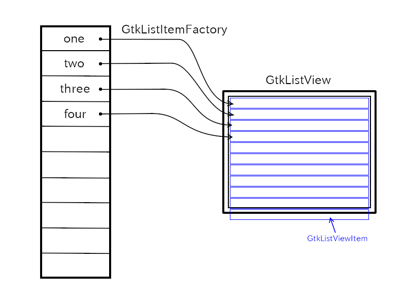
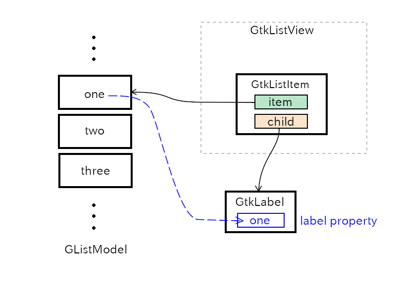

Up: [README.md](../README.md),  Prev: [Section 25](sec25.md), Next: [Section 27](sec27.md)

# GtkListView

GTK 4 has added new list objects GtkListView, GtkGridView and GtkColumnView.
The new feature is described in [Gtk API Reference, List Widget Overview](https://docs.gtk.org/gtk4/section-list-widget.html).

GTK 4 has other means to implement lists.
They are GtkListBox and GtkTreeView which are took over from GTK 3.
There's an article in [Gtk Development blog](https://blog.gtk.org/2020/06/07/scalable-lists-in-gtk-4/) about list widgets by Matthias Clasen.
He described why GtkListView are developed to replace GtkListBox and GtkTreeView.

I want to explain GtkListView and its related objects in this tutorial.

## Outline

A list is a sequential data structure.
For example, an ordered string sequence "one", "two", "three", "four" is a list.
Each element of the list is called item.
A list is like an array, but in many cases it is implemented with pointers which point to the next item of the list.
And it has a start point.
So, each item can be referred by the index of the item (first item, second item, ..., nth item, ...).
There are two cases.
One is the index starts from one (one-based) and the other is it starts from zero (zero-based).

Gio provides GListModel interface.
It is a zero-based list of the same type of GObject objects, or objects that implement the same interface.
An object implements GListModel is usually not a widget.
So, the list is not displayed on the screen directly.
There's another object GtkListView which is a widget to display the list.
The items in the list need to be connected to the items in GtkListView.
GtkListItemFactory object maps items in the list to GListView.

The instruction to build the whole list related objects is:

1. Implement the list object which implements GListModel.
2. Build widgets and put GtkListView as a child of GtkScrolledWindow.
3. Set GtkListItemFactory.

## GListModel

If you want to make a list of strings with GListModel, for example, "one", "two", "three", "four", note that strings can't be items of the list.
Because GListModel is a list of GObject objects and strings aren't GObject objects.
So, you need a wrapper which is a GObject and contains a string.
GtkStringObject is the wrapper object and GStringList, implements GListModel, is a list of GtkStringObject.

~~~C
char *array[] = {"one", "two", "three", "four", NULL};
GtkStringList *stringlist = gtk_string_list_new ((const char * const *) array);
~~~

The function `gtk_string_list_new` creates GtkStringList object.
Its items are GtkStringObject objects which contain the strings "one", "two", "three" and "four".
There are functions to add items to the list or remove items from the list.

- `gtk_string_list_append` appends an item to the list
- `gtk_string_list_remove` removes an item from the list
- `gtk_string_list_get_string` gets a string in the list

See [GTK 4 API Reference, GtkStringList](https://docs.gtk.org/gtk4/class.StringList.html) for further information.

I'll explain the other list objects later.

## GtkSelectionModel

GtkSelectionModel is an interface to support for selections.
Thanks to this model, user can select items by clicking on them.
It is implemented by GtkMultiSelection, GtkNoSelection and GtkSingleSelection objects.
These three objects are usually enough to build an application.
They are created with GListModel.
You can also create them alone and add GListModel later.

- GtkMultiSelection supports multiple selection.
- GtkNoSelection supports no selection. This is a wrapper to GListModel when GtkSelectionModel is needed.
- GtkSingleSelection supports single selection.

## GtkListView

GtkListView is a widget to show GListModel items.
GtkListItem is used by GtkListView to represent items of a list model.
But, GtkListItem itself is not a widget, so a user needs to set a widget, for example GtkLabel, as a child of GtkListItem to display an item of the list model.
"item" property of GtkListItem points an object that belongs to the list model.

In case the number of items is very big, for example more than a thousand, GtkListItem is recycled and connected to another item which is newly displayed.
This recycle makes the number of GtkListItem objects fairly small, less than 200.
This is very effective to restrain the growth of memory consumption so that GListModel can contain lots of items, for example, more than a million items.

## GtkListItemFactory

GtkListItemFactory creates or recycles GtkListItem and connects it with an item of the list model.
There are two child objects of this factory, GtkSignalListItemFactory and GtkBuilderListItemFactory.

### GtkSignalListItemFactory

GtkSignalListItemFactory provides signals for users to configure a GtkListItem object.
There are four signals.

1. "setup" is emitted to set up GtkListItem object.
A user sets its child widget in the handler.
For example, creates a GtkLabel widget and sets the child property of GtkListItem to it.
This setting is kept even the GtkListItem instance is recycled (to bind to another item of GListModel).
2. "bind" is emitted to bind an item in the list model to the widget.
For example, a user gets the item from "item" property of the GtkListItem instance.
Then gets the string of the item and sets the label property of the GtkLabel instance with the string.
This signal is emitted when the GtkListItem is newly created, recycled or some changes has happened to the item of the list.
3. "unbind" is emitted to unbind an item.
A user undoes everything done in step 2 in the signal handler.
If some object are created in step 2, they must be destroyed.
4. "teardown" is emitted to undo everything done in step 1.
So, the widget created in step 1 must be destroyed.
After this signal, the list item will be destroyed.

The following program `list1.c` shows the list of strings "one", "two", "three" and "four".
GtkNoSelection is used, so user can't select any item.

~~~C
 1 #include <gtk/gtk.h>
 2 
 3 static void
 4 setup_cb (GtkListItemFactory *factory, GtkListItem *listitem, gpointer user_data) {
 5   GtkWidget *lb = gtk_label_new (NULL);
 6   gtk_list_item_set_child (listitem, lb);
 7 }
 8 
 9 static void
10 bind_cb (GtkSignalListItemFactory *self, GtkListItem *listitem, gpointer user_data) {
11   GtkWidget *lb = gtk_list_item_get_child (listitem);
12   GtkStringObject *strobj = gtk_list_item_get_item (listitem);
13   const char *text = gtk_string_object_get_string (strobj);
14 
15   gtk_label_set_text (GTK_LABEL (lb), text);
16 }
17 
18 static void
19 unbind_cb (GtkSignalListItemFactory *self, GtkListItem *listitem, gpointer user_data) {
20   /* There's nothing to do here. */
21   /* If you does something like setting a signal in bind_cb, */
22   /* then disconnecting the signal is necessary in unbind_cb. */
23 }
24 
25 static void
26 teardown_cb (GtkListItemFactory *factory, GtkListItem *listitem, gpointer user_data) {
27   gtk_list_item_set_child (listitem, NULL);
28 /*  When the child of listitem is set to NULL, the reference to GtkLabel will be released and lb will be destroyed. */
29 /* Therefore, g_object_unref () for the GtkLabel object doesn't need in the user code. */
30 }
31 
32 /* ----- activate, open, startup handlers ----- */
33 static void
34 app_activate (GApplication *application) {
35   GtkApplication *app = GTK_APPLICATION (application);
36   GtkWidget *win = gtk_application_window_new (app);
37   gtk_window_set_default_size (GTK_WINDOW (win), 600, 400);
38   GtkWidget *scr = gtk_scrolled_window_new ();
39   gtk_window_set_child (GTK_WINDOW (win), scr);
40 
41   char *array[] = {
42     "one", "two", "three", "four", NULL
43   };
44   GtkStringList *sl = gtk_string_list_new ((const char * const *) array);
45   GtkNoSelection *ns = gtk_no_selection_new (G_LIST_MODEL (sl));
46 
47   GtkListItemFactory *factory = gtk_signal_list_item_factory_new ();
48   g_signal_connect (factory, "setup", G_CALLBACK (setup_cb), NULL);
49   g_signal_connect (factory, "bind", G_CALLBACK (bind_cb), NULL);
50   g_signal_connect (factory, "unbind", G_CALLBACK (unbind_cb), NULL);
51   g_signal_connect (factory, "teardown", G_CALLBACK (teardown_cb), NULL);
52 
53   GtkWidget *lv = gtk_list_view_new (GTK_SELECTION_MODEL (ns), factory);
54   gtk_scrolled_window_set_child (GTK_SCROLLED_WINDOW (scr), lv);
55   gtk_window_present (GTK_WINDOW (win));
56 }
57 
58 static void
59 app_startup (GApplication *application) {
60 }
61 
62 /* ----- main ----- */
63 #define APPLICATION_ID "com.github.ToshioCP.list1"
64 
65 int
66 main (int argc, char **argv) {
67   GtkApplication *app;
68   int stat;
69 
70   app = gtk_application_new (APPLICATION_ID, G_APPLICATION_DEFAULT_FLAGS);
71 
72   g_signal_connect (app, "startup", G_CALLBACK (app_startup), NULL);
73   g_signal_connect (app, "activate", G_CALLBACK (app_activate), NULL);
74 
75   stat =g_application_run (G_APPLICATION (app), argc, argv);
76   g_object_unref (app);
77   return stat;
78 }
79 
~~~

The file `list1.c` is located under the directory [src/misc](../src/misc).
Make a shell script below and save it to your bin directory.
(If you've installed GTK 4 from the source to $HOME/local, then your bin directory is $Home/local/bin.
Otherwise, $Home/bin is your private bin directory.)

~~~Shell
gcc `pkg-config --cflags gtk4` $1.c `pkg-config --libs gtk4`
~~~

Change the current directory to the directory includes `list1.c` and type as follows.

~~~
$ chmod 755 $HOME/local/bin/comp # or chmod 755 $Home/bin/comp
$ comp list1
$ ./a.out
~~~

Then, `list1.c` has been compiled and executed.

I think the program is not so difficult.
If you feel some difficulty, read this section again, especially GtkSignalListItemFactory subsubsection.

### GtkBuilderListItemFactory

GtkBuilderListItemFactory is another GtkListItemFactory.
Its behavior is defined with ui file.

~~~xml
<interface>
  <template class="GtkListItem">
    <property name="child">
      <object class="GtkLabel">
        <binding name="label">
          <lookup name="string" type="GtkStringObject">
            <lookup name="item">GtkListItem</lookup>
          </lookup>
        </binding>
      </object>
    </property>
  </template>
</interface>
~~~

Template tag is used to define GtkListItem.
And its child property is GtkLabel object.
The factory sees this template and creates GtkLabel and sets the child property of GtkListItem.
This is the same as what setup handler of GtkSignalListItemFactory did.

Then, bind the label property of GtkLabel to string property of GtkStringObject.
The string object is referred to by item property of GtkListItem.
So, the lookup tag is like this:

~~~
string <- GtkStringObject <- item <- GtkListItem
~~~

The last lookup tag has a content `GtkListItem`.
Usually, C type like `GtkListItem` doesn't appear in the content of tags.
This is a special case.
There is an explanation about it in the [GTK Development Blog](https://blog.gtk.org/2020/09/05/a-primer-on-gtklistview/) by Matthias Clasen.

> Remember that the classname (GtkListItem) in a ui template is used as the “this” pointer referring to the object that is being instantiated.

Therefore, GtkListItem instance is used as the `this` object of the lookup tag when it is evaluated.
`this` object will be explained in [section 28](sec28.md).

The C source code is as follows.
Its name is `list2.c` and located under [src/misc](../src/misc) directory.

~~~C
 1 #include <gtk/gtk.h>
 2 
 3 /* ----- activate, open, startup handlers ----- */
 4 static void
 5 app_activate (GApplication *application) {
 6   GtkApplication *app = GTK_APPLICATION (application);
 7   GtkWidget *win = gtk_application_window_new (app);
 8   gtk_window_set_default_size (GTK_WINDOW (win), 600, 400);
 9   GtkWidget *scr = gtk_scrolled_window_new ();
10   gtk_window_set_child (GTK_WINDOW (win), scr);
11 
12   char *array[] = {
13     "one", "two", "three", "four", NULL
14   };
15   GtkStringList *sl = gtk_string_list_new ((const char * const *) array);
16   GtkSingleSelection *ss = gtk_single_selection_new (G_LIST_MODEL (sl));
17 
18   const char *ui_string =
19 "<interface>"
20   "<template class=\"GtkListItem\">"
21     "<property name=\"child\">"
22       "<object class=\"GtkLabel\">"
23         "<binding name=\"label\">"
24           "<lookup name=\"string\" type=\"GtkStringObject\">"
25             "<lookup name=\"item\">GtkListItem</lookup>"
26           "</lookup>"
27         "</binding>"
28       "</object>"
29     "</property>"
30   "</template>"
31 "</interface>"
32 ;
33   GBytes *gbytes = g_bytes_new_static (ui_string, strlen (ui_string));
34   GtkListItemFactory *factory = gtk_builder_list_item_factory_new_from_bytes (NULL, gbytes);
35 
36   GtkWidget *lv = gtk_list_view_new (GTK_SELECTION_MODEL (ss), factory);
37   gtk_scrolled_window_set_child (GTK_SCROLLED_WINDOW (scr), lv);
38   gtk_window_present (GTK_WINDOW (win));
39 }
40 
41 static void
42 app_startup (GApplication *application) {
43 }
44 
45 /* ----- main ----- */
46 #define APPLICATION_ID "com.github.ToshioCP.list2"
47 
48 int
49 main (int argc, char **argv) {
50   GtkApplication *app;
51   int stat;
52 
53   app = gtk_application_new (APPLICATION_ID, G_APPLICATION_DEFAULT_FLAGS);
54 
55   g_signal_connect (app, "startup", G_CALLBACK (app_startup), NULL);
56   g_signal_connect (app, "activate", G_CALLBACK (app_activate), NULL);
57 
58   stat =g_application_run (G_APPLICATION (app), argc, argv);
59   g_object_unref (app);
60   return stat;
61 }
62 
~~~

No signal handler is needed for GtkBulderListItemFactory.
GtkSingleSelection is used, so user can select one item at a time.

Because this is a small program, the ui data is given as a string.

## GtkDirectoryList

GtkDirectoryList is a list model containing GFileInfo objects which are information of files under a certain directory.
It uses `g_file_enumerate_children_async()` to get the GFileInfo objects.
The list model is created by `gtk_directory_list_new` function.

~~~C
GtkDirectoryList *gtk_directory_list_new (const char *attributes, GFile *file);
~~~

`attributes` is a comma separated list of file attributes.
File attributes are key-value pairs.
A key consists of a namespace and a name.
For example, "standard::name" key is the name of a file.
"standard" means general file information.
"name" means filename.
The following table shows some example.

|key             |meaning                                                             |
|:---------------|:-------------------------------------------------------------------|
|standard::type  |file type. for example, regular file, directory, symbolic link, etc.|
|standard::name  |filename                                                            |
|standard::size  |file size in bytes                                                  |
|access::can-read|read privilege if the user is able to read the file                 |
|time::modified  |the time the file was last modified in seconds since the UNIX epoch |

The current directory is ".".
The following program makes GtkDirectoryList `dl` and its contents are GFileInfo objects under the current directory.

~~~C
GFile *file = g_file_new_for_path (".");
GtkDirectoryList *dl = gtk_directory_list_new ("standard::name", file);
g_object_unref (file);
~~~

It is not so difficult to make file listing program by changing `list2.c` in the previous subsection.
One problem is that GInfoFile doesn't have properties.
Lookup tag look for a property, so it is useless for looking for a filename from a GFileInfo object.
Instead, closure tag is appropriate in this case.
Closure tag specifies a function and the type of the return value of the function.

~~~C
char *
get_file_name (GtkListItem *item, GFileInfo *info) {
  if (! G_IS_FILE_INFO (info))
    return NULL;
  else
    return g_strdup (g_file_info_get_name (info));
}

... ...
... ...

"<interface>"
  "<template class=\"GtkListItem\">"
    "<property name=\"child\">"
      "<object class=\"GtkLabel\">"
        "<binding name=\"label\">"
          "<closure type=\"gchararray\" function=\"get_file_name\">"
            "<lookup name=\"item\">GtkListItem</lookup>"
          "</closure>"
        "</binding>"
      "</object>"
    "</property>"
  "</template>"
"</interface>"
~~~

- "gchararray" is the type name of strings.
"gchar" is the same as "char" type.
Therefore, "gchararray" is "an array of char type", which is the same as string type.
It is used to get the type of GValue object.
GValue is a generic value and it can contain various type of values.
For example, the type name can be gboolean, gchar (char), gint (int), gfloat (float), gdouble (double), gchararray (char *) and so on.
These type names are the names of the fundamental types that are registered to the type system.
See [GObject tutorial](https://github.com/ToshioCP/Gobject-tutorial/blob/main/gfm/sec5.md#gvalue).
- closure tag has type attribute and function attribute.
Function attribute specifies the function name and type attribute specifies the type of the return value of the function.
The contents of closure tag (it is between \<closure...\> and\</closure\>) is parameters of the function.
`<lookup name="item">GtkListItem</lookup>` gives the value of the item property of the GtkListItem.
This will be the second argument of the function.
The first parameter is always the GListItem instance.
- `gtk_file_name` function first check the `info` parameter.
Because it can be NULL when GListItem `item` is unbound.
If its GFileInfo, then return the filename (copy of the filename).

The whole program (`list3.c`) is as follows.
The program is located in [src/misc](../src/misc) directory.

~~~C
 1 #include <gtk/gtk.h>
 2 
 3 char *
 4 get_file_name (GtkListItem *item, GFileInfo *info) {
 5   if (! G_IS_FILE_INFO (info))
 6     return NULL;
 7   else
 8     return g_strdup (g_file_info_get_name (info));
 9 }
10 
11 /* ----- activate, open, startup handlers ----- */
12 static void
13 app_activate (GApplication *application) {
14   GtkApplication *app = GTK_APPLICATION (application);
15   GtkWidget *win = gtk_application_window_new (app);
16   gtk_window_set_default_size (GTK_WINDOW (win), 600, 400);
17   GtkWidget *scr = gtk_scrolled_window_new ();
18   gtk_window_set_child (GTK_WINDOW (win), scr);
19 
20   GFile *file = g_file_new_for_path (".");
21   GtkDirectoryList *dl = gtk_directory_list_new ("standard::name", file);
22   g_object_unref (file);
23   GtkNoSelection *ns = gtk_no_selection_new (G_LIST_MODEL (dl));
24 
25   const char *ui_string =
26 "<interface>"
27   "<template class=\"GtkListItem\">"
28     "<property name=\"child\">"
29       "<object class=\"GtkLabel\">"
30         "<binding name=\"label\">"
31           "<closure type=\"gchararray\" function=\"get_file_name\">"
32             "<lookup name=\"item\">GtkListItem</lookup>"
33           "</closure>"
34         "</binding>"
35       "</object>"
36     "</property>"
37   "</template>"
38 "</interface>"
39 ;
40   GBytes *gbytes = g_bytes_new_static (ui_string, strlen (ui_string));
41   GtkListItemFactory *factory = gtk_builder_list_item_factory_new_from_bytes (NULL, gbytes);
42 
43   GtkWidget *lv = gtk_list_view_new (GTK_SELECTION_MODEL (ns), factory);
44   gtk_scrolled_window_set_child (GTK_SCROLLED_WINDOW (scr), lv);
45   gtk_window_present (GTK_WINDOW (win));
46 }
47 
48 static void
49 app_startup (GApplication *application) {
50 }
51 
52 /* ----- main ----- */
53 #define APPLICATION_ID "com.github.ToshioCP.list3"
54 
55 int
56 main (int argc, char **argv) {
57   GtkApplication *app;
58   int stat;
59 
60   app = gtk_application_new (APPLICATION_ID, G_APPLICATION_DEFAULT_FLAGS);
61 
62   g_signal_connect (app, "startup", G_CALLBACK (app_startup), NULL);
63   g_signal_connect (app, "activate", G_CALLBACK (app_activate), NULL);
64 
65   stat =g_application_run (G_APPLICATION (app), argc, argv);
66   g_object_unref (app);
67   return stat;
68 }
69 
~~~

The ui data (xml data above) is used to build the GListItem template at runtime.
GtkBuilder refers to the symbol table to find the function `get_file_name`.

Generally, a symbol table is used by a linker to link objects to an executable file.
It includes function names and their location.
A linker usually doesn't put a symbol table into the created executable file.
But if `--export-dynamic` option is given, the linker adds the symbol table to the executable file.

To accomplish it, an option `-Wl,--export-dynamic` is given to the C compiler.

- `-Wl` is a C compiler option that passes the following option to the linker.
- `--export-dynamic` is a linker option.
The following is cited from the linker document.
"When creating a dynamically linked executable, add all symbols to the dynamic symbol table.
The dynamic symbol table is the set of symbols which are visible from dynamic objects at run time."

Compile and execute it.

~~~
$ gcc -Wl,--export-dynamic `pkg-config --cflags gtk4` list3.c `pkg-config --libs gtk4`
~~~

You can also make a shell script to compile `list3.c`

~~~bash
gcc -Wl,--export-dynamic `pkg-config --cflags gtk4` $1.c `pkg-config --libs gtk4`
~~~

Save this one liner to a file `comp`.
Then, copy it to `$HOME/bin` and give it executable permission.

~~~
$ cp comp $HOME/bin/comp
$ chmod +x $HOME/bin/comp
~~~

You can compile `list3.c` and execute it, like this:

~~~
$ comp list3
$ ./a.out
~~~

Up: [README.md](../README.md),  Prev: [Section 25](sec25.md), Next: [Section 27](sec27.md)
