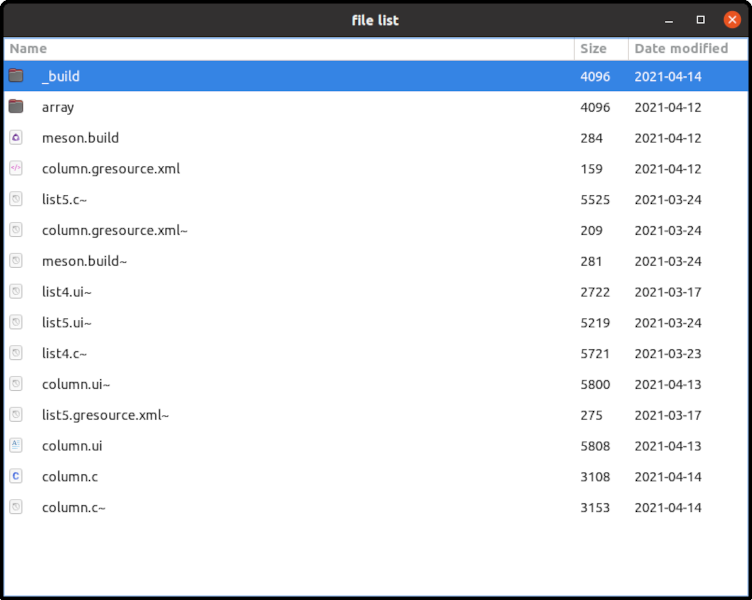
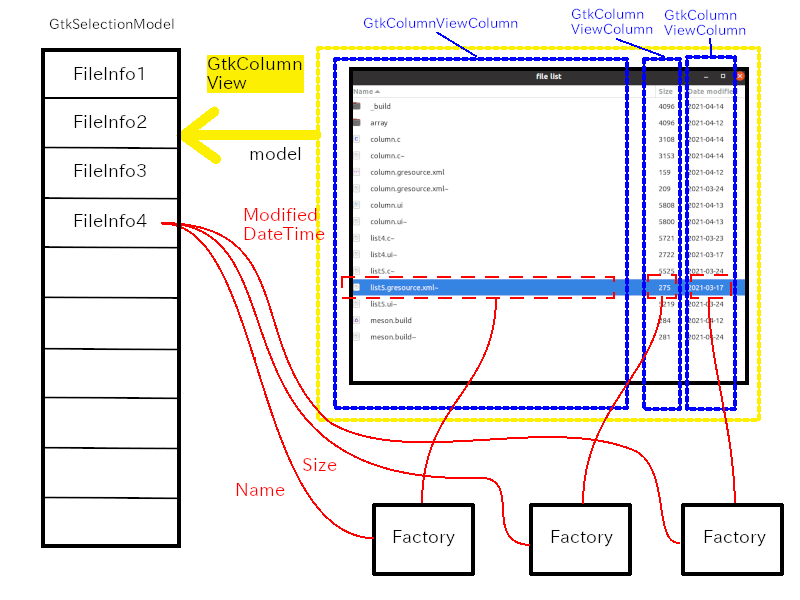

Up: [Readme.md](../Readme.md),  Prev: [Section 28](sec28.md)

# GtkColumnView

## GtkColumnView

GtkColumnView is like GtkListView, but it has multiple columns.
Each column is GtkColumnViewColumn.

- GtkColumnView has "model" property.
The property points a GtkSelectionModel object.
- Each GtkColumnViewColumn has "factory" property.
The property points a GtkListItemFactory (GtkSignalListItemFactory or GtkBuilderListItemFactory).
- The factory connects GtkListItem, which belongs to GtkColumnViewColumn, and items of GtkSelectionModel.
And the factory builds the descendants widgets of GtkColumnView to display the item on the display.
This process is the same as the one in GtkListView.

The following diagram shows the image how it works.

The example in this section is a window that displays information of files in a current directory.
The information is the name, size and last modified datetime of files.
So, there are three columns.

In addition, the example uses GtkSortListModel and GtkSorter to sort the information.

## column.ui

Ui file specifies whole widgets and their structure.

~~~xml
  1 <?xml version="1.0" encoding="UTF-8"?>
  2 <interface>
  3   <object class="GtkApplicationWindow" id="win">
  4     <property name="title">file list</property>
  5     <property name="default-width">800</property>
  6     <property name="default-height">600</property>
  7     <child>
  8       <object class="GtkScrolledWindow" id="scr">
  9         <property name="hexpand">TRUE</property>
 10         <property name="vexpand">TRUE</property>
 11         <child>
 12           <object class="GtkColumnView" id="columnview">
 13             <property name="model">
 14               <object class="GtkSingleSelection" id="singleselection">
 15                 <property name="model">
 16                   <object class="GtkSortListModel" id="sortlist">
 17                     <property name="model">
 18                       <object class="GtkDirectoryList" id="directorylist">
 19                         <property name="attributes">standard::name,standard::icon,standard::size,time::modified</property>
 20                       </object>
 21                     </property>
 22                     <binding name="sorter">
 23                       <lookup name="sorter">columnview</lookup>
 24                     </binding>
 25                   </object>
 26                 </property>
 27               </object>
 28             </property>
 29             <child>
 30               <object class="GtkColumnViewColumn" id="column1">
 31                 <property name="title">Name</property>
 32                 <property name="expand">TRUE</property>
 33                 <property name="factory">
 34                   <object class="GtkBuilderListItemFactory">
 35                     <property name="bytes"><![CDATA[
 36 <?xml version="1.0" encoding="UTF-8"?>
 37 <interface>
 38   <template class="GtkListItem">
 39     <property name="child">
 40       <object class="GtkBox">
 41         <property name="orientation">GTK_ORIENTATION_HORIZONTAL</property>
 42         <property name="spacing">20</property>
 43         <child>
 44           <object class="GtkImage">
 45             <binding name="gicon">
 46               <closure type="GIcon" function="get_icon_factory">
 47                 <lookup name="item">GtkListItem</lookup>
 48               </closure>
 49             </binding>
 50           </object>
 51         </child>
 52         <child>
 53           <object class="GtkLabel">
 54             <property name="hexpand">TRUE</property>
 55             <property name="xalign">0</property>
 56             <binding name="label">
 57               <closure type="gchararray" function="get_file_name_factory">
 58                 <lookup name="item">GtkListItem</lookup>
 59               </closure>
 60             </binding>
 61           </object>
 62         </child>
 63       </object>
 64     </property>
 65   </template>
 66 </interface>
 67                     ]]></property>
 68                   </object>
 69                 </property>
 70                 <property name="sorter">
 71                   <object class="GtkStringSorter" id="sorter_name">
 72                     <property name="expression">
 73                       <closure type="gchararray" function="get_file_name">
 74                       </closure>
 75                     </property>
 76                   </object>
 77                 </property>
 78               </object>
 79             </child>
 80             <child>
 81               <object class="GtkColumnViewColumn" id="column2">
 82                 <property name="title">Size</property>
 83                 <property name="factory">
 84                   <object class="GtkBuilderListItemFactory">
 85                     <property name="bytes"><![CDATA[
 86 <?xml version="1.0" encoding="UTF-8"?>
 87 <interface>
 88   <template class="GtkListItem">
 89     <property name="child">
 90       <object class="GtkLabel">
 91         <property name="hexpand">TRUE</property>
 92         <property name="xalign">0</property>
 93         <binding name="label">
 94           <closure type="gchararray" function="get_file_size_factory">
 95             <lookup name="item">GtkListItem</lookup>
 96           </closure>
 97         </binding>
 98       </object>
 99     </property>
100   </template>
101 </interface>
102                     ]]></property>
103                   </object>
104                 </property>
105                 <property name="sorter">
106                   <object class="GtkNumericSorter" id="sorter_size">
107                     <property name="expression">
108                       <closure type="gint64" function="get_file_size">
109                       </closure>
110                     </property>
111                     <property name="sort-order">GTK_SORT_ASCENDING</property>
112                   </object>
113                 </property>
114               </object>
115             </child>
116             <child>
117               <object class="GtkColumnViewColumn" id="column3">
118                 <property name="title">Date modified</property>
119                 <property name="factory">
120                   <object class="GtkBuilderListItemFactory">
121                     <property name="bytes"><![CDATA[
122 <?xml version="1.0" encoding="UTF-8"?>
123 <interface>
124   <template class="GtkListItem">
125     <property name="child">
126       <object class="GtkLabel">
127         <property name="hexpand">TRUE</property>
128         <property name="xalign">0</property>
129         <binding name="label">
130           <closure type="gchararray" function="get_file_time_modified_factory">
131             <lookup name="item">GtkListItem</lookup>
132           </closure>
133         </binding>
134       </object>
135     </property>
136   </template>
137 </interface>
138                     ]]></property>
139                   </object>
140                 </property>
141                 <property name="sorter">
142                   <object class="GtkNumericSorter" id="sorter_datetime_modified">
143                     <property name="expression">
144                       <closure type="gint64" function="get_file_unixtime_modified">
145                       </closure>
146                     </property>
147                     <property name="sort-order">GTK_SORT_ASCENDING</property>
148                   </object>
149                 </property>
150               </object>
151             </child>
152           </object>
153         </child>
154       </object>
155     </child>
156   </object>
157 </interface>
~~~

- 3-12: Widget parent-child relationship is GtkApplicationWindow => GtkScrolledWindow => GtkColumnView.
- 12-18: GtkColumnView has "model" property.
It points GtkSelectionModel interface.
In this ui file, GtkSingleSelection is used as GtkSelectionModel.
GtkSingleSelection is an object that implements GtkSelectionModel.
And again, it has "model" property.
It points GtkSortListModel.
This list model supports sorting the list.
It will be explained in the later subsection.
And it also has "model" property.
It points GtkDirectoryList.
Therefore, the chain is: GtkColumnView => GtkSingleSelection => GtkSortListModel => GtkDirectoryList.
- 18-20: GtkDirectoryList.
It is a list of GFileInfo, which holds information of files under a directory.
It has "attributes" property.
It specifies what attributes is kept in each GFileInfo.
  - "standard::name" is a name of the file.
  - "standard::icon" is a GIcon object of the file
  - "standard::size" is the file size.
  - "time::modified" is the date and time the file was last modified.
- 29-79: The first GtkColumnViewColumn object.
There are four properties, "title", "expand", factory" and "sorter".
- 31: Sets the "title" property with "Name".
This is the title on the header of the column.
- 32: Sets the "expand" property to TRUE to allow the column to expand as much as possible.
(See the image above).
- 33- 69: Sets the "factory" property with GtkBuilderListItemFactory.
The factory has "bytes" property which holds a ui string to define a template to build GtkListItem composite widget.
The CDATA section (line 36-66) is the ui string to put into the "bytes" property.
The contents are the same as the ui file `factory_list.ui` in the section 27.
- 70-77: Sets the "sorter" property with GtkStringSorter object.
This object provides a sorter that compares strings.
It has "expression" property which is set with GtkExpression.
A closure tag with a string type function `get_file_name` is used here.
The function will be explained later.
- 80-115: The second GtkColumnViewColumn object.
Its "title", "factory" and "sorter" properties are set.
GtkNumericSorter is used.
- 116-151: The third GtkColumnViewColumn object.
Its "title", "factory" and "sorter" properties are set.
GtkNumericSorter is used.

## GtkSortListModel and GtkSorter

GtkSortListModel is a list model that sorts its elements according to a GtkSorter.
It has "sorter" property that is set with GtkSorter.
The property is bound to "sorter" property of GtkColumnView in line 22 to 24.

~~~xml
<object class="GtkSortListModel" id="sortlist">
... ... ...
  <binding name="sorter">
    <lookup name="sorter">columnview</lookup>
  </binding>
~~~

Therefore, `columnview` determines the way how to sort the list model.
The "sorter" property of GtkColumnView is read-only property and it is a special sorter.
It reflects the user's sorting choice.
If a user clicks the header of a column, then the sorter ("sorter" property) of the column is referenced by "sorter" property of the GtkColumnView.
If the user clicks the header of another column, then the "sorter" property of the GtkColumnView refers to the newly clicked column's "sorter" property.

The binding above makes a indirect connection between the "sorter" property of GtkSortListModel and the "sorter" property of each column.

GtkSorter has several child objects.

- GtkStringSorter compares strings.
- GtkNumericSorter compares numbers.
- GtkCustomSorter uses a callback to compare.
- GtkMultiSorter combines multiple sorters.

The example uses GtkStringSorter and GtkNumericSorter.

GtkStringSorter uses GtkExpression to get the strings from the objects.
The GtkExpression is stored in the "expression" property of GtkStringSorter.
For example, in the ui file above, the GtkExpression is in the line 71 to 76.

~~~xml
<object class="GtkStringSorter" id="sorter_name">
  <property name="expression">
    <closure type="gchararray" function="get_file_name">
    </closure>
  </property>
</object>
~~~

The GtkExpression calls `get_file_name` function when it is evaluated.

~~~C
1 char *
2 get_file_name (GFileInfo *info) {
3   g_return_val_if_fail (G_IS_FILE_INFO (info), NULL);
4 
5   return g_strdup(g_file_info_get_name (info));
6 }
~~~

The function is given the item (GFileInfo) of the GtkSortListModel as an argument (`this` object).
The function retrieves a filename from `info`.
The string is owned by `info` so it is necessary to duplicate it.
And it returns the copied string.
The string will be owned by the expression.

GtkNumericSorter compares numbers.
It is used in the line 106 to 112 and line 142 to 148.
The lines from 106 to 112 is:

~~~xml
<object class="GtkNumericSorter" id="sorter_size">
  <property name="expression">
    <closure type="gint64" function="get_file_size">
    </closure>
  </property>
  <property name="sort-order">GTK_SORT_ASCENDING</property>
</object>
~~~

The closure tag specifies a callback function `get_file_size`.

~~~C
1 goffset
2 get_file_size (GFileInfo *info) {
3   g_return_val_if_fail (G_IS_FILE_INFO (info), -1);
4 
5   return g_file_info_get_size (info);
6 }
~~~

It just returns the size of `info`.
The type of the size is `goffset`.
The type `goffset` is the same as `gint64`.

The lines from 142 to 148 is:

~~~xml
<object class="GtkNumericSorter" id="sorter_datetime_modified">
  <property name="expression">
    <closure type="gint64" function="get_file_unixtime_modified">
    </closure>
  </property>
  <property name="sort-order">GTK_SORT_ASCENDING</property>
</object>
~~~

The closure tag specifies a callback function `get_file_unixtime_modified`.

~~~C
1 gint64
2 get_file_unixtime_modified (GFileInfo *info) {
3   g_return_val_if_fail (G_IS_FILE_INFO (info), -1);
4 
5   GDateTime *dt;
6 
7   dt = g_file_info_get_modification_date_time (info);
8   return g_date_time_to_unix (dt);
9 }
~~~

It gets the modification date and time (GDateTime type) of `info`.
Then it gets a unix time from `dt`.
Unix time, sometimes called unix epoch, is the number of seconds that have elapsed since 00:00:00 UTC on 1 January 1970.
It returns the unix time (gint64 type).

## column.c

`column.c` is as follows.

~~~C
  1 #include <gtk/gtk.h>
  2 
  3 /* functions (closures) for GtkBuilderListItemFactory */
  4 GIcon *
  5 get_icon_factory (GtkListItem *item, GFileInfo *info) {
  6   GIcon *icon;
  7   if (! G_IS_FILE_INFO (info))
  8     return NULL;
  9   else {
 10     icon = g_file_info_get_icon (info);
 11     g_object_ref (icon);
 12     return icon;
 13   }
 14 }
 15 
 16 char *
 17 get_file_name_factory (GtkListItem *item, GFileInfo *info) {
 18   if (! G_IS_FILE_INFO (info))
 19     return NULL;
 20   else
 21     return g_strdup (g_file_info_get_name (info));
 22 }
 23 
 24 char *
 25 get_file_size_factory (GtkListItem *item, GFileInfo *info) {
 26   /* goffset is gint64 */
 27   goffset size;
 28 
 29   if (! G_IS_FILE_INFO (info))
 30     return NULL;
 31   else {
 32     size = g_file_info_get_size (info);
 33     return g_strdup_printf ("%ld", (long int) size);
 34   }
 35 }
 36 
 37 char *
 38 get_file_time_modified_factory (GtkListItem *item, GFileInfo *info) {
 39   GDateTime *dt;
 40 
 41   if (! G_IS_FILE_INFO (info))
 42     return NULL;
 43   else {
 44     dt = g_file_info_get_modification_date_time (info);
 45     return g_date_time_format (dt, "%F");
 46   }
 47 }
 48 
 49 /* Functions (closures) for GtkSorter */
 50 char *
 51 get_file_name (GFileInfo *info) {
 52   g_return_val_if_fail (G_IS_FILE_INFO (info), NULL);
 53 
 54   return g_strdup(g_file_info_get_name (info));
 55 }
 56 
 57 goffset
 58 get_file_size (GFileInfo *info) {
 59   g_return_val_if_fail (G_IS_FILE_INFO (info), -1);
 60 
 61   return g_file_info_get_size (info);
 62 }
 63 
 64 gint64
 65 get_file_unixtime_modified (GFileInfo *info) {
 66   g_return_val_if_fail (G_IS_FILE_INFO (info), -1);
 67 
 68   GDateTime *dt;
 69 
 70   dt = g_file_info_get_modification_date_time (info);
 71   return g_date_time_to_unix (dt);
 72 }
 73 
 74 /* ----- activate, open, startup handlers ----- */
 75 static void
 76 app_activate (GApplication *application) {
 77   GtkApplication *app = GTK_APPLICATION (application);
 78   GFile *file;
 79 
 80   GtkBuilder *build = gtk_builder_new_from_resource ("/com/github/ToshioCP/column/column.ui");
 81   GtkWidget *win = GTK_WIDGET (gtk_builder_get_object (build, "win"));
 82   GtkDirectoryList *directorylist = GTK_DIRECTORY_LIST (gtk_builder_get_object (build, "directorylist"));
 83   g_object_unref (build);
 84 
 85   gtk_window_set_application (GTK_WINDOW (win), app);
 86 
 87   file = g_file_new_for_path (".");
 88   gtk_directory_list_set_file (directorylist, file);
 89   g_object_unref (file);
 90 
 91   gtk_widget_show (win);
 92 }
 93 
 94 static void
 95 app_startup (GApplication *application) {
 96 }
 97 
 98 #define APPLICATION_ID "com.github.ToshioCP.columnview"
 99 
100 int
101 main (int argc, char **argv) {
102   GtkApplication *app;
103   int stat;
104 
105   app = gtk_application_new (APPLICATION_ID, G_APPLICATION_FLAGS_NONE);
106 
107   g_signal_connect (app, "startup", G_CALLBACK (app_startup), NULL);
108   g_signal_connect (app, "activate", G_CALLBACK (app_activate), NULL);
109 /*  g_signal_connect (app, "open", G_CALLBACK (app_open), NULL);*/
110 
111   stat =g_application_run (G_APPLICATION (app), argc, argv);
112   g_object_unref (app);
113   return stat;
114 }
115 
~~~

- 4-47: Functions for the closure tag in the "bytes" property of GtkBuilderListItemFactory.
These are almost same as the functions in section 26 and 26.
- 50-72: Functions for the closure in the expression property of GtkStringSorter or GtkNumericSorter.
- 75-92: `app_activate` is an "activate" handler of GApplication.
- 80-83: Builds objects with ui resource and gets `win` and `directorylist`.
- 85: Sets the application of the top level window with `app`. 
- 87-89: Sets the file of `directorylist` with "." (current directory).
- 94-96: Startup handler.
- 98-114: `main` function.

`exp.c` is simple and short thanks to `exp.ui`.

## Compilation and execution.

All the source files are in [src/column](../src/column) directory.
Change your current directory to the directory and type the following.

~~~
$ meson _build
$ ninja -C _build
$ _build/column
~~~

Then, a window appears.

If you click the header of a column, then the whole lists are sorted by the column.
If you click the header of another column, then the whole lists are sorted by the newly selected column.

GtkColumnView is very useful and it can manage very big GListModel.
It is possible to use it for file list, application list, database frontend and so on.

Up: [Readme.md](../Readme.md),  Prev: [Section 28](sec28.md)
