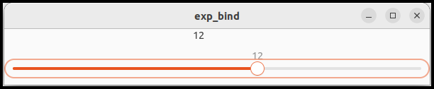

Up: [README.md](../README.md),  Prev: [Section 30](sec30.md), Next: [Section 32](sec32.md)

# GtkExpression

GtkExpression is a fundamental type.
It is not a descendant of GObject.
GtkExpression provides a way to describe references to values.
GtkExpression needs to be evaluated to obtain a value.

It is similar to arithmetic calculation.

~~~
1 + 2 = 3
~~~

`1+2` is an expression.
It shows the way how to calculate.
`3` is the value comes from the expression.
Evaluation is to calculate the expression and get the value.

GtkExpression is a way to get a value.
Evaluation is like a calculation.
A value is got by evaluating the expression.

## Constant expression

A constant expression (GtkConstantExpression) provides constant value or instance when it is evaluated.

~~~C
  GValue value = G_VALUE_INIT;
  expression = gtk_constant_expression_new (G_TYPE_INT,100);
  gtk_expression_evaluate (expression, NULL, &value);
~~~

- GtkExpression uses GValue to hold a value.
GValue is a structure and container to hold a type and value.
It must be initialized with `G_VALUE_INIT`, first.
Be careful that `value` is a structure, not a pointer to a structure.
- Constant expression is created with `gtk_constant_expression_new` function.
The parameter of the function is a type (GType) and a value (or instance).
This expression holds a constant value.
`G_TYPE_INT` is a type that is registered to the type system.
It is integer type.
Some types are shown in the following table.
- `gtk_expression_evaluate` evaluates the expression.
It has three parameters, the expression to evaluate, `this` instance and a pointer to a GValue for being set with the value.
`this` instance isn't necessary for constant expressions.
Therefore, the second argument is NULL.
`gtk_expression_evaluate` returns TRUE if it successfully evaluates the expression.
Otherwise it returns FALSE.
- If it returns TRUE, the GValue `value` is set with the value of the expression.
The type of the value is int.

|GType            |C type|type name |notes                  |
|:----------------|:-----|:---------|:----------------------|
|G\_TYPE\_CHAR    |char  |gchar     |                       |
|G\_TYPE\_BOOLEAN |int   |gboolean  |                       |
|G\_TYPE\_INT     |int   |gint      |                       |
|G\_TYPE\_FLOAT   |float |gfloat    |                       |
|G\_TYPE\_DOUBLE  |double|gdouble   |                       |
|G\_TYPE\_POINTER |void *|gpointer  |general pointer        |
|G\_TYPE\_STRING  |char *|gchararray|null-terminated Cstring|
|G\_TYPE\_OBJECT  |      |GObject   |                       |
|GTK\_TYPE\_WINDOW|      |GtkWindow |                       |

A sample program `exp_constant_simple.c` is in `src/expression` directory.

~~~C
 1 #include <gtk/gtk.h>
 2 
 3 int
 4 main (int argc, char **argv) {
 5   GtkExpression *expression;
 6   GValue value = G_VALUE_INIT;
 7 
 8   /* Create an expression */
 9   expression = gtk_constant_expression_new (G_TYPE_INT,100);
10   /* Evaluate the expression */
11   if (gtk_expression_evaluate (expression, NULL, &value))
12     g_print ("The value is %d.\n", g_value_get_int (&value));
13   else
14     g_print ("The constant expression wasn't evaluated correctly.\n");
15   gtk_expression_unref (expression);
16   g_value_unset (&value);
17 
18   return 0;
19 }
~~~

- 9: A constant expression is created. It holds an int value 100. The variable `expression` points the expression.
- 11-14: Evaluates the expression. If it successes, show the value to the stdout. Otherwise show an error message.
- 15-16: Releases the expression and unsets the GValue.

Constant expression is usually used to give a constant value or instance to another expression.

## Property expression

A property expression (GtkPropertyExpression) looks up a property in a GObject instance.
For example, a property expression that refers "label" property in a GtkLabel object is created like this.

~~~C
expression = gtk_property_expression_new (GTK_TYPE_LABEL, another_expression, "label");
~~~

The second parameter `another_expression` is one of:

- An expression that gives a GtkLabel instance when it is evaluated.
- NULL. When NULL is given, a GtkLabel instance will be given when it is evaluated.
The instance is called `this` object.

For example,

~~~C
label = gtk_label_new ("Hello");
another_expression = gtk_constant_expression_new (GTK_TYPE_LABEL, label);
expression = gtk_property_expression_new (GTK_TYPE_LABEL, another_expression, "label");
~~~

If `expression` is evaluated, the second parameter `another_expression` is evaluated in advance.
The value of `another_expression` is the `label` (GtkLabel instance).
Then, `expression` looks up "label" property of the label and the evaluation results in "Hello".

In the example above, the second argument of `gtk_property_expression_new` is another expression.
But the second argument can be NULL.
If it is NULL, `this` instance is used instead.
`this` is given by `gtk_expression_evaluate` function.

There's a simple program `exp_property_simple.c` in `src/expression` directory.

~~~C
 1 #include <gtk/gtk.h>
 2 
 3 int
 4 main (int argc, char **argv) {
 5   GtkWidget *label;
 6   GtkExpression *expression;
 7   GValue value = G_VALUE_INIT;
 8 
 9   gtk_init ();
10   label = gtk_label_new ("Hello world.");
11   /* Create an expression */
12   expression = gtk_property_expression_new (GTK_TYPE_LABEL, NULL, "label");
13   /* Evaluate the expression */
14   if (gtk_expression_evaluate (expression, label, &value))
15     g_print ("The value is %s.\n", g_value_get_string (&value));
16   else
17     g_print ("The property expression wasn't evaluated correctly.\n");
18   gtk_expression_unref (expression);
19   g_value_unset (&value);
20 
21   return 0;
22 }
~~~

- 9-10: `gtk_init` initializes GTK GUI toolkit.
It isn't usually necessary because the GtkApplication default startup handler does the initialization.
A GtkLabel instance is created with the text "Hello world.".
- 12: A property expression is created.
It looks a "label" property of a GtkLabel instance.
But at the creation, no instance is given because the second argument is NULL.
The expression just knows how to take the property from a future-given GtkLabel instance.
- 14-17: The function `gtk_expression_evaluate` evaluates the expression with a 'this' instance `label`.
The result is stored in the GValue `value`.
The function `g_value_get_string` gets a string from the GValue.
But the string is owned by the GValue so you must not free the string.
- 18-19: Releases the expression and unset the GValue.
At the same time the string in the GValue is freed.

If the second argument of `gtk_property_expression_new` isn't NULL, it is another expression.
The expression is owned by a newly created property expression.
So, when the expressions are useless, you just release the last expression.
Then it releases another expression it has.

## Closure expression

A closure expression calls closure when it is evaluated.
A closure is a generic representation of a callback (a pointer to a function).
For information about closure, see [GObject API Reference -- The GObject messaging system](https://docs.gtk.org/gobject/concepts.html#the-gobject-messaging-system).
There are simple closure example files `closure.c` and `closure_each.c` in the `src/expression` directory.

There are two types of closure expressions, GtkCClosureExpression and GtkClosureExpression.
They corresponds to GCClosure and GClosure respectively.
When you program in C language, GtkCClosureExpression and GCClosure are appropriate.

A closure expression is created with `gtk_cclosure_expression_new` function.

~~~C
GtkExpression *
gtk_cclosure_expression_new (GType value_type,
                             GClosureMarshal marshal,
                             guint n_params,
                             GtkExpression **params,
                             GCallback callback_func,
                             gpointer user_data,
                             GClosureNotify user_destroy);
~~~
@else
~~~{.C}
GtkExpression *
gtk_cclosure_expression_new (GType value_type,
                             GClosureMarshal marshal,
                             guint n_params,
                             GtkExpression **params,
                             GCallback callback_func,
                             gpointer user_data,
                             GClosureNotify user_destroy);
~~~
@end

- `value_type` is the type of the value when it is evaluated.
- `marshal` is a marshaller.
You can assign NULL.
If it is NULL, then `g_cclosure_marshal_generic ()` is used as a marshaller.
It is a generic marshaller function implemented via libffi.
- `n_params` is the number of parameters.
- `params` points expressions for each parameter of the call back function.
- `callback_func` is a callback function.
It is given arguments `this` and parameters above.
So, if `n_params` is 3, the number of arguments of the function is 4.
(`this` and `params`. See below.)
- `user_data` is user data.
You can add it for the closure.
It is like `user_data` in `g_signal_connect`.
If it is not necessary, assign NULL.
- `user_destroy` is a destroy notify for `user_data`.
It is called to destroy `user_data` when it is no longer needed.
If NULL is assigned to `user_data`, assign NULL to `user_destroy`, too.

Call back functions have the following format.

~~~
C-type
callback (this, param1, param2, ...)
~~~

For example,

@@@if gfm
~~~C
int
callback (GObject *object, int x, const char *s)
~~~

The following is `exp_closure_simple.c` in `src/expression`.

~~~C
 1 #include <gtk/gtk.h>
 2 
 3 static int
 4 calc (GtkLabel *label) { /* this object */
 5   const char * s;
 6   int i, j;
 7 
 8   s = gtk_label_get_text (label); /* s is owned by the label. */
 9   sscanf (s, "%d+%d", &i, &j);
10   return i+j;
11 }
12 
13 int
14 main (int argc, char **argv) {
15   GtkExpression *expression;
16   GValue value = G_VALUE_INIT;
17   GtkLabel *label;
18 
19   gtk_init ();
20   label = GTK_LABEL (gtk_label_new ("123+456"));
21   g_object_ref_sink (label);
22   expression = gtk_cclosure_expression_new (G_TYPE_INT, NULL, 0, NULL,
23                  G_CALLBACK (calc), NULL, NULL);
24   if (gtk_expression_evaluate (expression, label, &value)) /* 'this' object is the label. */
25     g_print ("%d\n", g_value_get_int (&value));
26   else
27     g_print ("The closure expression wasn't evaluated correctly.\n");
28   gtk_expression_unref (expression);
29   g_value_unset (&value);
30   g_object_unref (label);
31   
32   return 0;
33 }
~~~

- 3-11: A call back function.
The parameter is only one and it is a 'this' object.
It is a GtkLabel and its label is assumed to be "(number)+(number)".
- 8-10: Retrieves two integers from the label and returns the sum of them.
This function has no error report.
If you want to return error report, change the return value type to be a pointer to a structure of gboolean and integer.
One for error and the other for the sum.
The first argument of `gtk_cclosure_expression_new` is `G_TYPE_POINTER`.
There is a sample program `exp_closure_with_error_report` in `src/expression` directory.
- 19: The function `gtk_init`` initializes GTK. It is necessary for GtkLabel.
- 20: A GtkLabel instance is created with "123+456".
- 21: The instance has floating reference. It is changed to an ordinary reference count.
- 22-23: Creates a closure expression. Its return value type is `G_TYPE_INT` and no parameters or 'this' object.
- 24: Evaluates the expression with the label as a 'this' object.
- 25: If the evaluation successes, the sum of "123+456", which is 579, is shown.
- 27: If it fails, an error message appears.
- 28-30: Releases the expression and the label. Unsets the value.

Closure expression is flexible than other type of expression because you can specify your own callback function.

## GtkExpressionWatch

GtkExpressionWatch is a structure, not an object.
It represents a watched GtkExpression.
Two functions create GtkExpressionWatch structure.
They are `gtk_expression_bind` and `gtk_expression_watch`.

### gtk\_expression\_bind function

This function binds the target object's property to the expression.
If the value of the expression changes, the property reflects the value immediately.

~~~C
GtkExpressionWatch*
gtk_expression_bind (
  GtkExpression* self,
  GObject* target,
  const char* property,
  GObject* this_
)
~~~

This function takes the ownership of the expression.
So, if you want to own the expression, call `gtk_expression_ref ()` to increase the reference count of the expression.
And you should unref it when it is useless.
If you don't own the expression, you don't care about releasing the expression.

An example `exp_bind.c` and `exp_bind.ui` is in [`src/expression`](../src/expression) directory.

It includes a label and a scale.
If you move the slider to the right, the scale value increases and the number on the label also increases.
In the same way, if you move it to the left, the number on the label decreases.
The label is bound to the scale value via an adjustment.

~~~xml
 1 <?xml version='1.0' encoding='UTF-8'?>
 2 <interface>
 3   <object class='GtkApplicationWindow' id='win'>
 4     <property name='default-width'>600</property>
 5     <child>
 6       <object class='GtkBox'>
 7         <property name='orientation'>GTK_ORIENTATION_VERTICAL</property>
 8         <child>
 9           <object class='GtkLabel' id='label'>
10             <property name="label">10</property>
11           </object>
12         </child>
13         <child>
14           <object class='GtkScale'>
15             <property name='adjustment'>
16               <object class='GtkAdjustment' id='adjustment'>
17                 <property name='upper'>20.0</property>
18                 <property name='lower'>0.0</property>
19                 <property name='value'>10.0</property>
20                 <property name='step-increment'>1.0</property>
21                 <property name='page-increment'>5.0</property>
22                 <property name='page-size'>0.0</property>
23               </object>
24             </property>
25             <property name='digits'>0</property>
26             <property name='draw-value'>true</property>
27             <property name='has-origin'>true</property>
28             <property name='round-digits'>0</property>
29           </object>
30         </child>
31       </object>
32     </child>
33   </object>
34 </interface>
~~~

The ui file describes the following parent-child relationship.

~~~
GtkApplicationWindow (win) -- GtkBox -+- GtkLabel (label)
                                      +- GtkScale
~~~

Four GtkScale properties are defined.

- adjustment. GtkAdjustment provides the followings.
  - upper and lower: the range of the scale.
  - value: current value of the scale. It reflects the value of the scale.
  - step increment and page increment: When a user press an arrow key or page up/down key,
the scale moves by the step increment or page increment respectively.
  - page-size: When an adjustment is used with a scale, page-size is zero.
- digits: The number of decimal places that are displayed in the value.
- draw-value: Whether the value is displayed.
- has-origin: Whether the scale has the origin. If it's true, an orange bar appears between the origin and the current point.
- round-digits: The number of digits to round the value to when it changes.
For example, if it is zero, the slider moves to an integer point.

~~~C
 1 #include <gtk/gtk.h>
 2 
 3 GtkExpressionWatch *watch;
 4 
 5 static int
 6 f2i (GObject *object, double d) {
 7   return (int) d;
 8 }
 9 
10 static int
11 close_request_cb (GtkWindow *win) {
12   gtk_expression_watch_unwatch (watch);
13   return false;
14 }
15 
16 static void
17 app_activate (GApplication *application) {
18   GtkApplication *app = GTK_APPLICATION (application);
19   gtk_window_present (gtk_application_get_active_window(app));
20 }
21 
22 static void
23 app_startup (GApplication *application) {
24   GtkApplication *app = GTK_APPLICATION (application);
25   GtkBuilder *build;
26   GtkWidget *win, *label;
27   GtkAdjustment *adjustment;
28   GtkExpression *expression, *params[1];
29 
30   /* Builds a window with exp.ui resource */
31   build = gtk_builder_new_from_resource ("/com/github/ToshioCP/exp/exp_bind.ui");
32   win = GTK_WIDGET (gtk_builder_get_object (build, "win"));
33   label = GTK_WIDGET (gtk_builder_get_object (build, "label"));
34   // scale = GTK_WIDGET (gtk_builder_get_object (build, "scale"));
35   adjustment = GTK_ADJUSTMENT (gtk_builder_get_object (build, "adjustment"));
36   gtk_window_set_application (GTK_WINDOW (win), app);
37   g_signal_connect (win, "close-request", G_CALLBACK (close_request_cb), NULL);
38   g_object_unref (build);
39 
40   /* GtkExpressionWatch */
41   params[0] = gtk_property_expression_new (GTK_TYPE_ADJUSTMENT, NULL, "value");
42   expression = gtk_cclosure_expression_new (G_TYPE_INT, NULL, 1, params, G_CALLBACK (f2i), NULL, NULL);
43   watch = gtk_expression_bind (expression, label, "label", adjustment); /* watch takes the ownership of the expression. */
44 }
45 
46 #define APPLICATION_ID "com.github.ToshioCP.exp_watch"
47 
48 int
49 main (int argc, char **argv) {
50   GtkApplication *app;
51   int stat;
52 
53   app = gtk_application_new (APPLICATION_ID, G_APPLICATION_DEFAULT_FLAGS);
54 
55   g_signal_connect (app, "startup", G_CALLBACK (app_startup), NULL);
56   g_signal_connect (app, "activate", G_CALLBACK (app_activate), NULL);
57 
58   stat =g_application_run (G_APPLICATION (app), argc, argv);
59   g_object_unref (app);
60   return stat;
61 }
~~~

The point of the program is:

- 41-42: Two expressions are defined.
One is a property expression and the other is a closure expression.
The property expression looks up the "value" property of the adjustment instance.
The closure expression just converts the double into an integer.
- 43: `gtk_expression_bind` binds the label property of the GtkLabel instance to the integer returned by the closure expression.
It creates a GtkExpressionWatch structure.
The binding works during the watch lives.
When the window is destroyed, the scale and adjustment are also destroyed.
And the watch recognizes the value of the expression changes and tries to change the property of the label.
Obviously, it is not a correct behavior.
The watch should be unwatched before the window is destroyed.
- 37: Connects the "close-request" signal on the window to a handler `close_request_cb`.
This signal is emitted when the close button is clicked.
The handler is called just before the window closes.
It is the right moment to make the GtkExpressionWatch unwatched.
- 10-14: "close-request" signal handler.
The function `gtk_expression_watch_unwatch (watch)` makes the watch stop watching the expression.
It also releases the expression.

If you want to bind a property to an expression, `gtk_expression_bind` is the best choice.
You can do it with `gtk_expression_watch` function, but it is less suitable.

### gtk\_expression\_watch function

~~~C
GtkExpressionWatch*
gtk_expression_watch (
  GtkExpression* self,
  GObject* this_,
  GtkExpressionNotify notify,
  gpointer user_data,
  GDestroyNotify user_destroy
)
~~~

The function doesn't take the ownership of the expression.
It differs from `gtk_expression_bind`.
So, you need to release the expression when it is useless.
It creates a GtkExpressionWatch structure.
The third parameter `notify` is a callback to invoke when the expression changes.
You can set `user_data` to give it to the callback.
The last parameter is a function to destroy the `user_data` when the watch is unwatched.
Put NULL if you don't need them.

Notify callback has the following format.

~~~C
void
notify (
  gpointer user_data
)
~~~

This function is used to do something when the value of the expression changes.
But if you want to bind a property to the value, use `gtk_expression_bind` instead.

There's a sample program `exp_watch.c` in [`src/expression`](../src/expression) directory.
It outputs the width of the window to the standard output.

When you resize the window, the width is displayed in the terminal.

~~~C
 1 #include <gtk/gtk.h>
 2 
 3 GtkExpression *expression;
 4 GtkExpressionWatch *watch;
 5 
 6 static void
 7 notify (gpointer user_data) {
 8   GValue value = G_VALUE_INIT;
 9 
10   if (gtk_expression_watch_evaluate (watch, &value))
11     g_print ("width = %d\n", g_value_get_int (&value));
12   else
13     g_print ("evaluation failed.\n");
14 }
15 
16 static int
17 close_request_cb (GtkWindow *win) {
18   gtk_expression_watch_unwatch (watch);
19   gtk_expression_unref (expression);
20   return false;
21 }
22 
23 static void
24 app_activate (GApplication *application) {
25   GtkApplication *app = GTK_APPLICATION (application);
26   gtk_window_present (gtk_application_get_active_window(app));
27 }
28 
29 static void
30 app_startup (GApplication *application) {
31   GtkApplication *app = GTK_APPLICATION (application);
32   GtkWidget *win;
33 
34   win = GTK_WIDGET (gtk_application_window_new (app));
35   g_signal_connect (win, "close-request", G_CALLBACK (close_request_cb), NULL);
36 
37   expression = gtk_property_expression_new (GTK_TYPE_WINDOW, NULL, "default-width");
38   watch = gtk_expression_watch (expression, win, notify, NULL, NULL);
39 }
40 
41 #define APPLICATION_ID "com.github.ToshioCP.exp_watch"
42 
43 int
44 main (int argc, char **argv) {
45   GtkApplication *app;
46   int stat;
47 
48   app = gtk_application_new (APPLICATION_ID, G_APPLICATION_DEFAULT_FLAGS);
49 
50   g_signal_connect (app, "startup", G_CALLBACK (app_startup), NULL);
51   g_signal_connect (app, "activate", G_CALLBACK (app_activate), NULL);
52 
53   stat =g_application_run (G_APPLICATION (app), argc, argv);
54   g_object_unref (app);
55   return stat;
56 }
~~~

- 37: A property expression looks up the "default-width" property of the window.
- 38: Create a watch structure for the expression.
The callback `notify` is called every time the value of the expression changes.
The 'this' object is `win`, so the expression returns the default width of the window.
- 6-14: The callback function `notify`.
It uses `gtk_expression_watch_evaluate` to get the value of the expression.
The 'this' object is given in advance (when the watch is created).
It outputs the window width to the standard output.
- 16-21: A handler for the "close-request"signal on the window.
It stops the watch.
In addition, it releases the reference to the expression.
Because `gtk_expression_watch` doesn't take the ownership of the expression, you own it.
So, the release is necessary.

## Gtkexpression in ui files

GtkBuilder supports GtkExpressions.
There are four tags.

- constant tag to create constant expression. Type attribute specifies the type name of the value.
If no type is specified, the type is assumed to be an object.
The content is the value of the expression.
- lookup tag to create property expression. Type attribute specifies the type of the object.
Name attribute specifies the property name.
The content is an expression or object which has the property to look up.
If there's no content, 'this' object is used.
- closure tag to create closure expression. Type attribute specifies the type of the returned value.
Function attribute specifies the callback function.
The contents of the tag are arguments that are expressions.
- binding tag to bind a property to an expression.
It is put in the content of an object tag.
Name attribute specifies the property name of the object.
The content is an expression.

~~~xml
<constant type="gchararray">Hello world</constant>
<lookup name="label" type="GtkLabel">label</lookup>
<closure type="gint" function="callback_function"></closure>
<bind name="label">
  <lookup name="default-width">win</lookup>
</bind>
~~~

These tags are usually used for GtkBuilderListItemFactory.

~~~xml
<interface>
  <template class="GtkListItem">
    <property name="child">
      <object class="GtkLabel">
        <binding name="label">
          <lookup name="string" type="GtkStringObject">
            <lookup name="item">GtkListItem</lookup>
          </lookup>
        </binding>
      </object>
    </property>
  </template>
</interface>
~~~

GtkBuilderListItemFactory uses GtkBuilder to extends the GtkListItem with the XML data.

In the xml file above, "GtkListItem" is an instance of the GtkListItem template.
It is the 'this' object given to the expressions.
(The information is in the [GTK Development Blog](https://blog.gtk.org/2020/09/)).

GtkBuilder calls `gtk_expression_bind` function when it finds a binding tag.
The function sets the 'this' object like this:

1. If the binding tag has object attribute, the object will be the 'this' object.
2. If the current object of the GtkBuilder exists, it will be the 'this' object.
That's why a GtkListItem instance is the 'this' object of the XML data for a GtkBuilderListItemFactory.
3. Otherwise, the target object of the binding tag will be the 'this' object.

GTK 4 document doesn't describe information about "this" object when expressions are defined in a ui file.
The information above is found from the GTK 4 source files and it is possible to include mistakes.
If you have accurate information, please let me know.

A sample program `exp.c` and a ui file `exp.ui` is in [`src/expression`](../src/expression) directory.
The ui file includes lookup, closure and bind tags.
No constant tag is included.
However, constant tags are not used so often.

If you resize the window, the size is shown at the title of the window.
If you type characters in the entry, the same characters appear on the label.

The ui file is as follows.

~~~xml
 1 <?xml version="1.0" encoding="UTF-8"?>
 2 <interface>
 3   <object class="GtkApplicationWindow" id="win">
 4     <binding name="title">
 5       <closure type="gchararray" function="set_title">
 6         <lookup name="default-width" type="GtkWindow"></lookup>
 7         <lookup name="default-height" type="GtkWindow"></lookup>
 8       </closure>
 9     </binding>
10     <property name="default-width">600</property>
11     <property name="default-height">400</property>
12     <child>
13       <object class="GtkBox">
14         <property name="orientation">GTK_ORIENTATION_VERTICAL</property>
15         <child>
16           <object class="GtkLabel">
17             <binding name="label">
18               <lookup name="text">
19                 buffer
20               </lookup>
21             </binding>
22           </object>
23         </child>
24         <child>
25           <object class="GtkEntry">
26             <property name="buffer">
27               <object class="GtkEntryBuffer" id="buffer"></object>
28             </property>
29           </object>
30         </child>
31       </object>
32     </child>
33   </object>
34 </interface>
~~~

- 4-9: The title property of the main window is bound to a closure expression.
Its callback function `set_title` is defined in the C source file.
It returns a string because the type attribute of the tag is "gchararray".
Two parameters are given to the function.
They are width and height of the window.
Lookup tags don't have contents, so 'this' object is used to look up the properties.
The 'this' object is `win`, which is the target of the binding (`win` includes the binding tag).
- 17-21: The "label" property of the GtkLabel instance is bound to the "text" property of `buffer`,
which is the buffer of GtkEntry defined in line 25.
If a user types characters in the entry, the same characters appear on the label.

The C source file is as follows.

~~~C
 1 #include <gtk/gtk.h>
 2 
 3 char *
 4 set_title (GtkWidget *win, int width, int height) {
 5   return g_strdup_printf ("%d x %d", width, height);
 6 }
 7 
 8 static void
 9 app_activate (GApplication *application) {
10   GtkApplication *app = GTK_APPLICATION (application);
11   gtk_window_present (gtk_application_get_active_window(app));
12 }
13 
14 static void
15 app_startup (GApplication *application) {
16   GtkApplication *app = GTK_APPLICATION (application);
17   GtkBuilder *build;
18   GtkWidget *win;
19 
20   build = gtk_builder_new_from_resource ("/com/github/ToshioCP/exp/exp.ui");
21   win = GTK_WIDGET (gtk_builder_get_object (build, "win"));
22   gtk_window_set_application (GTK_WINDOW (win), app);
23   g_object_unref (build);
24 }
25 
26 #define APPLICATION_ID "com.github.ToshioCP.exp"
27 
28 int
29 main (int argc, char **argv) {
30   GtkApplication *app;
31   int stat;
32 
33   app = gtk_application_new (APPLICATION_ID, G_APPLICATION_DEFAULT_FLAGS);
34 
35   g_signal_connect (app, "startup", G_CALLBACK (app_startup), NULL);
36   g_signal_connect (app, "activate", G_CALLBACK (app_activate), NULL);
37 
38   stat =g_application_run (G_APPLICATION (app), argc, argv);
39   g_object_unref (app);
40   return stat;
41 }
~~~

- 4-6: The callback function.
It returns a string (w)x(h), where the w and h are the width and height of the window.
String duplication is necessary.

The C source file is very simple because almost everything is done in the ui file.

## Conversion between GValues

If you bind different type properties, type conversion is automatically done.
Suppose a label property (string) is bound to default-width property (int).

~~~xml
<object class="GtkLabel">
  <binding name="label">
    <lookup name="default-width">
      win
    </lookup>
  </binding>
</object>
~~~

The expression created by the lookup tag returns a int type GValue.
On the other hand "label" property holds a string type GValue.
When a GValue is copied to another GValue, the type is automatically converted if possible.
If the current width is 100, an int `100` is converted to a string `"100"`.

If you use `g_object_get` and `g_object_set` to copy properties, the value is automatically converted. 

## Meson.build

The source files are in `src/expression` directory.
You can build all the files at once.

~~~
$ cd src/expression
$ meson setup _build
$ ninja -C _build
~~~

For example, if you want to run "exp", which is the executable file from "exp.c", type `_build/exp`.
You can run other programs as well.

The file `meson.build` is as follows.

~~~meson
 1 project('exp', 'c')
 2 
 3 gtkdep = dependency('gtk4')
 4 
 5 gnome=import('gnome')
 6 resources = gnome.compile_resources('resources','exp.gresource.xml')
 7 
 8 sourcefiles=files('exp.c')
 9 
10 executable('exp', sourcefiles, resources, dependencies: gtkdep, export_dynamic: true, install: false)
11 executable('exp_constant', 'exp_constant.c', dependencies: gtkdep, export_dynamic: true, install: false)
12 executable('exp_constant_simple', 'exp_constant_simple.c', dependencies: gtkdep, export_dynamic: true, install: false)
13 executable('exp_property_simple', 'exp_property_simple.c', dependencies: gtkdep, export_dynamic: true, install: false)
14 executable('closure', 'closure.c', dependencies: gtkdep, export_dynamic: true, install: false)
15 executable('closure_each', 'closure_each.c', dependencies: gtkdep, export_dynamic: true, install: false)
16 executable('exp_closure_simple', 'exp_closure_simple.c', dependencies: gtkdep, export_dynamic: true, install: false)
17 executable('exp_closure_with_error_report', 'exp_closure_with_error_report.c', dependencies: gtkdep, export_dynamic: true, install: false)
18 executable('exp_bind', 'exp_bind.c', resources, dependencies: gtkdep, export_dynamic: true, install: false)
19 executable('exp_watch', 'exp_watch.c', dependencies: gtkdep, export_dynamic: true, install: false)
20 executable('exp_test', 'exp_test.c', resources, dependencies: gtkdep, export_dynamic: true, install: false)
~~~

Up: [README.md](../README.md),  Prev: [Section 30](sec30.md), Next: [Section 32](sec32.md)
