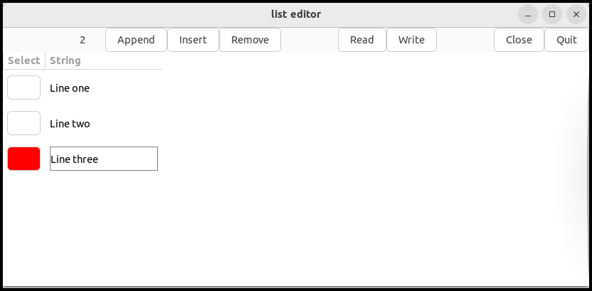

Up: [README.md](../README.md),  Prev: [Section 32](sec32.md)

# GtkSignalListItemFactory

## GtkSignalListItemFactory and GtkBulderListItemFactory

GtkBuilderlistItemFactory is convenient when GtkListView just shows the contents of a list.
Its binding direction is always from an item of a list to a child of GtkListItem.

When it comes to dynamic connection, it's not enough.
For example, suppose you want to edit the contents of a list.
You set a child of GtkListItem to a GtkText instance so a user can edit a text with it.
You need to bind an item in the list with the buffer of the GtkText.
The direction is opposite from the one with GtkBuilderListItemFactory.
It is from the GtkText instance to the item in the list.
You can implement this with GtkSignalListItemFactory, which is more flexible than GtkBuilderListItemFactory.

This section shows just some parts of the source file `listeditor.c`.
If you want to see the whole codes, see `src/listeditor` directory of the [Gtk4 tutorial repository](https://github.com/ToshioCP/Gtk4-tutorial).

## A list editor

The sample program is a list editor and data of the list are strings.
It's the same as a line editor.
It reads a text file line by line.
Each line is an item of the list.
The list is displayed with GtkColumnView.
There are two columns.
The one is a button, which shows if the line is a current line.
If the line is the current line, the button is colored with red.
The other is a string which is the contents of the corresponding item of the list.

The source files are located at `src/listeditor` directory.
You can compile end execute it as follows.

- Download the program from the [repository](https://github.com/ToshioCP/Gtk4-tutorial).
- Change your current directory to `src/listeditor`.
- Type the following on your commandline.

~~~
$ meson setup _build
$ ninja -C _build
$ _build/listeditor
~~~

- Append button: appends a line after the current line, or at the last line if no current line exists.
- Insert button: inserts a line before the current line, or at the top line if no current line exists.
- Remove button: removes a current line.
- Read button: reads a file.
- Write button: writes the contents to a file.
- close button: closes the contents.
- quit button: quits the application.
- Button on the select column: makes the line current.
- String column: GtkText. You can edit a string in the field.

The current line number (zero-based) is shown at the left of the tool bar.
The file name is shown at the right of the write button.

## Connect a GtkText instance and an item in the list

The second column (GtkColumnViewColumn) sets its factory property to GtkSignalListItemFactory.
It uses three signals setup, bind and unbind.
The following shows the signal handlers.

~~~C
 1 static void
 2 setup2_cb (GtkListItemFactory *factory, GtkListItem *listitem) {
 3   GtkWidget *text = gtk_text_new ();
 4   gtk_list_item_set_child (listitem, GTK_WIDGET (text));
 5   gtk_editable_set_alignment (GTK_EDITABLE (text), 0.0);
 6 }
 7 
 8 static void
 9 bind2_cb (GtkListItemFactory *factory, GtkListItem *listitem) {
10   GtkWidget *text = gtk_list_item_get_child (listitem);
11   GtkEntryBuffer *buffer = gtk_text_get_buffer (GTK_TEXT (text));
12   LeData *data = LE_DATA (gtk_list_item_get_item(listitem));
13   GBinding *bind;
14 
15   gtk_editable_set_text (GTK_EDITABLE (text), le_data_look_string (data));
16   gtk_editable_set_position (GTK_EDITABLE (text), 0);
17 
18   bind = g_object_bind_property (buffer, "text", data, "string", G_BINDING_DEFAULT);
19   g_object_set_data (G_OBJECT (listitem), "bind", bind);
20 }
21 
22 static void
23 unbind2_cb (GtkListItemFactory *factory, GtkListItem *listitem) {
24   GBinding *bind = G_BINDING (g_object_get_data (G_OBJECT (listitem), "bind"));
25 
26   if (bind)
27     g_binding_unbind(bind);
28   g_object_set_data (G_OBJECT (listitem), "bind", NULL);
29 }
~~~

- 1-6: `setup2_cb` is a setup signal handler on the GtkSignalListItemFactory.
This factory is inserted to the factory property of the second GtkColumnViewColumn.
The handler just creates a GtkText instance and sets the child of `listitem` to it.
The instance will be destroyed automatically when the `listitem` is destroyed.
So, teardown signal handler isn't necessary.
- 8-20: `bind2_cb` is a bind signal handler.
It is called when the `listitem` is bound to an item in the list.
The list items are LeData instances.
LeData is defined in the file `listeditor.c` (the C source file of the list editor).
It is a child class of GObject and has string data which is the content of the line. 
  - 10-11: `text` is a child of the `listitem` and it is a GtkText instance.
And `buffer` is a GtkEntryBuffer instance of the `text`.
  - 12: The LeData instance `data` is an item pointed by the `listitem`.
  - 15-16: Sets the text of `text` to `le_data_look_string (data)`.
le\_data\_look\_string returns the string of the `data` and the ownership of the string is still taken by the `data`.
So, the caller doesn't need to free the string.
  - 18: `g_object_bind_property` binds a property and another object property.
This line binds the "text" property of the `buffer` (source) and the "string" property of the `data` (destination).
It is a uni-directional binding (`G_BINDING_DEFAULT`).
When a user changes the GtkText text, the same string is immediately put into the `data`. 
The function returns a GBinding instance.
This binding is different from bindings of GtkExpression.
This binding needs the existence of the two properties.
  - 19: GObjec has a table.
The key is a string (or GQuark) and the value is a gpointer (pointer to any type).
The function `g_object_set_data` sets the association from the key to the value.
This line sets the association from "bind" to `bind` instance.
It makes possible for the "unbind" handler to get the `bind` instance.
- 22-29: `unbind2_cb` is a unbind signal handler.
  - 24: Retrieves the `bind` instance from the table in the `listitem` instance.
  - 26-27: Unbind the binding.
  - 28: Removes the value corresponds to the "bind" key.

This technique is not so complicated.
You can use it when you make a cell editable application.

If it is impossible to use `g_object_bind_property`, use a notify signal on the GtkEntryBuffer instance.
You can use "deleted-text" and "inserted-text" signal instead.
The handler of the signals above copies the text in the GtkEntryBuffer instance to the LeData string.
Connect the notify signal handler in `bind2_cb` and disconnect it in `unbind2_cb`.

## Change the cell of GtkColumnView dynamically

Next topic is to change the GtkColumnView (or GtkListView) cells dynamically.
The example changes the color of the buttons, which are children of GtkListItem instances, as the current line position moves.

The line editor has the current position of the list.

- At first, no line is current.
- When a line is appended or inserted, the line is current.
- When the current line is deleted, no line will be current.
- When a button in the first column of GtkColumnView is clicked, the line will be current.
- It is necessary to set the line status (whether current or not) when a GtkListItem is bound to an item in the list.
It is because GtkListItem is recycled.
A GtkListItem was possibly current line before but not current after recycled.
The opposite can also be happen.

The button of the current line is colored with red and otherwise white.

The current line has no relationship to GtkSingleSelection object.
GtkSingleSelection selects a line on the display.
The current line doesn't need to be on the display.
It is possible to be on the line out of the Window (GtkScrolledWindow).
Actually, the program doesn't use GtkSingleSelection.

The LeWindow instance has two instance variables for recording the current line.

- `win->position`: An int type variable. It is the position of the current line. It is zero-based. If no current line exists, it is -1.
- `win->current_button`: A variable points the button, located at the first column, on the current line. If no current line exists, it is NULL.

If the current line moves, the following two functions are called.
They updates the two varables.

~~~C
 1 static void
 2 update_current_position (LeWindow *win, int new) {
 3   char *s;
 4 
 5   win->position = new;
 6   if (win->position >= 0)
 7     s = g_strdup_printf ("%d", win->position);
 8   else
 9     s = "";
10   gtk_label_set_text (GTK_LABEL (win->position_label), s);
11   if (*s) // s isn't an empty string
12     g_free (s);
13 }
14 
15 static void
16 update_current_button (LeWindow *win, GtkButton *new_button) {
17   const char *non_current[1] = {NULL};
18   const char *current[2] = {"current", NULL};
19 
20   if (win->current_button) {
21     gtk_widget_set_css_classes (GTK_WIDGET (win->current_button), non_current);
22     g_object_unref (win->current_button);
23   }
24   win->current_button = new_button;
25   if (win->current_button) {
26     g_object_ref (win->current_button);
27     gtk_widget_set_css_classes (GTK_WIDGET (win->current_button), current);
28   }
29 }
~~~

The varable `win->position_label` points a GtkLabel instance.
The label shows the current line position.

The current button has CSS "current" class.
The button is colored red through the CSS "button.current {background: red;}".

The order of the call for these two functions is important.
The first function, which updates the position, is usually called first.
After that, a new line is appended or inserted.
Then, the second function is called.

The following functions call the two functions above.
Be careful about the order of the call.

~~~C
 1 void
 2 select_cb (GtkButton *btn, GtkListItem *listitem) {
 3   LeWindow *win = LE_WINDOW (gtk_widget_get_ancestor (GTK_WIDGET (btn), LE_TYPE_WINDOW));
 4 
 5   update_current_position (win, gtk_list_item_get_position (listitem));
 6   update_current_button (win, btn);
 7 }
 8 
 9 static void
10 setup1_cb (GtkListItemFactory *factory, GtkListItem *listitem) {
11   GtkWidget *button = gtk_button_new ();
12   gtk_list_item_set_child (listitem, button);
13   gtk_widget_set_focusable (GTK_WIDGET (button), FALSE);
14   g_signal_connect (button, "clicked", G_CALLBACK (select_cb), listitem);
15 }
16 
17 static void
18 bind1_cb (GtkListItemFactory *factory, GtkListItem *listitem, gpointer user_data) {
19   LeWindow *win = LE_WINDOW (user_data);
20   GtkWidget *button = gtk_list_item_get_child (listitem);
21 
22   if (win->position == gtk_list_item_get_position (listitem))
23     update_current_button (win, GTK_BUTTON (button));
24 }
~~~

- 1-7: `select_cb` is a "clicked" signal handler.
The handler just calls the two functions and update the position and button.
- 9-15: `setup1_cb` is a setup signal handler on the GtkSignalListItemFactory.
It sets the child of `listitem` to a GtkButton instance.
The "clicked" signal on the button is connected to the handler `select_cb`.
When the listitem is destroyed, the child (GtkButton) is also destroyed.
At the same time, the connection of the signal and the handler is also destroyed.
So, you don't need teardown signal handler.
- 17-24: `bind1_cb` is a bind signal handler.
Usually, the position moves before this handler is called.
If the item is on the current line, the button is updated.
No unbind handler is necessary.

When a line is added, the current position is updated in advance.

~~~C
 1 static void
 2 app_cb (GtkButton *btn, LeWindow *win) {
 3   LeData *data = le_data_new_with_data ("");
 4 
 5   if (win->position >= 0) {
 6     update_current_position (win, win->position + 1);
 7     g_list_store_insert (win->liststore, win->position, data);
 8   } else {
 9     update_current_position (win, g_list_model_get_n_items (G_LIST_MODEL (win->liststore)));
10     g_list_store_append (win->liststore, data);
11   }
12   g_object_unref (data);
13 }
14 
15 static void
16 ins_cb (GtkButton *btn, LeWindow *win) {
17   LeData *data = le_data_new_with_data ("");
18 
19   if (win->position >= 0)
20     g_list_store_insert (win->liststore, win->position, data);
21   else {
22     update_current_position (win, 0);
23     g_list_store_insert (win->liststore, 0, data);
24   }
25   g_object_unref (data);
26 }
~~~

When a line is removed, the current position becomes -1 and no button is current.

~~~C
1 static void
2 rm_cb (GtkButton *btn, LeWindow *win) {
3   if (win->position >= 0) {
4     g_list_store_remove (win->liststore, win->position);
5     update_current_position (win, -1);
6     update_current_button (win, NULL);
7   }
8 }
~~~

The color of buttons are determined by the "background" CSS style.
The following CSS node is a bit complicated.
CSS node `column view` has `listview` child node.
It covers the rows in the GtkColumnView.
The `listview` node is the same as the one for GtkListView.
It has `row` child node, which is for each child widget.
Therefore, the following node corresponds buttons on the GtkColumnView widget.
In addition, it is applied to the "current" class.

~~~css
columnview listview row button.current {background: red;}
~~~

## A waring from GtkText

If your program has the following two, a warning message can be issued.

- The list has many items and it needs to be scrolled.
- A GtkText instance is the focus widget.

~~~
GtkText - unexpected blinking selection. Removing
~~~

I don't have an exact idea why this happens.
But if GtkText "focusable" property is FALSE, the warning doesn't happen.
So it probably comes from focus and scroll.

You can avoid this by unsetting any focus widget under the main window.
When scroll begins, the "value-changed" signal on the vertical adjustment of the scrolled window is emitted.

The following is extracted from the ui file and C source file.

~~~xml
... ... ...
<object class="GtkScrolledWindow">
  <property name="hexpand">TRUE</property>
  <property name="vexpand">TRUE</property>
  <property name="vadjustment">
    <object class="GtkAdjustment">
      <signal name="value-changed" handler="adjustment_value_changed_cb" swapped="no" object="LeWindow"/>
    </object>
  </property>
... ... ...  
~~~

~~~C
1 static void
2 adjustment_value_changed_cb (GtkAdjustment *adjustment, gpointer user_data) {
3   GtkWidget *win = GTK_WIDGET (user_data);
4 
5   gtk_window_set_focus (GTK_WINDOW (win), NULL);
6 }
~~~

Up: [README.md](../README.md),  Prev: [Section 32](sec32.md)
