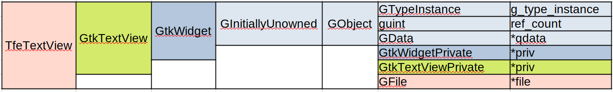
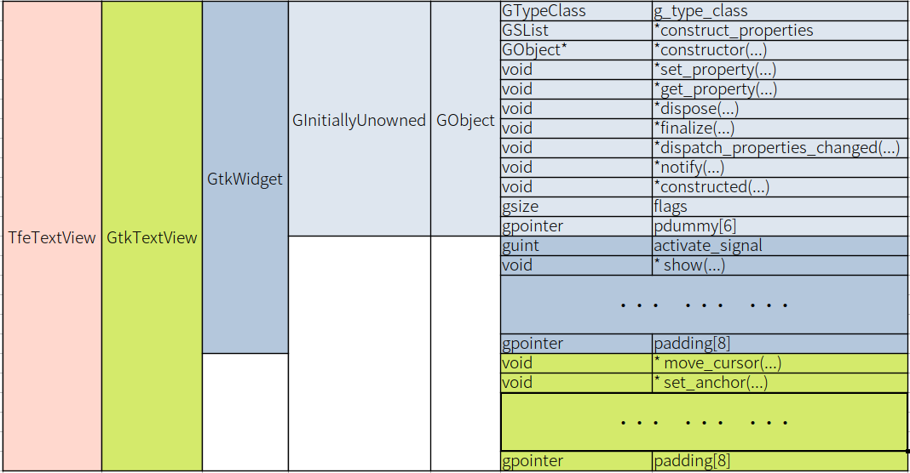

# Instance Initialization and destruction

A new version of the text file editor (`tfe`) will be made in this section and the following four sections.
It is `tfe5`.
There are many changes from the prior version.
They are located in two directories, [src/tfe5](tfe5) and [src/tfetextview](tfetextview).

## Encapsulation

We've divided C source file into two parts.
But it is not enough in terms of encapsulation.

- `tfe.c` includes everything other than TfeTextView.
It should be divided at least into two parts, `tfeapplication.c` and `tfenotebook.c`.
- Header files also need to be organized.

However, first of all, I'd like to focus on the object TfeTextView.
It is a child object of GtkTextView and has a new member `file` in it.
The important thing is to manage the Gfile object pointed by `file`.

- What is necessary to GFile when creating (or initializing) TfeTextView?
- What is necessary to GFile when destructing TfeTextView?
- TfeTextView should read/write a file by itself or not?
- How it communicates with objects outside?

You need to know at least class, instance and signals before thinking about them.
I will explain them in this section and the next section.
After that I will explain:

- Organizing functions.
- How to use GtkFileChooserDialog

## GObject and its children

GObject and its children are objects, which have both class and object C structures.
First, think about instances.
An instance is memories which has the object structure.
The following is the structure of TfeTextView.

~~~C
/* This typedef statement is automatically generated by the macro G_DECLARE_FINAL_TYPE */
typedef struct _TfeTextView TfeTextView;

struct _TfeTextView {
  GtkTextView parent;
  GFile *file;
};
~~~

The members of the structure are:

- The type of `parent` is GtkTextView which is C structure.
It is declared in `gtktextview.h`.
GtkTextView is the parent of TfeTextView.
- `file` is a pointer to a GFile. It can be NULL if no file corresponds to the TfeTextView instance.

You can find the declaration of the ancestors' object structures in the source files of GTK and GLib.
The following is extracted from the source files (not exactly the same).

~~~C
typedef struct _GObject GObject;
typedef struct _GObject GInitiallyUnowned;
struct  _GObject
{
  GTypeInstance  g_type_instance;
  volatile guint ref_count;
  GData         *qdata;
};

typedef struct _GtkWidget GtkWidget;
struct _GtkWidget
{
  GInitiallyUnowned parent_instance;
  GtkWidgetPrivate *priv;
};

typedef struct _GtkTextView GtkTextView;
struct _GtkTextView
{
  GtkWidget parent_instance;
  GtkTextViewPrivate *priv;
};
~~~

In each structure, its parent is declared at the top of the members.
So, all the ancestors are included in the child object.
The structure of `TfeTextView` is like the following diagram.

{width=14.39cm height=2.16cm}

Derivable classes (ancestor classes) have their own private data area which are not included by the structure above.
For example, GtkWidget has GtkWidgetPrivate (C structure) for its private data.

Notice declarations are not definitions.
So, no memories are allocated when C structures are declared.
Memories are allocated to them from the heap area when the `tfe_text_view_new` function is called.
At the same time, the ancestors' private area allocated for the TfeTetView.
They are hidden from TfeTextView and it can't access to them directly.
The created memory is called instance.
When a TfeTextView instance is created, it is given three data area.

- The instance (C structure).
- GtkWidgetPrivate structure.
- GtkTextViewPrivate structure.

TfeTextView functions can access to its instance only.
The GtkWidgetPrivate and GtkTextViewPrivate are used by the ancestors' functions. 
See the following example.

~~~C
GtkWidget *tv = tfe_text_view_new ();
GtkTextBuffer *buffer = gtk_text_view_get_buffer (GTK_TEXT_VIEW (tv));
~~~

The parent's function `gtk_text_view_get_buffer` accesses the GtkTextViewPrivate data (owned by `tv`).
There is a pointer, which points the GtkBuffer, in the private area and the function returns the pointer.
(Actual behavior is a bit more complicated.)

TfeTextView instances inherit the ancestors functions like this.

A TfeTextView instance is created every time the `tfe_text_view_new` function is called.
Therefore, multiple TfeTextView instances can exist.

## Initialization of TfeTextView instances

The function `tfe_text_view_new` creates a new TfeTextView instance.

@@@include
tfetextview/tfetextview.c tfe_text_view_new
@@@

When this function is invoked, a TfeTextView instance is created and initialized.
The initialization process is as follows.

1. When the instance is created, GtkWidgetPrivate and GtkTextViewPrivate structures are also created
2. Initializes GObject (GInitiallyUnowned) part in the TfeTextView instance.
3. Initializes GtkWidget part (the first `priv`) in the TfeTextView instance and GtkWidgetPrivate structure.
4. Initializes GtkTextView part (the second `priv`) in the TfeTextView instance and GtkTextViewPrivate structure.
5. Initializes TfeTextView part (`file`) in the TfeTextView instance.

The step two through four is done by `g_object_init`, `gtk_widget_init` and `gtk_text_view_init`.
They are called by the system automatically and you don't need to care about them.
Step four is done by the function `tfe_text_view_init` in `tfetextview.c`.

@@@include
tfetextview/tfetextview.c tfe_text_view_init
@@@

This function just initializes `tv->file` to be `NULL`.

## Functions and Classes

In Gtk, all objects derived from GObject have class and instance (except abstract object).
Instances are memory of C structure, which are described in the previous two subsections.
Each object can have more than one instance.
Those instances have the same structure.
Instances just have data.
Therefore, it doesn't define object's behavior.
We need at least two things.
One is functions and the other is class methods.

You've already seen many functions.
For example,

- `TfeTextView *tfe_text_view_new (void);` is a function to create a TfeTextView instance.
- `GtkTextBuffer *gtk_text_view_get_buffer (GtkTextView *textview)` is a function to get a GtkTextBuffer from GtkTextView.

Functions are public, which means that they are expected to be used by other objects.
They are similar to public methods in object oriented languages.

Class (C structure) mainly consists of pointers to functions.
The functions are called class methods and used by the object itself or its descendant objects.
For example, GObject class is declared in `gobject.h` in GLib source files.

@@@include
class_gobject.c
@@@

There's a pointer to the function `dispose` in line 23.

~~~C
void (*dispose) (GObject *object);
~~~

The declaration is a bit complicated.
The asterisk before the identifier `dispose` means pointer.
So, the pointer `dispose` points to a function which has one parameter, which points a GObject structure, and returns no value.
In the same way, line 24 says `finalize` is a pointer to the function which has one parameter, which points a GObject structure, and returns no value.

~~~C
void (*finalize) (GObject *object);
~~~

Look at the declaration of `_GObjectClass` so that you would find that most of the members are pointers to functions.

- 13: A function pointed by `constructor` is called when the instance is generated. It completes the initialization of the instance.
- 25: A function pointed by `dispose` is called when the instance destructs itself.
Destruction process is divided into two phases.
The first one is called disposing.
In this phase, the instance releases all the references to other instances.
The second phase is finalizing.
- 26: A function pointed by `finalize` finishes the destruction process.
- The other pointers point to functions which are called while the instance lives.

These functions are called class methods.
The methods are open to its descendants.
But not open to the objects which are not the descendants.

## TfeTextView class 

TfeTextView class is a structure and it includes all its ancestors' classes in it.
Therefore, classes have similar hierarchy to instances.

~~~
GObjectClass (GInitiallyUnownedClass) -- GtkWidgetClass -- GtkTextViewClass -- TfeTextViewClass
~~~

The following is extracted from the source codes (not exactly the same).

@@@include
classes.c
@@@

- 120-122: This three lines are generated by the macro `G_DECLARE_FINAL_TYPE`.
So, they are not written in either `tfe_text_view.h` or `tfe_text_view.c`.
- 3, 84, 121: Each class has its parent class at the first member of its structure.
It is the same as instance structures.
- Class members in ancestors are open to the descendant class.
So, they can be changed in `tfe_text_view_class_init` function.
For example, the `finalize` pointer in GObjectClass will be overridden later in `tfe_text_view_class_init`.
(Override is an object oriented programming terminology.
Override is rewriting ancestors' class methods in the descendant class.)
- Some class methods are often overridden.
`set_property`, `get_property`, `dispose`, `finalize` and `constructed` are such methods.

TfeTextViewClass includes its ancestors' class in it.
It is illustrated in the following diagram.

{width=16.02cm height=8.34cm}

## Destruction of TfeTextView

Every Object derived from GObject has a reference count.
If an object A refers to an object B, then A keeps a pointer to B in A and at the same time increases the reference count of B by one with the function `g_object_ref (B)`.
If A doesn't need B any longer, then A discards the pointer to B (usually it is done by assigning NULL to the pointer) and decreases the reference count of B by one with the function `g_object_unref (B)`.

If two objects A and B refer to C, then the reference count of C is two.
If A no longer needs C, A discards the pointer to C and decreases the reference count in C by one.
Now the reference count of C is one.
In the same way, if B no longer needs C, B discards the pointer to C and decreases the reference count in C by one.
At this moment, no object refers to C and the reference count of C is zero.
This means C is no longer useful.
Then C destructs itself and finally the memories allocated to C is freed.

{width=15.855cm height=2.475cm}

The idea above is based on an assumption that an object referred by nothing has reference count of zero.
When the reference count drops to zero, the object starts its destruction process.
The destruction process is split into two phases: disposing and finalizing.
In the disposing process, the object invokes the function pointed by `dispose` in its class to release all references to other instances.
After that, it invokes the function pointed by `finalize` in its class to complete the destruction process.
For example, dispose handler or dispose method.

In the destruction process, TfeTextView needs to unref the GFile pointed by `tv->file`.
You must write the dispose handler `tfe_text_view_dispose`.

@@@include
tfetextview/tfetextview.c tfe_text_view_dispose
@@@

- 5,6: If `tv->file` points a GFile, decrease its reference count.
`g_clear_object` decreases the reference count and assigns NULL to `tv->file`.
In dispose handlers, we usually use `g_clear_object` rather than `g_object_unref`.
- 8: invokes parent's dispose handler. (This will be explained later.)

In the disposing process, the object uses the pointer in its class to call the handler.
Therefore, `tfe_text_view_dispose` needs to be registered in the class when the TfeTextView class is initialized.
The function `tfe_text_view_class_init` is the class initialization function and it is declared in the `G_DEFINE_TYPE` macro expansion.

~~~C
static void
tfe_text_view_class_init (TfeTextViewClass *class) {
  GObjectClass *object_class = G_OBJECT_CLASS (class);

  object_class->dispose = tfe_text_view_dispose;

}
~~~

Each ancestors' class has been created before TfeTextViewClass is created.
Therefore, there are four classes and each class has a pointer to each dispose handler.
Look at the following diagram.
There are four classes -- GObjectClass (GInitiallyUnownedClass), GtkWidgetClass, GtkTextViewClass and TfeTextViewClass.
Each class has its own dispose handler -- `dh1`, `dh2`, `dh3` and `tfe_text_view_dispose`.

{width=14.925cm height=4.455cm}

Now, look at the `tfe_text_view_dispose` program above.
It first releases the reference to GFile object pointed by `tv->file`.
Then it invokes its parent's dispose handler in line 8.

~~~C
G_OBJECT_CLASS (tfe_text_view_parent_class)->dispose (gobject);
~~~

A variable `tfe_text_view_parent_class`, which is made by `G_DEFINE_TYPE` macro, is a pointer that points the parent object class.
The variable `gobject` is a pointer to TfeTextView instance which is casted as a GObject instance.
Therefore, `G_OBJECT_CLASS (tfe_text_view_parent_class)->dispose` points the handler `dh3` in the diagram above.
The statement `G_OBJECT_CLASS (tfe_text_view_parent_class)->dispose (gobject)` is the same as `dh3 (gobject)`, which means it releases all the reference to the other instances in the GtkTextViewPrivate in the TfeTextView instance.
After that, `dh3` calls `dh2`, and `dh2` calls `dh1`.
Finally all the references are released.
