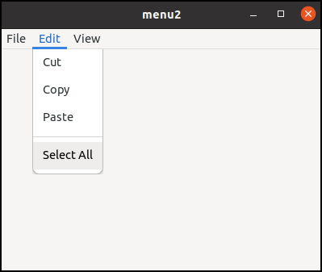
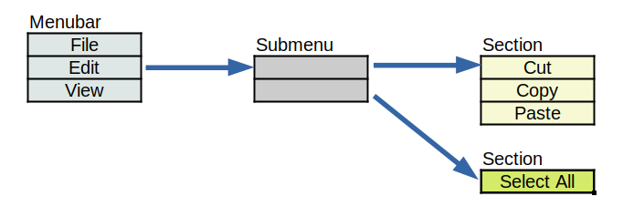
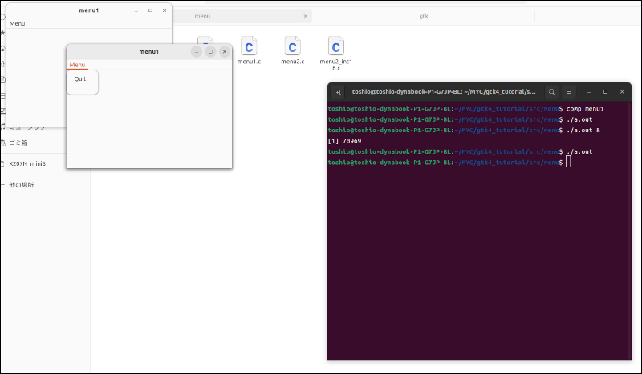

# Menu and action

## Menu

Users often use menus to tell a command to the computer.
It is like this:

{width=5.985cm height=5.055cm}

Now let's analyze the menu above.
There are two types of object.

- "File", "Edit", "View", "Cut", "Copy", "Paste" and "Select All".
They are called "menu item" or simply "item".
When the user clicks one of these items, then something will happen.
- Menubar, submenu referenced by "Edit" item and two sections.
They are called "menu".
Menu is an ordered list of items.
They are similar to arrays.

{width=10.23cm height=3.57cm}

- Menubar is a menu which has three items, which are "File", "Edit" and "View".
- The menu item labeled "Edit" has a link to the submenu which has two items.
These two items don't have labels.
Each item refers to a section.
- The first section is a menu which has three items -- "Cut", "Copy" and "Paste".
- The second section is a menu which has one item -- "Select All".

Menus can build a complicated structure thanks to the links of menu items.

## GMenuModel, GMenu and GMenuItem

GMenuModel is an abstract object which represents a menu.
GMenu is a simple implementation of GMenuModel and a child object of GMenuModel.

    GObject -- GMenuModel -- GMenu

Because GMenuModel is an abstract object, it isn't instantiatable.
Therefore, it doesn't have any functions to create its instance.
If you want to create a menu, use `g_menu_new` to create a GMenu instance.
GMenu inherits all the functions of GMenuModel.

GMenuItem is an object directly derived from GObject.
GMenuItem and Gmenu (or GMenuModel) don't have a parent-child relationship.

    GObject -- GMenuModel -- GMenu
    GObject -- GMenuItem

GMenuItem has attributes.
One of the attributes is label.
For example, there is a menu item which has "Edit" label in the first diagram.
"Cut", "Copy", "Paste" and "Select All" are also the labels of the menu items.
Other attributes will be explained later.

Some menu items have a link to another GMenu.
There are two types of links, submenu and section.

GMenuItem can be inserted, appended or prepended to GMenu.
When it is inserted, all of the attributes and link values are copied and stored in the menu.
The GMenuItem itself is not really inserted.
Therefore, after the insertion, GMenuItem is useless and it should be freed.
The same goes for appending or prepending.

The following code shows how to append GMenuItem to GMenu.

    GMenu *menu = g_menu_new ();
    GMenuItem *menu_item_quit = g_menu_item_new ("Quit", "app.quit");
    g_menu_append_item (menu, menu_item_quit);
    g_object_unref (menu_item_quit);

## Menu and action

One of the attributes of menu items is an action.
This attribute points an action object.

There are two action objects, GSimpleAction and GPropertyAction.
GSimpleAction is often used.
And it is used with a menu item.
Only GSimpleAction is described in this section.

An action corresponds to a menu item will be activated when the menu item is clicked.
Then the action emits an activate signal.

1. menu item is clicked.
2. The corresponding action is activated.
3. The action emits a signal.
4. The connected handler is invoked.

The following code is an example.

~~~C
static void
quit_activated(GSimpleAction *action, GVariant *parameter, gpointer app) { ... ... ...}

GSimpleAction *act_quit = g_simple_action_new ("quit", NULL);
g_action_map_add_action (G_ACTION_MAP (app), G_ACTION (act_quit));
g_signal_connect (act_quit, "activate", G_CALLBACK (quit_activated), app);
GMenuItem *menu_item_quit = g_menu_item_new ("Quit", "app.quit");
~~~

- The variable `menu_item_quit` points a menu item.
It is actually a pointer, but we often say that `menu_item_quit` *is* a menu item.
It has a label "Quit" and is connected to an action "app.quit".
"app" is a prefix and "quit" is the name of the action.
The prefix "app" means that the action belongs to the GtkApplication instance.
- `act_quit` is an action.
It has a name "quit".
The function `g_simple_action_new` creates a stateless action.
So, `act_quit` is stateless.
The meaning of stateless will be explained later.
The argument `NULL` means that the action doesn't have an parameter.
Most of the actions are stateless and have no parameter.
- The action `act_quit` is added to the GtkApplication instance with `g_action_map_add_action`.
So, the action's scope is application.
The prefix of `app.quit` indicates the scope.
- "activate" signal of the action is connected to the handler `quit_activated`.

If the menu is clicked, the corresponding action "quit" will be activated and emits an "activate" signal.
Then, the handler `quit_activated` is called.

## Menu bar

A menu bar and menus are traditional style.
Menu buttons are often used instead of a menu bar lately, but the old style is still used widely.

Applications have only one menu bar.
If an application has two or more windows which have menu bars, the menu bars are exactly the same.
Because every window refers to the same menubar instance in the application.

An application's menu bar is usually unchanged once it is set.
So, it is appropriate to set it in the "startup" handler.
Because it is called only once in the primary application instance.

I think it is good for readers to clarify how applications behave.

- When an application is run for the first time, the instance is called primary.
- The primary instance registers itself to the system. If it succeeds, it emits "startup" signal.
- When the instance is activated, an "activate" or "open" signal is emitted.
- If the application is run for the second time or later and there exists a primary instance, the instance is called a remote instance.
- A remote instance doesn't emit "startup signal.
- If it tries to emit an "activate" or "open" signal, the signals are not emitted on the remote instance but primary instance.
- The remote instance quits.

Therefore, an "activate" or "open" handler can be called twice or more.
On the other hand, a "startup" handler is called once.
So, setting a menubar should be done in the "startup" handler.

~~~C
static void
app_startup (GApplication *app) {
... ... ...
  gtk_application_set_menubar (GTK_APPLICATION (app), G_MENU_MODEL (menubar));
... ... ...
}
~~~

## Simple example

The following is a simple example of menus and actions.
The source file `menu1.c` is located at [src/menu](menu) directory.

@@@include
menu/menu1.c
@@@

- 3-6: `quit_activated` is a handler of the "activate" signal on the action `act_quit`.
Handlers of the "activate" signal have three parameters.
  1. The action instance on which the signal is emitted.
  2. Parameter.
In this example it is `NULL` because the second argument of `g_simple_action_new` (line 23) is `NULL`.
You don' t need to care about it.
  3. User data.
It is the fourth parameter in the `g_signal_connect` (line 25) that connects the action and the handler.
- 5: The function `g_application_quit` immediately quits the application.
- 8-17: `app_activate` is an "activate" signal handler.
- 11-13: Creates a GtkApplicationWindow `win`. And sets the title and the default size.
- 15: Sets GtkApplicationWindow to show the menubar.
- 16: Shows the window.
- 19-38: `app_startup` is a "startup" signal handler
- 23: Creates GSimpleAction `act_quit`.
It is stateless.
The first argument of `g_simple_action_new` is a name of the action and the second argument is a parameter.
If you don't need the parameter, pass `NULL`.
Therefore, `act_quit` has a name "quit" and no parameter.
- 24: Adds the action to GtkApplication `app`.
GtkApplication implements an interface GActionMap and GActionGroup.
GtkApplication (GActionMap) can have a group of actions and the actions are added with the function `g_action_map_add_action`.
This function is described in [Gio API Reference -- g\_action\_map\_add\_action](https://docs.gtk.org/gio/method.ActionMap.add_action.html).
Because this action belongs to GtkApplication, its scope is "app" and it is referred with "app.quit" if the prefix (scope) is necessary.
- 25: Connects "activate" signal of the action and the handler `quit_activated`.
- 27-30: Creates GMenu and GMenuItem instances.
`menubar` and `menu` are GMenu.
`menu_item_menu` and `menu_item_quit` are GMenuItem.
`menu_item_menu` has a label "Menu" and no action.
`menu_item_quit` has a label "Quit" and an action "app.quit".
- 31-32: Appends `menu_item_quit` to `menu`.
As I mentioned before, all the attributes and links are copied and used to form a new item in `menu`.
Therefore after the addition, `menu_item_quit` is no longer needed.
It is freed by `g_object_unref`.
- 33: Sets the submenu link in `menu_item_menu` to point `menu`.
- 34-35: Appends `menu_item_menu` to `menubar`.
Then frees `menu_item_menu`.
GMenu and GMenuItem are connected and finally a menu is made up.
The structure of the menu is shown in the diagram below.
- 37: The menubar is inserted to the application.

{width=12.555cm height=3.285cm}

## Compiling

Change your current directory to `src/menu`.
Use comp to compile `menu1.c`.

~~~
$ comp menu1
$ ./a.out
~~~

Then, a window appears.
Click on "Menu" on the menubar, then a menu appears.
Click on "Quit" menu, then the application quits.

{width=6.0cm height=5.115cm}

## Primary and remote application instances

Let's try running the application twice.
Use `&` in your shell command line, then the application runs concurrently.

~~~
$ ./a.out &
[1] 70969
$ ./a.out
$ 
~~~

Then, two windows appear.

- The first `./a.out` calls the application and a primary instance is created.
It calls "startup" and "activate" handlers and shows a window.
- The second`./a.out` calls the the application again and the created instance is a remote one.
It doesn't emit "startup" signal.
And it activates the application but the "activate" signal is emitted on the primary instance.
The remote instance quits.
- The primary instance called "activate" handler.
The handler creates a new window.
It adds a menu bar to the window with `gtk_application_window_set_show_menubar` function.

Both the windows have menu bars.
And they are exactly the same.
The two windows belong to the primary instance.

If you click on the "Quit" menu, the application (the primary instance) quits.

{width=12cm height=7cm}

The second run makes a new window.
However, it depends on the "activate" handler.
If you create your window in the startup handler and the activate handler just presents the window, no new window is created at the second run.
For example, tfe (text file editor) doesn't create a second window.
It just creates a new notebook page.
Because its activate handler doesn't create any window but just creates a new notebook page.

Second or more executions often happen on the desktop applications.
If you double-click the icon twice or more, the application is run multiple times.
Therefore, you need to think about your startup and activate (open) handler carefully.
