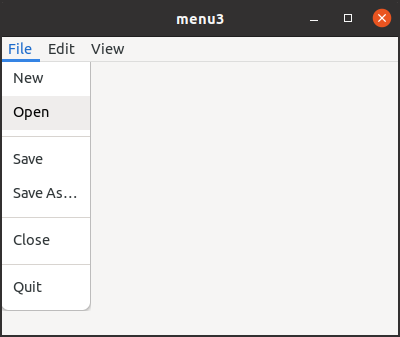

# Ui file for menu and action entries

## Ui file for menu

You may have thought that building menus was really bothersome.
Yes, the program was complicated and it needs lots of time to code them.
The situation is similar to building widgets.
When we built widgets, using ui file was a good way to avoid such complication.
The same goes for menus.

The ui file for menus has interface and menu tags.
The file starts and ends with interface tags.

~~~xml
<interface>
  <menu id="menubar">
  </menu>
</interface>
~~~

`menu` tag corresponds to GMenu object.
`id` attribute defines the name of the object.
It will be referred by GtkBuilder.

~~~xml
<submenu>
  <attribute name="label">File</attribute>
    <item>
      <attribute name="label">New</attribute>
      <attribute name="action">win.new</attribute>
    </item>
</submenu>
~~~

`item` tag corresponds to an item in the GMenu which has the same structure as GMenuItem.
The item above has a label attribute.
Its value is "New".
The item also has an action attribute and its value is "win.new".
"win" is a prefix and "new" is an action name.
`submenu` tag corresponds to both GMenuItem and GMenu.
The GMenuItem has a link to GMenu.

The ui file above can be described as follows.

~~~xml
<item>
  <attribute name="label">File</attribute>
    <link name="submenu">
      <item>
        <attribute name="label">New</attribute>
        <attribute name="action">win.new</attribute>
      </item>
    </link>
</item>
~~~

`link` tag expresses the link to submenu.
And at the same time it also expresses the submenu itself.
This file illustrates the relationship between the menus and items better than the prior ui file.
But `submenu` tag is simple and easy to understand.
So, we usually prefer the former ui style.

For further information, see [GTK 4 API reference -- PopoverMenu](https://docs.gtk.org/gtk4/class.PopoverMenu.html#menu-models).

The following is a screenshot of the sample program `menu3`.
It is located in the directory [src/menu3](menu3).

{width=6.0cm height=5.055cm}

The following is the ui file for `menu3`.

@@@include
menu3/menu3.ui
@@@

The ui file is converted to the resource by the resource compiler `glib-compile-resouces` with xml file.

@@@include
menu3/menu3.gresource.xml
@@@

GtkBuilder builds menus from the resource.

~~~C
GtkBuilder *builder = gtk_builder_new_from_resource ("/com/github/ToshioCP/menu3/menu3.ui");
GMenuModel *menubar = G_MENU_MODEL (gtk_builder_get_object (builder, "menubar"));

gtk_application_set_menubar (GTK_APPLICATION (app), menubar);
g_object_unref (builder);
~~~

The builder instance is freed after the GMenuModel `menubar` is inserted to the application.
If you do it before the insertion, bad thing will happen -- your computer might freeze.

## Action entry

The coding for building actions and signal handlers is bothersome work as well.
Therefore, it should be automated.
You can implement them easily with GActionEntry structure and `g_action_map_add_action_entries` function.

GActionEntry contains action name, signal handlers, parameter and state.

~~~C
typedef struct _GActionEntry GActionEntry;

struct _GActionEntry
{
  /* action name */
  const char *name;
  /* activate handler */
  void (* activate) (GSimpleAction *action, GVariant *parameter, gpointer user_data);
  /* the type of the parameter given as a single GVariant type string */
  const char *parameter_type;
  /* initial state given in GVariant text format */
  const char *state;
  /* change-state handler */
  void (* change_state) (GSimpleAction *action, GVariant *value, gpointer user_data);
  /*< private >*/
  gsize padding[3];
};
~~~
For example, the actions in the previous section are:

~~~C
{ "fullscreen", NULL, NULL, "false", fullscreen_changed }
{ "color", color_activated, "s", "'red'", NULL }
{ "quit", quit_activated, NULL, NULL, NULL },
~~~

- Fullscreen action is stateful, but doesn't have parameters.
So, the third element (parameter type) is NULL.
[GVariant text format](https://docs.gtk.org/glib/gvariant-text.html) provides "true" and "false" as boolean GVariant values.
The initial state of the action is false (the fourth element).
It doesn't have activate handler, so the second element is NULL.
Instead, it has change-state handler.
The fifth element `fullscreen_changed` is the handler.
- Color action is stateful and has a parameter.
The parameter type is string.
[GVariant format strings](https://docs.gtk.org/glib/gvariant-format-strings.html) provides string formats to represent GVariant types.
The third element "s" means GVariant string type.
GVariant text format defines that strings are surrounded by single or double quotes.
So, the string red is 'red' or "red".
The fourth element is `"'red'"`, which is a C string format and the string is 'red'.
You can write `"\"red\""` instead.
The second element color\_activated is the activate handler.
The action doesn't have change-state handler, so the fifth element is NULL.
- Quit action is non-stateful and has no parameter.
So, the third and fourth elements are NULL.
The second element quit\_activated is the activate handler.
The action doesn't have change-state handler, so the fifth element is NULL.

The function `g_action_map_add_action_entries` does everything
to create GSimpleAction instances and add them to a GActionMap (an application or window).

~~~C
const GActionEntry app_entries[] = {
  { "color", color_activated, "s", "'red'", NULL },
  { "quit", quit_activated, NULL, NULL, NULL }
};
g_action_map_add_action_entries (G_ACTION_MAP (app), app_entries,
                                 G_N_ELEMENTS (app_entries), app);
~~~

The code above does:

- Builds the "color" and "quit" actions
- Connects the action and the "activate" signal handlers (color\_activated and quit\_activated).
- Adds the actions to the action map `app`.

The same goes for the other action.

~~~C
const GActionEntry win_entries[] = {
  { "fullscreen", NULL, NULL, "false", fullscreen_changed }
};
g_action_map_add_action_entries (G_ACTION_MAP (win), win_entries,
                                 G_N_ELEMENTS (win_entries), win);
~~~
The code above does:

- Builds the "fullscreen" action.
- Connects the action and the signal handler `fullscreen_changed`
- Its initial state is set to false.
- Adds the action to the action map `win`.

## Example

Source files are `menu3.c`, `menu3.ui`, `menu3.gresource.xml` and `meson.build`.
They are in the directory [src/menu3](menu3).
The following are `menu3.c` and `meson.build`.

@@@include
menu3/menu3.c
@@@

meson.build

@@@include
menu3/meson.build
@@@

Action handlers need to follow the following format.

~~~C
static void
handler (GSimpleAction *action_name, GVariant *parameter, gpointer user_data) { ... ... ... }
~~~

You can't write, for example, "GApplication *app" instead of "gpointer user_data".
Because `g_action_map_add_action_entries` expects that handlers follow the format above.

There are `menu2_ui.c` and `menu2.ui` under the `menu` directory.
They are other examples to show menu ui file and `g_action_map_add_action_entries`.
It includes a stateful action with parameters.

~~~xml
<item>
  <attribute name="label">Red</attribute>
  <attribute name="action">app.color</attribute>
  <attribute name="target">red</attribute>
</item>
~~~

Action name and target are separated like this.
Action attribute includes prefix and name only.
You can't write like `<attribute name="action">app.color::red</attribute>`.
