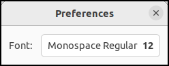

# Template XML and composite widget

The tfe program in the previous section is not so good because many things are crammed into `tfepplication.c`.
And many static variables in `tfepplication.c`.
The file `tfeapplication.c` should be divided into several files.

- `tfeapplication.c` only has codes related to the application.
- A file for the main window
- A file for a preference dialog
- A file for an alert dialog

The preference dialog is defined by a ui file.
And it has GtkBox, GtkLabel and GtkFontButton in it.
Such widget can be defined as a composite widget.
Composite widget is:

- a child object (not child widget) of a widget.
For example, the preference composite widget is a child object of GtkDialog.
- Composite widget can be built from template XML.
The widget is defined with template tag, not object tag.

Next subsection shows how to build a preference dialog.

## Preference dialog

First, write a template XML file.

@@@include
tfe7/tfepref.ui
@@@

Template tag specifies a composite widget.
The value of a class attribute is the object name.
It is "TfePref".
A parent attribute specifies the direct parent class of the composite widget.
Therefore. `TfePref` is a child class of `GtkDialog`.
A parent attribute is optional.
But it is recommended to specify it.
Other lines are the same as before.

The class `TfePref` is defined like TfeTextView.
There are two files `tfepref.h` and `tfepref.c`.

The file `tfepref.h` defines types and declares public functions.
The definitions are public and open to any C files.

@@@include
tfe7/tfepref.h
@@@

- 6: Defines a type `TFE_TYPE_PREF`, which is a macro replaced by `tfe_pref_get_type ()`.
- 7: The macro `G_DECLAER_FINAL_TYPE` expands to:
  - The function `tfe_pref_get_type ()` is declared.
  - TfePrep type is defined as a typedef of `struct _TfePrep`.
  - TfePrepClass type is defined as a typedef of `struct {GtkDialogClass *parent;}`.
  - Two functions `TFE_PREF ()` and `TFE_IS_PREF ()` is defined.
- 9-10: `tfe_pref_new` creates a new TfePref object.

The file `tfepref.c` includes:

- `struct _TfePrep` structure
- `G_DEFINE_TYPE` macro
- Initialize and dispose functions
- public functions

@@@include
tfe7/tfepref.c
@@@

- 4-9: The structure `struct _TfePref` is defined.
Every TfePref instance has its own data of the structure.
The structure has references to:
  - a GSettings instance
  - a FontButton instance
- 11: `G_DEFINE_TYPE` macro.
The macro expands to:
  - the declaration of the class initialization function `tfe_pref_class_init`
  - the declaration of the instance initialization function `tfe_pref_init`
  - a static variable `tfe_pref_parent_class` that points the parent class (GtkDialogClass) structure.
  - a definition of `tfe_pref_get_type ()` function
- 13-19: `tfe_pref_dispose` function.
It is called in the destruction process and releases all the reference to other objects.
For further information about destruction process, refer to [Section 11](sec11.src.md).
- 17: g\_clear\_object is often used in dispose handlers. `g_clear_object (&pref->gsettings)` does:
  - `g_object_unref (pref->gsettings)`
  - `pref->settings =  NULL`
- 21-26: Instance initialization function.
The argument `pref` points a newly created TfePref instance.
- 23: The function `gtk_widget_init_template` creates and initializes the child widgets.
The widgets are created based on the template which is created in the `gtk_widget_class_set_template_from_resource` function.
- 24: Creates GSettings instance and assigns the pointer to it into `pref->settings`.
The instance refers to a GSetting id `com.github.ToshioCP.tfe`.
- 25: Binds the GSettings data `font` and the `font` property of `pref->fontbtn` (GtkFontButton).
The element `pref->fontbtn` points the GtkFontButton, which is the instance of `fontbtn` in the ui file.
The relation was made by the `gtk_widget_class_bind_template_child` function.
- 28-35: Class initialization function.
- 32: Sets the dispose handler.
- 33: `gtk_widget_class_set_template_from_resource` function associates the description in the XML file (`tfepref.ui`) with the widget.
At this moment no instance is created.
It just makes the class recognize the structure of the object.
That's why the top level tag is not `<object>` but `<template>` in the XML file.
The instance will be created in the `gtk_widget_init_template` function later.
- 34: `gtk_widget_class_bind_template_child` macro binds the structure member (`fontbtn` in `struct _TfePref`) and the id `fontbtn` in the XML file.
The two names must be the same.
This binding is between the member and the template (not an instance).
- 37-40: The function `tfe_pref_new` creates a TfePref instance.

Now, It is very simple to use this dialog.
A caller just creates this object and shows it.

~~~C
TfePref *pref;
pref = tfe_pref_new ();
gtk_window_set_transient_for (GTK_WINDOW (pref), win); /* win is the main window */
gtk_window_present (GTK_WINDOW (pref));
~~~

This instance is automatically destroyed when a user clicks on the close button.
That's all.
If you want to show the dialog again, just create and show it.

{width=4cm height=1.6cm}

## Alert dialog

It is almost same as preference dialog.

Its ui file is:

@@@include
tfe7/tfealert.ui
@@@

The header file is:

@@@include
tfe7/tfealert.h
@@@

There are three public functions.
The functions `tfe_alert_set_message` and `tfe_alert_set_button_label` sets the label and button name of the alert dialog.
For example, if you want to show an alert that the user tries to close without saving the content, set them like:

~~~C
tfe_alert_set_message (alert, "Contents aren't saved yet.\nAre you sure to close?");
tfe_alert_set_button_label (alert, "Close");
~~~

The function `tfe_alert_new` creates a TfeAlert dialog.

{width=4cm height=2.14cm}

The C source file is:

@@@include
tfe7/tfealert.c
@@@

The program is almost same as `tfepref.c`.

The Usage of the alert object is as follows.

1. Write the "response" signal handler.
2. Create a TfeAlert object.
3. Connect "response" signal to a handler
4. Show the dialog
5. In the signal handler, do something with regard to the response-id and destroy the dialog.

## Top-level window

`TfeWindow` is a child class of GtkApplicationWindow.

@@@include
tfe7/tfewindow.ui
@@@

This XML file is almost same as before except template tag and "action-name" property in buttons.

GtkButton implements GtkActionable interface, which has "action-name" property.
If this property is set, GtkButton activates the action when it is clicked.
For example, if an open button is clicked, "win.open" action will be activated and `open_activated` handler will be invoked.

This action is also used by "\<Control\>o" accelerator (See `tfeapplication.c`).
If you used "clicked" signal for the button, you would need its signal handler.
Then, there would be two handlers:

- a handler for the "clicked" signal on the button
- a handler for the "activate" signal on the "win.open" action, to which "\<Control\>o" accelerator is connected

These two handlers are almost same.
It is inefficient.
Connecting buttons to actions is a good way to reduce unnecessary codes.

@@@include
tfe7/tfewindow.h
@@@

There are three public functions.
The function `tfe_window_notebook_page_new` creates a new notebook page.
This is a wrapper function for `notebook_page_new`.
It is called by TfeApplication object.
The function `tfe_window_notebook_page_new_with_files` creates notebook pages with a contents read from the given files.
The function `tfe_window_new` creates a TfeWindow instance.

@@@include
tfe7/tfewindow.c
@@@

- 7-12: `_TfeWindow` structure.
A TfeWindow instance points the structure.
- 14: `G_DEFINE_TYPE` macro.
- 17-28: `alert_response_cb` is a call back function for the "response" signal of TfeAlert dialog.
- 21: Destroys the alert dialog.
- 22-27: If the user has clicked on the accept button, it destroys the main window or closes the current notebook page.
- 30-46: A "close-request" signal handler on the TfeWindow.
When a user clicked on the close button (top right x-shaped button), the handler is called before the window closes.
If the handler returns true, the default handler isn't called and the window doesn't close.
If the handler returns false, the default handler is called and the window closes.
- 34: If `has_saved_all` returns true, the handler returns false and the window will close.
Otherwise, it shows an alert dialog.
- 48-111: Handlers of action activated signal.
The `user_data` is a pointer to the TfeWindow instance.
- 115-128: Public functions.
- 130-155: Instance initialization function.
- 135: The function `gtk_widget_init_template` creates a child widgets and initializes them.
- 137-140: Builds and inserts `menu`. It is inserted to the menu button.
- 143-152: Creates actions and inserts them to the window.
The scope of the actions is "win".
- 154: Connects the "close-request" signal and a handler.
- 157-162: Class initialization function.
- 159: Sets the composite widget template
- 160-161: Binds private variables with child class templates.
- 164-167: `tfe_window_new`.
This function creates TfeWindow instance.

## TfeApplication

The file `tfeaplication.h` and `tfeapplication.c` are now very simple.
The following is the header file.

@@@include
tfe7/tfeapplication.h
@@@

- 1: `#pragma once` isn't an official pre-processor command, but widely used.
It makes the header file be read only once.
- 5-6: `TFE_TYPE_APPLICATION` is defined as the type of TfeApplication.
`G_DECLARE_FINAL_TYPE` is a macro used in the header file to define a new object.
- 8-9: The function `tfe_application_new` creates a new TfeApplication instance.

The following is `tfeapplication.c`.
It defines the application and supports:

- GSettings
- CSS

@@@include
tfe7/tfeapplication.c
@@@

- 6-11: Defines `_TfeApplication` structure.
The members are:
  - win: main window instance
  - settings: GSettings instance.it is bound to "font" item in the GSettings
  - provider: a provider for the font of the textview.
- `G_DEFINE_TYPE` macro.
- 16-30: `changed_font_cb` is a handler for "changed::font" signal on the GSettings instance.
The signal name is "changed" and "font" is a key name.
When the valeu of "font" key is changed, the signal is emitted.
So, this handler doesn't directly relate to the font button, but through the GSettings database.
A user changes the font in the font button => GSettings font key data is changed => the handler is called.
- 22-24: Retrieves a string from the GSetting database and converts it into a pango font description.
- 25-29: Sets the css provider with the font data.
The provider has been inserted to the current display in advance.
- 33-39: Activate signal handler.
It uses `tfe_window_notebook_page_new` instead of `notebook_page_new`.
- 41-47: Open signal handler.
It just calls `tfe_window_notebook_page_new_with_files` and shows the main window.
Be careful that the activate and open handlers don't create a new window.
They just create a new notebook page.
Therefore, even if the second application runs, no new window appears.
Just a new notebook page is inserted to the same main window.
- 49-85: Startup signal handler.
- 56: Creates a new window (main window) and assigns it to `app->win`.
- 57-61: Creates a css provider (`provider0`).
It includes only the padding data for the textview.
The provider is inserted to the default display.
- 63-65: Another css provider is created (`app->provider`) and inserted to the default display.
It will include the font data for the textview.
- 66-68: Creates a new GSettings instance.
If the GSettings data is changed, the "changed" signal is emitted.
The signal can have a key name like "changed::font".
This style ("changed::font") is called detailed signal.
The detailed signal is emitted only if the font data is changed.
The handler `changed_font_cb` is called to set the CSS with the font data.
The handler gets the font data from the GSettings data which is the last font in the previous run of the application.
- 71-84: Defines accelerators.
- 87-94: A dispose handler. It releases references to the instances of GSettings and GtkCssProvider.
- 96-101: An initialization for the instance.
It connects three signals (activate, open and startup) and their handlers.
- 183-188: An initialization for the class.
It overrides the dispose class method.
- 110-113: `tfe_application_new` creates a new TfeApplication instance.
The parameters are an application-id and flags. 

## Other files

main.c

@@@include
tfe7/main.c
@@@

CSS related files `pfd2css.h` and `pfd2css.c` are the same as the previous section.

Resource XML file.

@@@include
tfe7/tfe.gresource.xml
@@@

GSchema XML file

@@@include
tfe7/com.github.ToshioCP.tfe.gschema.xml
@@@

Meson.build

@@@include
tfe7/meson.build
@@@

## Compilation and installation.

If you want to install it to your local area, use `--prefix=$HOME/.local` or `--prefix=$HOME` option.
If you want to install it to the system area, no option is needed.
It will be installed under `/user/local` directory.

~~~
$ meson --prefix=$HOME/.local _build
$ ninja -C _build
$ ninja -C _build install
~~~

You need root privilege to install it to the system area..

~~~
$ meson _build
$ ninja -C _build
$ sudo ninja -C _build install
~~~

Source files are in [src/tfe7](tfe7) directory.

Composite widgets give us two advantages.

- A set of widgets is better than individual widgets because of the simple coding.
- They hold instance variables (members of the object structure) so static variables are no longer necessary.
It makes the program simpler.

We made a very small text editor.
You can add features to this editor.
When you add a new feature, be careful about the structure of the program.
Maybe you need to divide a file into several files like this section.
It isn't good to put many things into one file.
And it is important to think about the relationship between source files and widget structures.
