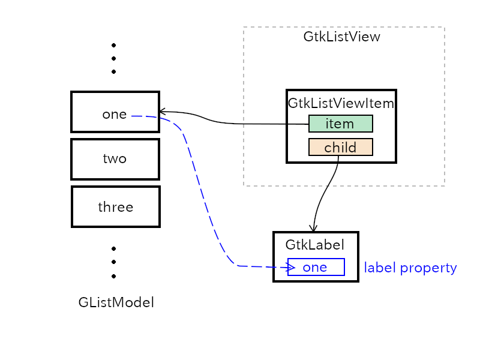

# GtkListView

Gtk4 has added new list objects GtkListView, GtkGridView and GtkColumnView.
The new feature is described in the sections "GListModel support" and "List-based widgets" at the top of [the third chapter of the API reference](https://developer.gnome.org/gtk4/stable/gtkobjects.html).

Gtk4 has other means to implement lists.
They are GtkListBox and GtkTreeView which are took over from Gtk3.
There's an article in [Gtk Development blog](https://blog.gtk.org/2020/06/07/scalable-lists-in-gtk-4/) about list widgets by Matthias Clasen.
He described why GtkListView are developed to replace GtkListBox and GtkTreeView.

I want to explain GtkListView and its related objects in this tutorial.

## Outline

A list is a sequential data structure.
For example, an ordered string sequence "one", "two", "three", "four" is a list.
Each element of the list is called item.
A list is like an array, but in many cases it is implemented with pointers which point to the next item of the list.
And it has a start point.
So, each item can be referred by the index of the item (first item, second item, ..., nth item, ...).
There are two cases.
One is the index starts from one (one-based) and the other is it starts from zero (zero-based).

Gio provides GListModel interface.
It is a zero-based list of the same type of GObject objects, or objects that implement the same interface.
An object implements GListModel is usually not a widget.
So, the list is not displayed on the screen directly.
There's another object GtkListView which is a widget to display the list.
The items in the list need to be connected to the items in GtkListView.
GtkListItemFactory object maps items in the list to GListView.

{width=10cm height=7.5cm}

The instruction to build the whole list related objects is:

1. Implement the list object which implements GListModel.
2. Build widgets and put GtkListView as a child of GtkScrolledWindow.
3. Set GtkListItemFactory.

## GListModel

If you want to make a list of strings with GListModel, for example, "one", "two", "three", "four", note that strings can't be items of the list.
Because GListModel is a list of GObject objects and strings aren't GObject objects.
So, you need a wrapper which is a gobject and contains a string.
GtkStringObject is the wrapper object and GStringList, implements GListModel, is a list of GtkStringObject.

@@@if gfm
~~~C
@@@elif html
~~~{.C}
@@@elif latex
~~~{.C}
@@@else
~~~
@@@end
char *array[] = {"one", "two", "three", "four", NULL};
GtkStringList *stringlist = gtk_string_list_new ((const char * const *) array);
~~~

The function `gtk_string_list_new` creates GtkStringList object.
Its items are GtkStringObject objects which contain the strings "one", "two", "three" and "four".
There are functions to add items to the list or remove items from the list.

- `gtk_string_list_append` appends an item to the list
- `gtk_string_list_remove` removes an item from the list
- `gtk_string_list_get_string` gets a string in the list

See [API document](https://developer.gnome.org/gtk4/stable/GtkStringList.html) for the further information.

I'll explain the other list objects later.

## GtkSelectionModel

GtkSelectionModel is an interface to support for selections.
Thanks to this model, user can select items by clicking on them.
It is implemented by GtkMultiSelection, GtkNoSelection and GtkSingleSelection objects.
These three objects are usually enough to build an application.
They are created with GListModel.
You can also create them alone and add GListModel later.

- GtkMultiSelection supports multiple selection.
- GtkNoSelection supports no selection. This is a wrapper to GListModel when GtkSelectionModel is needed.
- GtkSingleSelection supports single selection.

## GtkListView

GtkListView is a widget to show GListModel items.
GtkListViewItem is used by GtkListView to represent items of a list model.
But, GtkListViewItem itself is not a widget, so a user needs to set a widget, for example GtkLabel, as a child of GtkListView to display an item of the list model.
"item" property of GtkListViewItem points an object that belongs to the list model.

{width=10cm height=7.5cm}

In case the number of items is very big, for example more than a thousand, GtkListViewItem is recycled and connected to another item which is newly displayed.
This recycle makes the number of GtkListViewItem objects fairly small, less than 200.
This is very effective to restrain the growth of memory consumption so that GListModel can contain lots of items, for example, more than a million items.

## GtkListItemFactory

GtkListItemFactory creates or recycles GtkListViewItem and connects it with an item of the list model.
There are two child objects of this factory, GtkSignalListItemFactory and GtkBuilderListItemFactory.

### GtkSignalListItemFactory

GtkSignalListItemFactory provides signals for users to configure a GtkListViewItem object.
There are four signals.

1. "setup" is emitted to set up GtkListViewItem object.
A user sets its child widget in the handler.
For example, creates a GtkLabel widget and sets the child property of GtkListViewItem object to it.
This setting is kept even the GtkListViewItem object is recycled (to bind to another item of GModelList).
2. "bind" is emitted to bind an item in the list model to the widget.
For example, a user gets the item object from "item" property of the GtkListViewItem object.
Then gets the string of the item and sets the label property of the GtkLabel object with the string.
This signal is emitted when the GtkListViewItem is newly created and set up, recycled or some changes has happened to the item of the list.
3. "unbind" is emitted to unbind an item.
A user undoes everything done in step 2 in the signal handler.
If some object are created in step 2, they must be destroyed.
4. "teardown" is emitted to undo everything done in step 1.
So, the widget created in step 1 must be destroyed.
After this signal, the list item will be destroyed.

The following program `list1.c` shows the list of strings "one", "two", "three" and "four".
GtkNoSelection is used, so user can't select any item.

@@@include
misc/list1.c
@@@

The file `list1.c` is located under the directory [src/misc](misc).
Make a shell script below and save it to $HOME/local/bin/comp (comp is the filename).

@@@if gfm
~~~Shell
@@@elif html
~~~{.bash}
@@@elif latex
~~~{.bash}
@@@else
~~~
@@@end
gcc `pkg-config --cflags gtk4` $1.c `pkg-config --libs gtk4`
~~~

Change the current directory to the directory includes `list1.c` and type as follows.

~~~
$ chmod 755 $HOME/local/bin/comp
$ comp list1
$ ./a.out
~~~

Then, `list1.c` has been compiled and executed.

{width=6.04cm height=4.40cm}

I think the program is not so difficult.
If you feel some difficulty, read this section again, especially GtkSignalListItemFactory subsubsection.

### GtkBuilderListItemFactory

GtkBuilderListItemFactory is another GtkListItemFactory.
Its behavior is defined with ui file.

~~~xml
<interface>
  <template class="GtkListItem">
    <property name="child">
      <object class="GtkLabel">
        <binding name="label">
          <lookup name="string" type="GtkStringObject">
            <lookup name="item">GtkListItem</lookup>
          </lookup>
        </binding>
      </object>
    </property>
  </template>
</interface>
~~~

Template tag is used to define GtkListItem.
And its child property is GtkLabel object.
The factory sees this template and creates GtkLabel and sets the child property of GtkListItem.
This is the same as what setup handler of GtkSignalListItemFactory did.

Then, bind the label property of GtkLabel to string property of GtkStringObject.
The string object is referred to by item property of GtkListItem.
So, the lookup tag is like this:

~~~
string <- GtkStringObject <- item <- GtkListItem
~~~

The source code is as follows.
Its name is `list2.c` and located under [src/misc](misc) directory.

@@@include
misc/list2.c
@@@

No signal handler is needed for GtkBulderListItemFactory.
GtkSingleSelection is used, so user can select one item at a time.

Because this is a small program, the ui data is given as strings.
However, generally, ui file is better than string and using resource compiler is the best choice.
