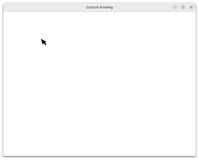
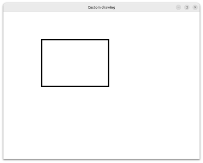

# Custom drawing

Custom drawing is to draw shapes dynamically.
This section shows an example of custom drawing.
You can draw rectangles by dragging the mouse.

Down the button.

{width=6cm height=4.83cm}

Move the mouse

{width=6cm height=4.83cm}

Up the button.

{width=6cm height=4.83cm}

The programs are at `src/custom_drawing` directory.
Download the [repository](https://github.com/ToshioCP/Gtk4-tutorial) and see the directory.
There are four files.

- meson.build
- rect.c
- rect.gresource.xml
- rect.ui

## rect.gresource.xml

This file describes a ui file to compile.
The compiler glib-compile-resources uses it.

@@@include
custom_drawing/rect.gresource.xml
@@@

The prefix is `/com/github/ToshioCP/rect` and the file is `rect.ui`.
Therefore, GtkBuilder reads the resource from `/com/github/ToshioCP/rect/rect.ui`.

## rect.ui

The following is the ui file that defines the widgets.
There are two widgets which are GtkApplicationWindow and GtkDrawingArea.
The ids are `win` and `da` respectively.

@@@include
custom_drawing/rect.ui
@@@

## rect.c

### GtkApplication

This program uses GtkApplication.
The application ID is `com.github.ToshioCP.rect`.

```c
#define APPLICATION_ID "com.github.ToshioCP.rect"
```

See [GNOME Developer Documentation](https://developer.gnome.org/documentation/tutorials/application-id.html) for further information.

The function `main` is called at the beginning of the application.

@@@include
custom_drawing/rect.c main
@@@

It connects three signals and handlers.

- startup: It is emitted after the application is registered to the system. 
- activate: It is emitted when the application is activated.
- shutdown: It is emitted just before the application quits.

@@@include
custom_drawing/rect.c app_startup
@@@

The startup handler does three things.

- Builds the widgets.
- Initializes the GtkDrawingArea instance.
  - Sets the drawing function
  - Connects the "resize" signal and the handler.
- Creates the GtkGestureDrag instance and initializes it.
Gesture will be explained in this section later.

@@@include
custom_drawing/rect.c app_activate
@@@

The activate handler just shows the window.

### GtkDrawingArea

The program has two cairo surfaces and they are pointed by the global variables.

@@@if gfm
```C
static cairo_surface_t *surface = NULL;
static cairo_surface_t *surface_save = NULL;
```
@@@else
```{.C}
static cairo_surface_t *surface = NULL;
static cairo_surface_t *surface_save = NULL;
```
@@@end

The drawing process is as follows.

- Creates an image on `surface`.
- Copies `surface` to the cairo surface of the GtkDrawingArea.
- Calls ` gtk_widget_queue_draw (da)` to draw it if necessary.

They are created in the "resize" signal handler.

@@@include
custom_drawing/rect.c resize_cb
@@@

This callback is called when the GtkDrawingArea is shown.
It is the only call because the window is not resizable.

It creates image surfaces for `surface` and `surface_save`.
The `surface` surface is painted white, which is the background color.

The drawing function copies `surface` to the GtkDrawingArea surface.

@@@include
custom_drawing/rect.c draw_cb
@@@

This function is called by the system when it needs to redraw the drawing area.

Two surfaces `surface` and `surface_save` are destroyed before the application quits.

@@@include
custom_drawing/rect.c app_shutdown
@@@

### GtkGestureDrag

Gesture class is used to recognize human gestures such as click, drag, pan, swipe and so on.
It is a subclass of GtkEventController.
GtkGesture class is abstract and there are several implementations.

- GtkGestureClick
- GtkGestureDrag
- GtkGesturePan
- GtkGestureSwipe
- other implementations

The program `rect.c` uses GtkGestureDrag.
It is the implementation for drags.
The parent-child relationship is as follows.

```
GObject -- GtkEventController -- GtkGesture -- GtkGestureSingle -- GtkGestureDrag
```

GtkGestureSingle is a subclass of GtkGesture and optimized for singe-touch and mouse gestures.

A GtkGestureDrag instance is created and initialized in the startup signal handler in `rect.c`.
See line 18 to 23 in the following.

@@@include
custom_drawing/rect.c app_startup
@@@

- The function `gtk_gesture_drag_new` creates a new GtkGestureDrag instance.
- The function `gtk_gesture_single_set_button` sets the button number to listen to.
The constant `GDK_BUTTON_PRIMARY` is the left button of a mouse.
- The function `gtk_widget_add_controller` adds an event controller, gestures are descendants of the event controller, to a widget.
- Three signals and handlers are connected.
  - drag-begin: Emitted when dragging starts.
  - drag-update: Emitted when the dragging point moves.
  - drag-end: Emitted when the dragging ends.

The process during the drag is as follows.

- start: save the surface and start points
- update: restore the surface and draw a thin rectangle between the start point and the current point of the mouse
- end: restore the surface and draw a thick rectangle between the start and end points.

We need two global variables for the start point.

@@@if gfm
```C
static double start_x;
static double start_y;
```
@@@else
```{.C}
static double start_x;
static double start_y;
```
@@@end

The following is the handler for the "drag-begin" signal.

@@@include
custom_drawing/rect.c copy_surface drag_begin
@@@

- Copies `surface` to `surface_save`, which is an image just before the dragging.
- Stores the points to `start_x` and `start_y`.

@@@include
custom_drawing/rect.c drag_update
@@@

- Restores `surface` from `surface_save`.
- Draws a rectangle with thin lines.
- Calls `gtk_widget_queue_draw` to add the GtkDrawingArea to the queue to redraw.

@@@include
custom_drawing/rect.c drag_end
@@@

- Restores `surface` from `surface_save`.
- Draws a rectangle with thick lines.
- Calls `gtk_widget_queue_draw` to add the GtkDrawingArea to the queue to redraw.

## Build and run

Download the [repository](https://github.com/ToshioCP/Gtk4-tutorial).
Change your current directory to `src/custom_drawing`.
Run meson and ninja to build the program.
Type `_build/rect` to run the program.
Try to draw rectangles.

```
$ cd src/custom_drawing
$ meson setup _build
$ ninja -C _build
$ _build/rect
```

{width=12.4cm height=10cm}
