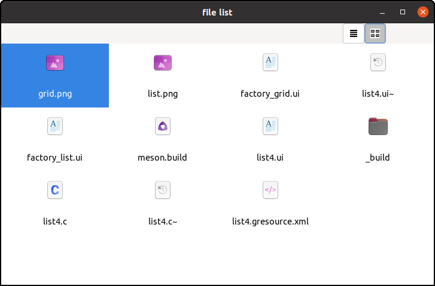
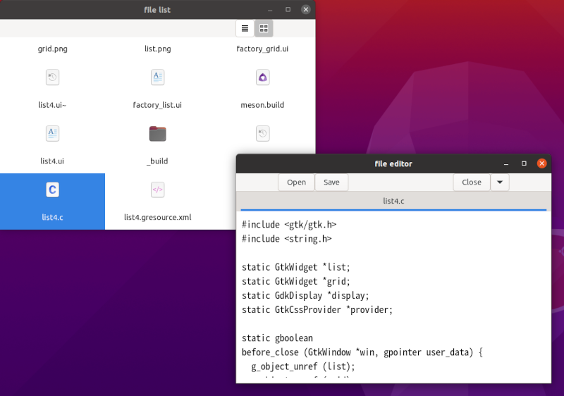

# GtkGridView and activate signal

GtkGridView is similar to GtkListView.
It displays a GListModel as a grid, which is like a square tessellation.

{width=10cm height=6.6cm}

This is often seen when you use a file browser like nautilus.

In this section, let's make a very simple file browser `list4`.
It just shows the files in the current directory.
And a user can choose list or grid by clicking on buttons in the tool bar.
Each item in the list or grid has an icon and a filename.
In addition, `list4` provides the way to open the `tfe` text editor to show a text file.
A user can do that by double clicking on an item or pressing enter key when an item is selected.

## GtkDirectoryList

GtkDirectoryList implements GListModel and it contains information of files in a certain directory.
The items of the list are GFileInfo objects.

In the `list4` source files, GtkDirectoryList is described in a ui file and built by GtkBuilder.
The GtkDirectoryList instance is assigned to the "model" property of a GtkSingleSelection instance.
And the GtkSingleSelection instance is assigned to the "model" property of a GListView or GGridView instance.

~~~
GtkListView (model property) => GtkSingleSelection (model property) => GtkDirectoryList
GtkGridView (model property) => GtkSingleSelection (model property) => GtkDirectoryList
~~~

{width=10cm height=7.5cm}

The following is the part of the ui file `list4.ui`.
It defines GtkListView, GtkSingleSelection and GtkDirectoryList.
It also defines GtkGridView and GtkSingleSelection.

~~~xml
<object class="GtkListView" id="list">
  <property name="model">
    <object class="GtkSingleSelection" id="singleselection">
      <property name="model">
        <object class="GtkDirectoryList" id="directorylist">
          <property name="attributes">standard::name,standard::icon,standard::content-type</property>
        </object>
      </property>
    </object>
  </property>
</object>
<object class="GtkGridView" id="grid">
  <property name="model">singleselection</property>
</object>
~~~

GtkDirectoryList has an "attributes" property.
It is attributes of GFileInfo such as "standard::name", "standard::icon" and "standard::content-type".

- standard::name is a filename.
- standard::icon is an icon of the file. It is a GIcon object.
- standard::content-type is a content-type.
Content-type is the same as mime type for the internet technology.
For example, "text/plain" is a text file, "text/x-csrc" is a C source code and so on.
("text/x-csrc"is not registered to IANA media types.
Such "x-" subtype is not a standard mime type.)
Content type is also used by the desktop system.

GtkGridView has the same structure as GtkListView.
But it is enough to specify its model property to `singleselection` which is the identification of the GtkSingleSelection.
Therefore the description for GtkGridView is very short.

## Ui file of the window

Look at the screenshot of `list4` at the top of this section.
The widgets are built with the following ui file.

@@@include
list4/list4.ui
@@@

The file consists of two parts.
The first part begins at the third line and ends at the 57th line.
This part is the widgets from the top level window to the scrolled window.
It also includes two buttons.
The second part begins at the 58th line and ends at the 71st line.
This is the part of GtkListView and GtkGridView.
They are described in the previous section.

- 13-17, 42-46: Two labels are dummy labels.
They just work as a space to put the two buttons at the appropriate position.
- 19-41: GtkButton `btnlist` and `btngrid`.
These two buttons work as selection buttons to switch from list to grid and vice versa.
These two buttons are connected to a stateful action `win.view`.
This action is stateful and has a parameter.
Such action consists of prefix, action name and parameter.
The prefix of the action is `win`, which means the action belongs to the top level window.
So, a prefix gives the scope of the action.
The action name is `view`.
The parameters are `list` or `grid`, which show the state of the action.
A parameter is also called a target, because it is a target to which the buttons are clicked on to change the action state.
We often write the detailed action like "win.view::list" or "win.view::grid".
- 21-22: The properties "action-name" and "action-target" belong to GtkActionable interface.
GtkButton implements GtkActionable.
The action name is "win.view" and the target is "list".
Generally, a target is GVariant, which can be string, integer, float and so on.
You need to use GVariant text format to write GVariant value in ui files.
If the type of the GVariant value is string, then the value with GVariant text format is bounded by single quotes or double quotes.
Because ui file is xml format text, single quote cannot be written without escape.
Its escape sequence is \&apos;.
Therefore, the target 'list' is written as \&apos;list\&apos;.
Because the button is connected to the action, "clicked" signal handler isn't needed.
- 23-27: The child widget of the button is GtkImage.
GtkImage has a "resource" property.
It is a GResource and GtkImage reads an image data from the resource and sets the image.
This resource is built from 24x24-sized png image data, which is an original icon.
- 50-53: GtkScrolledWindow.
Its child widget will be GtkListView or GtkGridView.

The action `view` is created, connected to the "activate" signal handler and inserted to the window (action map) as follows.

~~~C
  act_view = g_simple_action_new_stateful ("view", g_variant_type_new("s"), g_variant_new_string ("list"));
  g_signal_connect (act_view, "activate", G_CALLBACK (view_activated), scr); /* scr is the GtkScrolledWindow object */
  g_action_map_add_action (G_ACTION_MAP (win), G_ACTION (act_view));
~~~

The signal handler `view_activated` will be explained later.

## Factories

Each view (GtkListView and GtkGridView) has its own factory because its items have different structure of widgets.
The factories are GtkBuilderListItemFactory objects.
Their ui files are as follows.

factory_list.ui

@@@include
list4/factory_list.ui
@@@

factory_grid.ui

@@@include
list4/factory_grid.ui
@@@

The two files above are almost same.
The difference is:

- The orientation of the box
- The icon size
- The position of the text of the label

@@@shell
cd list4; diff factory_list.ui factory_grid.ui
@@@

Each view item has two properties, "gicon" property of GtkImage and "label" property of GtkLabel.
Because GFileInfo doesn't have properties correspond to icon or filename, the factory uses closure tag to bind "gicon" and "label" properties to GFileInfo information.
A function `get_icon` gets GIcon the GFileInfo object has.
And a function `get_file_name` gets a filename the GFileInfo object has.

@@@include
list4/list4.c get_icon get_file_name
@@@

One important thing is view items own the instance or string.
It is achieved by `g_object_ref` to increase the reference count by one, or `strdup` to create a copy of the string.
The object or string will be automatically freed in unbinding process when the view item is recycled.

## An activate signal handler of the action

An activate signal handler `view_activate` switches the view.
It does two things.

- Changes the child widget of GtkScrolledWindow.
- Changes the CSS of buttons to show the current state.

@@@include
list4/list4.c view_activated
@@@

The second parameter of this handler is the target of the clicked button.
Its type is GVariant.

- If `btnlist` has been clicked, then `parameter` is a GVariant of the string "list".
- If `btngrid` has been clicked, then `parameter` is a GVariant of the string "grid".

The third parameter `user_data` points GtkScrolledWindow, which is set in the `g_signal_connect` function.

- 4: `g_variant_get_string` gets the string from the GVariant variable.
- 8-14: Sets the child of `scr`.
The function `gtk_scrolled_window_set_child` decreases the reference count of the old child by one.
And it increases the reference count of the new child by one.
- 15-17: Sets the CSS of the buttons.
The background of the clicked button will be silver color and the other button will be white.
- 18: Changes the state of the action.
 
## Activate signal of GtkListView and GtkGridView

Views (GtkListView and GtkGridView) have an "activate" signal.
It is emitted when an item in the view is double clicked or the enter key is pressed.
You can do anything you like by connecting the "activate" signal to the handler.

The example `list4` launches `tfe` text file editor if the item of the list is a text file.

~~~C
static void
list_activate (GtkListView *list, int position, gpointer user_data) {
  GFileInfo *info = G_FILE_INFO (g_list_model_get_item (G_LIST_MODEL (gtk_list_view_get_model (list)), position));
  launch_tfe_with_file (info);
}

static void
grid_activate (GtkGridView *grid, int position, gpointer user_data) {
  GFileInfo *info = G_FILE_INFO (g_list_model_get_item (G_LIST_MODEL (gtk_grid_view_get_model (grid)), position));
  launch_tfe_with_file (info);
}

... ...
... ...

  g_signal_connect (GTK_LIST_VIEW (list), "activate", G_CALLBACK (list_activate), NULL);
  g_signal_connect (GTK_GRID_VIEW (grid), "activate", G_CALLBACK (grid_activate), NULL);
~~~

The second parameter of the handlers is the position of the item (GFileInfo) of the GListModel.
So you can get the item with `g_list_model_get_item` function.

## Content type and launching an application

The function `launch_tfe_with_file` gets a file from the GFileInfo instance.
If the file is a text file, it launches `tfe` with the file.

GFileInfo has information about file type.
The file type is like "text/plain", "text/x-csrc" and so on.
It is called content type.
Content type can be got with `g_file_info_get_content_type` function.

@@@include
list4/list4.c launch_tfe_with_file
@@@

- 13: Gets the content type of the file from GFileInfo.
- 14: Prints the content type.
This is only useful to know a content type of a file.
You can delete it if unnecessary.
- 17-20: If the content type doesn't begin with "text/", then it returns.
- 21: Creates GAppInfo object of `tfe` application.
GAppInfo is an interface and the variable `appinfo` points a GDesktopAppInfo instance.
GAppInfo is a collection of information of an application.
- 30: Launches the application (`tfe`) with an argument `file`.
`g_app_info_launch` has four parameters.
The first parameter is GAppInfo object.
The second parameter is a list of GFile objects.
In this function, only one GFile instance is given to `tfe`, but you can give more arguments.
The third parameter is GAppLaunchContext, but this program gives NULL instead.
The last parameter is the pointer to the pointer to a GError.
- 34: `g_list_free_full` frees the memories used by the list and items.

If your distribution supports GTK 4, using `g_app_info_launch_default_for_uri` is convenient.
The function automatically determines the default application from the file and launches it.
For example, if the file is text, then it launches gedit with the file.
Such functionality comes from desktop.

## Compilation and execution

The source files are located in [src/list4](list4) directory.
To compile and execute list4, type as follows.

~~~
$ cd list4 # or cd src/list4. It depends your current directory.
$ meson _build
$ ninja -C _build
$ _build/list4
~~~

Then a file list appears as a list style.
Click on a button on the tool bar so that you can change the style to grid or back to list.
Double click "list4.c" item, then `tfe` text editor runs with the argument "list4.c".
The following is the screenshot.

{width=8cm height=5.62cm}

## "gbytes" property of GtkBuilderListItemFactory

GtkBuilderListItemFactory has "gbytes" property.
The property contains a byte sequence of ui data.
If you use this property, you can put the contents of `factory_list.ui` and `factory_grid.ui`into `list4.ui`.
The following shows a part of the new ui file (`list5.ui`).

~~~xml
  <object class="GtkListView" id="list">
    <property name="model">
      <object class="GtkSingleSelection" id="singleselection">
        <property name="model">
          <object class="GtkDirectoryList" id="directorylist">
            <property name="attributes">standard::name,standard::icon,standard::content-type</property>
          </object>
        </property>
      </object>
    </property>
    <property name="factory">
      <object class="GtkBuilderListItemFactory">
        <property name="bytes"><![CDATA[
<?xml version="1.0" encoding="UTF-8"?>
<interface>
  <template class="GtkListItem">
    <property name="child">
      <object class="GtkBox">
        <property name="orientation">GTK_ORIENTATION_HORIZONTAL</property>
        <property name="spacing">20</property>
        <child>
          <object class="GtkImage">
            <binding name="gicon">
              <closure type="GIcon" function="get_icon">
                <lookup name="item">GtkListItem</lookup>
              </closure>
            </binding>
          </object>
        </child>
        <child>
          <object class="GtkLabel">
            <property name="hexpand">TRUE</property>
            <property name="xalign">0</property>
            <binding name="label">
              <closure type="gchararray" function="get_file_name">
                <lookup name="item">GtkListItem</lookup>
              </closure>
            </binding>
          </object>
        </child>
      </object>
    </property>
  </template>
</interface>
        ]]></property>
      </object>
    </property>
  </object>
~~~

CDATA section begins with "<![CDATA[" and ends with "]]>".
The contents of CDATA section is recognized as a string.
Any character, even if it is a key syntax marker such as '<' or '>', is recognized literally.
Therefore, the text between "<![CDATA[" and "]]>" is inserted to "bytes" property as it is.

This method decreases the number of ui files.
But, the new ui file is a bit complicated especially for the beginners.
If you feel some difficulty, it is better for you to separate the ui file.

A directory [src/list5](list5) includes the ui file above.

