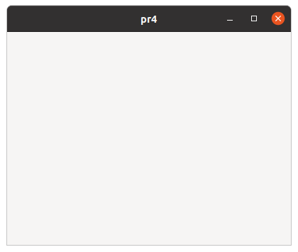

# GtkApplication and GtkApplicationWindow

## GtkApplication

### GtkApplication and g\_application\_run

People write programming code to make an application.
What are applications?
Applications are software that runs using libraries, which includes the
OS, frameworks and so on.
In GTK 4 programming, the GtkApplication is a program (or executable) that runs
using Gtk libraries.

The basic way to write a GtkApplication is as follows.

- Create a GtkApplication instance.
- Run the application.

That's all.
Very simple.
The following is the C code representing the scenario above.

@@@include
misc/pr1.c
@@@

The first line says that this program includes the header files of the Gtk libraries.
The function `main` is a startup function in C language.
The variable `app` is defined as a pointer to a GtkApplication instance.
The function `gtk_application_new` creates a GtkApplication instance and returns a pointer to the instance.
The GtkApplication instance is a C structure data in which the information about the application is stored.
The meaning of the arguments will be explained later.
The function `g_application_run` runs an application that the instance defined.
(We often say that the function runs `app`.
Actually, `app` is not an application but a pointer to the instance of the application.
However, it is simple and short, and probably no confusion occurs.)

Here I used the word `instance`.
Instance, class and object are terminologies in Object Oriented Programming.
I use these words in the same way.
But, I will often use "object" instead of "instance" in this tutorial.
That means "object" and "instance" is the same.
Object is a bit ambiguous word.
In a broad sense, object has wider meaning than instance.
So, readers should be careful of the contexts to find the meaning of "object".
In many cases, object and instance are the same.

To compile this, the following command needs to be run.
The string `pr1.c` is the filename of the C source code above.

~~~
$ gcc `pkg-config --cflags gtk4` pr1.c `pkg-config --libs gtk4`
~~~

The C compiler gcc generates an executable file, `a.out`.
Let's run it.

~~~
$ ./a.out

(a.out:13533): GLib-GIO-WARNING **: 15:30:17.449: Your application does not implement
g_application_activate() and has no handlers connected to the "activate" signal.
It should do one of these.
$
~~~

Oh, it just produces an error message.
This error message means that the GtkApplication object ran, without a doubt.
Now, let's think about what this message means.

### signal

The message tells us that:

1. The application GtkApplication doesn't implement `g_application_activate()`,
2. It has no handlers connected to the "activate" signal, and
3. You will need to solve at least one of these.

These two causes of the error are related to signals.
So, I will explain that to you first.

A signal is emitted when something happens.
For example, a window is created, a window is destroyed and so on.
The signal "activate" is emitted when the application is activated.
(Activated is a bit different from started, but you can think the both are almost same so far.)
If the signal is connected to a function, which is called a signal handler or
simply handler, then the function is invoked when the signal emits.

The flow is like this:

1. Something happens.
2. If it's related to a certain signal, then the signal is emitted.
3. If the signal has been connected to a handler in advance, then the handler is invoked.

Signals are defined in objects.
For example, the "activate" signal belongs to the GApplication object, which is
a parent object of GtkApplication object.

The GApplication object is a child object of the GObject object.
GObject is the top object in the hierarchy of all the objects.

~~~
GObject -- GApplication -- GtkApplication
<---parent                      --->child
~~~

A child object inherits signals, functions, properties and so on from its parent object.
So, GtkApplication also has the "activate" signal.

Now we can solve the problem in `pr1.c`.
We need to connect the "activate" signal to a handler.
We use a function `g_signal_connect` which connects a signal to a handler.

@@@include
misc/pr2.c
@@@

First, we define the handler `app_activate` which simply displays a message.
The function `g_print` is defined in GLib and it's like a printf in the C standard library.
In the function `main`, we add `g_signal_connect` before `g_application_run`.
The function `g_signal_connect` has four arguments.

1. An instance to which the signal belongs.
2. The name of the signal.
3. A handler function (also called callback), which needs to be casted by `G_CALLBACK`.
4. Data to pass to the handler. If no data is necessary, NULL should be given.

It is described in the [GObject API Reference](https://docs.gtk.org/gobject/func.signal_connect.html).
Correctly, `g_signal_connect` is a macro (not a C function).

~~~c
#define g_signal_connect (
  instance,
  detailed_signal,
  c_handler,
  data
)
~~~

You can find the description of each signal in the API reference manual.
For example, "activate" signal is in [GApplication section](https://docs.gtk.org/gio/signal.Application.activate.html) in the GIO API Reference.

~~~c
void
activate (
  GApplication* self,
  gpointer user_data
)
~~~

This is a declaration of the "activate" signal handler.
You can use any name instead of "activate" in the declaration above.
The parameters are:

- self is an instance to which the signal belongs.
- user\_data is a data defined in the fourth argument of the `g_signal_connect` function.
If it is NULL, then you can ignore and left out the second parameter.

API reference manual is very important.
You should see and understand it.

Let's compile the source file above (`pr2.c`) and run it.

~~~
$ gcc `pkg-config --cflags gtk4` pr2.c `pkg-config --libs gtk4`
$ ./a.out
GtkApplication is activated.
$
~~~

OK, well done.
However, you may have noticed that it's painful to type such a long line to compile.
It is a good idea to use shell script to solve this problem.
Make a text file which contains the following line.

~~~
gcc `pkg-config --cflags gtk4` $1.c `pkg-config --libs gtk4`
~~~

Then, save it under the directory $HOME/bin, which is usually /home/(username)/bin.
(If your user name is James, then the directory is /home/james/bin).
And turn on the execute bit of the file.
If the filename is `comp`, do like this:

~~~
$ chmod 755 $HOME/bin/comp
$ ls -log $HOME/bin
    ...  ...  ...
-rwxr-xr-x 1   62 May 23 08:21 comp
    ...  ...  ...
~~~

If this is the first time that you make a $HOME/bin directory and save a file in it, then you need to logout and login again.

~~~
$ comp pr2
$ ./a.out
GtkApplication is activated.
$
~~~

## GtkWindow and GtkApplicationWindow

### GtkWindow

A message "GtkApplication is activated." was printed out in the previous subsection.
It was good in terms of a test of GtkApplication.
However, it is insufficient because Gtk is a framework for graphical user interface (GUI).
Now we go ahead with adding a window into this program.
What we need to do is:

1. Create a GtkWindow.
2. Connect it to GtkApplication.
3. Show the window.

Now rewrite the function `app_activate`.

#### Create a GtkWindow

@@@include
misc/pr3.c app_activate
@@@

Widget is an abstract concept that includes all the GUI interfaces such as windows, dialogs, buttons, multi-line text, containers and so on.
And GtkWidget is a base object from which all the GUI objects derive.

~~~
parent <-----> child
GtkWidget -- GtkWindow
~~~

GtkWindow includes GtkWidget at the top of its object.

{width=9.0cm height=6.0cm}

The function `gtk_window_new` is defined as follows.

~~~C
GtkWidget *
gtk_window_new (void);
~~~

By this definition, it returns a pointer to GtkWidget, not GtkWindow.
It actually creates a new GtkWindow instance (not GtkWidget) but returns a pointer to GtkWidget.
However,the pointer points the GtkWidget and at the same time it also points GtkWindow that contains GtkWidget in it.

If you want to use `win` as a pointer to a GtkWindow type instance, you need to cast it.

~~~C
(GtkWindow *) win
~~~

It works, but isn't usually used.
Instead, `GTK_WINDOW` macro is used.

~~~C
GTK_WINDOW (win)
~~~

The macro is recommended because it does not only cast but also check the type.

#### Connect it to GtkApplication.

The function `gtk_window_set_application` is used to connect GtkWindow to GtkApplication.

~~~C
gtk_window_set_application (GTK_WINDOW (win), GTK_APPLICATION (app));
~~~

You need to cast `win` to GtkWindow and `app` to GtkApplication with `GTK_WINDOW` and `GTK_APPLICATION` macro.

GtkApplication continues to run until the related window is destroyed.
If you didn't connect GtkWindow and GtkApplication, GtkApplication destroys itself immediately.
Because no window is connected to GtkApplication, GtkApplication doesn't need to wait anything.
As it destroys itself, the GtkWindow is also destroyed.

#### Show the window.

The function `gtk_window_present` presents the window to a user (shows it to the user).

GTK 4 changes the default widget visibility to on, so every widget doesn't need to change it to on.
But, there's an exception.
Top level window (this term will be explained later) isn't visible when it is created.
So you need to use the function above to show the window.

You can use `gtk_widget_set_visible (win, true)` instead of `gtk_window_present`.
But the behavior of these two is different.
Suppose there are two windows win1 and win2 on the screen and win1 is behind win2.
Both windows are visible.
The function `gtk_widget_set_visible (win1, true)` does nothing because win1 is already visible.
So, win1 is still behind win2.
The other function `gtk_window_present (win1)` moves win1 to the top of the stack of the windows.
Therefore, if you want to present the window, you should use `gtk_window_present`.

Two functions `gtk_widget_show` and `gtk_widget_hide` is deprecated since GTK 4.10.
You should use `gtk_widget_set_visible` instead.

Save the program as `pr3.c`, then compile and run it.

~~~
$ comp pr3
$ ./a.out
~~~

A small window appears.

{width=3.3cm height=3.825cm}

Click on the close button then the window disappears and the program finishes.

### GtkApplicationWindow

GtkApplicationWindow is a child object of GtkWindow.
It has some extra feature for better integration with GtkApplication.
It is recommended to use it as the top-level window of the application instead of GtkWindow.

Now rewrite the program and use GtkApplicationWindow.

@@@include
misc/pr4.c app_activate
@@@

When you create GtkApplicationWindow, you need to give GtkApplication instance as an argument.
Then it automatically connect these two instances.
So you don't need to call `gtk_window_set_application` any more.

The program sets the title and the default size of the window.
Compile it and run `a.out`, then you will see a bigger window with its title "pr4".

{width=6.3cm height=5.325cm}
