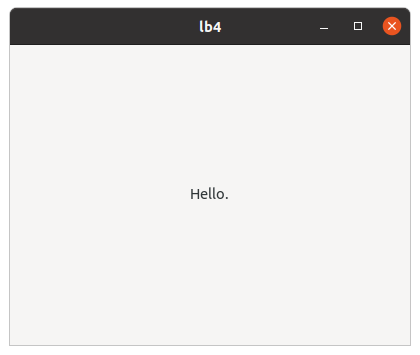
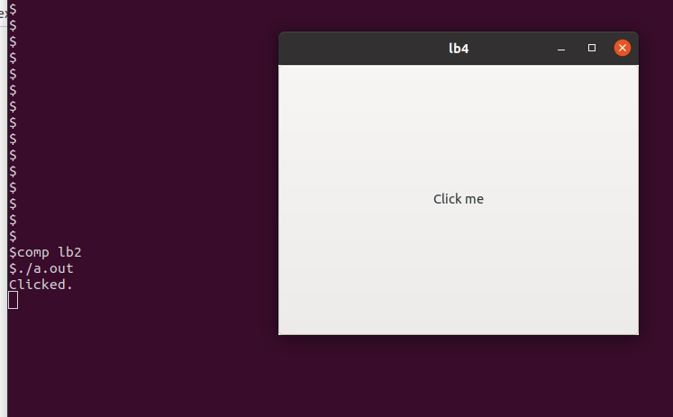
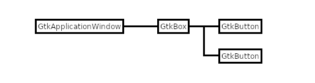

# Widgets (1)

## GtkLabel, GtkButton and GtkBox

### GtkLabel

In the previous section we made a window and displayed it on the screen.
Now we go on to the next topic, where we add widgets to this window.
The simplest widget is GtkLabel.
It is a widget with text in it.

@@@include
misc/lb1.c
@@@

Save this program to a file `lb1.c`.
Then compile and run it.

    $ comp lb1
    $ ./a.out

A window with a message "Hello." appears.

{width=6.3cm height=5.325cm}

There's only a little change between `pr4.c` and `lb1.c`.
A program `diff` is good to know the difference between two files.

@@@shell
cd misc; diff pr4.c lb1.c
@@@

This tells us:

- A signal handler `app_activate` doesn't have `user_data` parameter.
If the fourth argument of `g_signal_connect` is NULL, you can leave out `user_data`.
- The definition of a new variable `lab` is added.
- The title of the window is changed.
- A label is created and connected to the window as a child.

The function `gtk_window_set_child (GTK_WINDOW (win), lab)` makes the label `lab` a child widget of the window `win`.
Be careful.
A child widget is different from a child object.
Objects have parent-child relationships and widgets also have parent-child relationships.
But these two relationships are totally different.
Don't be confused.
In the program `lb1.c`, `lab` is a child widget of `win`.
Child widgets are always located in their parent widget on the screen.
See how the window has appeared on the screen.
The application window includes the label.

The window `win` doesn't have any parents.
We call such a window top-level window.
An application can have more than one top-level window.

### GtkButton

The next widget is GtkButton.
It displays a button on the screen with a label or icon on it.
In this subsection, we will make a button with a label.
When the button is clicked, it emits a "clicked" signal.
The following program shows how to catch the signal and do something.

@@@include
misc/lb2.c
@@@

Look at the line 17 to 19.
First, it creates a GtkButton instance `btn` with a label "Click me".
Then, adds the button to the window `win` as a child.
Finally, connects a "clicked" signal of the button to the handler `click_cb`.
So, if `btn` is clicked, the function `click_cb` is invoked.
The suffix "cb" means "call back".

Name the program `lb2.c` and save it.
Now compile and run it.

{width=11.205cm height=6.945cm}

A window with the button appears.
Click the button (it is a large button, you can click everywhere in the window), then a string "Clicked." appears on the terminal.
It shows the handler was invoked by clicking the button.

It's good that we make sure that the clicked signal was caught and the handler was invoked by using `g_print`.
However, using `g_print` is out of harmony with GTK, which is a GUI library.
So, we will change the handler.
The following code is `lb3.c`.

@@@include
misc/lb3.c click_cb app_activate
@@@

And the difference between `lb2.c` and `lb3.c` is as follows.

@@@shell
cd misc; diff lb2.c lb3.c
@@@

The changes are:

- The function `g_print` in `lb2.c` was deleted and two lines are inserted.
  - `click_cb` has the second parameter, which comes from the fourth argument of the `g_signal_connect` at the line 19.
One thing to be careful is the types are different between the second parameter of `click_cb` and the fourth argument of `g_signal_connect`.
The former is `GtkWindow *` and the latter is `GtkWidget *`.
The compiler doesn't complain because `g_signal_connect` uses gpointer (general type of pointer).
In this program the instance pointed by `win` is a GtkApplicationWindow object.
It is a descendant of GtkWindow and GtkWidget class, so both `GtkWindow *` and `GtkWidget *` are correct types for the instance.
  - `gtk_destroy (win)` destroys the top-level window. Then the application quits.
- The label of `btn` is changed from "Click me" to "Close".
- The fourth argument of `g_signal_connect` is changed from `NULL` to `win`.

The most important change is the fourth argument of the `g_signal_connect`.
This argument is described as "data to pass to handler" in the definition of [`g_signal_connect`](https://docs.gtk.org/gobject/func.signal_connect.html).

### GtkBox

GtkWindow and GtkApplicationWindow can have only one child.
If you want to add two or more widgets in a window, you need a container widget.
GtkBox is one of the containers.
It arranges two or more child widgets into a single row or column.
The following procedure shows the way to add two buttons in a window.

- Create a GtkApplicationWindow instance.
- Create a GtkBox instance and add it to the GtkApplicationWindow as a child.
- Create a GtkButton instance and append it to the GtkBox.
- Create another GtkButton instance and append it to the GtkBox.

After this, the Widgets are connected as the following diagram.

{width=7.725cm height=2.055cm}

The program `lb4.c` is as follows.

@@@include
misc/lb4.c
@@@

Look at the function `app_activate`.

After the creation of a GtkApplicationWindow instance, a GtkBox instance is created.

~~~C
box = gtk_box_new(GTK_ORIENTATION_VERTICAL, 5);
gtk_box_set_homogeneous (GTK_BOX (box), TRUE);
~~~

The first argument arranges the children of the box vertically.
The orientation constants are defined like this: 

- GTK\_ORIENTATION\_VERTICAL: the children widgets are arranged vertically
- GTK\_ORIENTATION\_HORIZONTAL: the children widgets are arranged horizontally

The second argument is the size between the children.
The unit of the length is pixel.

The next function fills the box with the children, giving them the same space.

After that, two buttons `btn1` and `btn2` are created and the signal handlers are set.
Then, these two buttons are appended to the box.

@@@include
misc/lb4.c click1.cb
@@@

The function `gtk_button_get_lable` returns a text from the label.
The string is owned by the button and you can't modify or free it.
The `const` qualifier is necessary for the string `s`.
If you change the string, your compiler will give you a waring.

You always need to be careful with the const qualifier when you see the GTK 4 API reference.

{width=6.3cm height=5.325cm}

The handler corresponds to `btn1` toggles its label.
The handler corresponds to `btn2` destroys the top-level window and the application quits.
