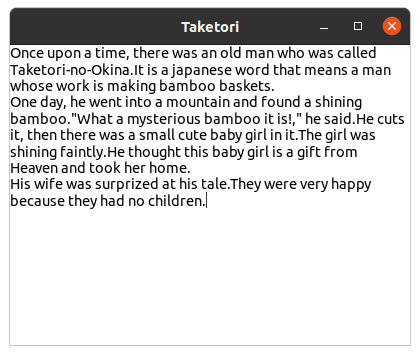

# Widgets (2)

## GtkTextView, GtkTextBuffer and GtkScrolledWindow

### GtkTextView and GtkTextBuffer

GtkTextView is a widget for multi-line text editing.
GtkTextBuffer is a text buffer which is connected to GtkTextView.
See the sample program `tfv1.c` below.

@@@include
tfv/tfv1.c
@@@

Look at line 25.
A GtkTextView instance is created and its pointer is assigned to `tv`.
When the GtkTextView instance is created, a GtkTextBuffer instance is also created and connected to the GtkTextView automatically.
"GtkTextBuffer instance" will be referred to simply as "GtkTextBuffer" or "buffer".
In the next line, the pointer to the buffer is assigned to `tb`.
Then, the text from line 10 to 20 is assigned to the buffer.
If the third argument of `gtk_text_buffer_set_text` is a positive integer, it is the length of the text.
It it is -1, the string terminates with NULL.

GtkTextView has a wrap mode.
When it is set to `GTK_WRAP_WORD_CHAR`, text wraps in between words, or if that is not enough, also between graphemes.

Wrap mode is written in [Gtk\_WrapMode](https://docs.gtk.org/gtk4/enum.WrapMode.html) in the GTK 4 API document.

In line 30, `tv` is added to `win` as a child.

Now compile and run it.

```
$ cd src/tfv
$ comp tfv1
$ ./a.out
```

{width=6.3cm height=5.325cm}

There's an I-beam pointer in the window.
You can add or delete any characters on the GtkTextView,
and your changes are kept in the GtkTextBuffer.
If you add more characters beyond the limit of the window, the height increases and the window extends.
If the height gets bigger than the height of the display screen, you won't be
able to control the size of the window or change it back to the original size.
This is a problem, that is to say a bug.
This can be solved by adding a GtkScrolledWindow between the GtkApplicationWindow and GtkTextView.

### GtkScrolledWindow

What we need to do is:

- Create a GtkScrolledWindow and insert it as a child of the GtkApplicationWindow
- Insert the GtkTextView widget to the GtkScrolledWindow as a child.

Modify `tfv1.c` and save it as `tfv2.c`.
There is only a few difference between these two files.

@@@shell
cd tfv; diff tfv1.c tfv2.c
@@@

The whole code of `tfv2.c` is as follows.

@@@include
tfv/tfv2.c
@@@

Compile and run it.

Now, the window doesn't extend even if you type a lot of characters,
it just scrolls.
