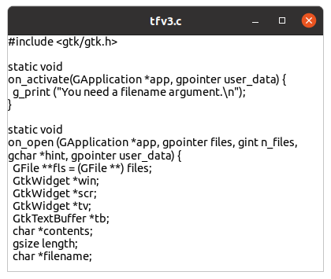

# Widgets (3)

## Open signal

### G\_APPLICATION\_HANDLES\_OPEN flag

We made a very simple editor in the previous section with GtkTextView, GtkTextBuffer and GtkScrolledWindow.
We will add file-reading ability to the program and improve it to a file viewer.

The easiest way to give a filename is to use a command line argument.

    $ ./a.out filename

The program will open the file and insert its contents into the GtkTextBuffer.

To do this, we need to know how GtkApplication (or GApplication) recognizes arguments.
This is described in the [GIO API Reference -- Application](https://docs.gtk.org/gio/class.Application.html).

When GtkApplication is created, a flag (GApplicationFlags) is given as an argument.

~~~C
GtkApplication *
gtk_application_new (const gchar *application_id, GApplicationFlags flags);
~~~

This tutorial explains only two flags, `G_APPLICATION_DEFAULT_FLAGS` and `G_APPLICATION_HANDLES_OPEN`.
(`G_APPLICATION_FLAGS_NONE` was used instead of `G_APPLICATION_DEFAULT_FLAGS` before GIO version2.73.3 (GLib 2.73.3 5/Aug/2022).
Some GTK 4 applications still use `G_APPLICATION_FLAGS_NONE`.
But now it is deprecated and `G_APPLICATION_DEFAULT_FLAGS` is recommended.)
If you want to handle command line arguments, the `G_APPLICATION_HANDLES_COMMAND_LINE` flag is what you need.

For further information, see [GIO API Reference -- ApplicationFlags](https://docs.gtk.org/gio/flags.ApplicationFlags.html) and
[GIO API Reference -- g\_application\_run](https://docs.gtk.org/gio/method.Application.run.html).

We've already used `G_APPLICATION_DEFAULT_FLAGS`, as it is the simplest option, and no command line arguments are allowed.
If you give arguments, an error will occur.

The flag `G_APPLICATION_HANDLES_OPEN` is the second simplest option.
It allows arguments but only files.
The application assumes all the arguments are filenames.

~~~C
app = gtk_application_new ("com.github.ToshioCP.tfv3", G_APPLICATION_HANDLES_OPEN);
~~~

### open signal

When `G_APPLICATION_HANDLES_OPEN` flag is given to the application, two signals are available.

- activate signal --- This signal is emitted when there's no argument.
- open signal --- This signal is emitted when there is at least one argument.

The handler of the "open" signal is defined as follows.

~~~C
void
open (
  GApplication* self,
  gpointer files,
  gint n_files,
  gchar* hint,
  gpointer user_data
)
~~~

The parameters are:

- `self` --- the application instance (usually GtkApplication)
- `files` --- an array of GFiles. [array length=n\_files] [element-type GFile]
- `n_files` --- the number of the elements of `files`
- `hint` --- a hint provided by the calling instance (usually it can be ignored)
- `user_data` --- user data set when the signal handler was connected.

## Making a file viewer

### What is a file viewer?

A file viewer is a program that displays text files.
Our file viewer will work as follows.

- When arguments are given, it recognizes the first argument as a filename and opens it.
- The second argument and after are ignored.
- If there's no argument, it shows an error message and quit.
- If it successfully opens the file, it reads the contents of the file, inserts them to GtkTextBuffer and shows the window.
- If it fails to open the file, it shows an error message and quit.

The program is shown below.

@@@include
tfv/tfv3.c
@@@

Save it as `tfv3.c`.
Then compile and run it.

    $ comp tfv3
    $ ./a.out tfv3.c

{width=6.3cm height=5.325cm}

The function `main` has only two changes from the previous version.

- `G_APPLICATION_DEFAULT_FLAGS` is replaced by `G_APPLICATION_HANDLES_OPEN`
- `g_signal_connect (app, "open", G_CALLBACK (app_open), NULL)` is added.

When the flag `G_APPLICATION_HANDLES_OPEN` is given to `gtk_application_new` function, the application behaves like this:

- If the application is run without command line arguments, it emits "activate" signal when it is activated.
- If the application is run with command line arguments, it emits "open" signal when it is activated.

The handler `app_activate` becomes very simple.
It just outputs the error message and return to the caller.
Then the application quits immediately because no window is created.

The main work is done in the handler `app_open`.

- Creates GtkApplicationWindow, GtkScrolledWindow, GtkTextView and GtkTextBuffer and connects them together
- Sets wrap mode to `GTK_WRAP_WORD_CHAR` in GtktextView
- Sets GtkTextView to non-editable because the program isn't an editor but only a viewer
- Reads the file and inserts the text into GtkTextBuffer (this will be explained later)
- If the file is not opened, outputs an error message and destroys the window. This makes the application quit.

The following is the file reading part of the program again.

~~~C
if (g_file_load_contents (files[0], NULL, &contents, &length, NULL, NULL)) {
  gtk_text_buffer_set_text (tb, contents, length);
  g_free (contents);
  if ((filename = g_file_get_basename (files[0])) != NULL) {
    gtk_window_set_title (GTK_WINDOW (win), filename);
    g_free (filename);
  }
  gtk_widget_show (win);
} else {
  if ((filename = g_file_get_path (files[0])) != NULL) {
    g_printerr ("No such file: %s.\n", filename);
    g_free (filename);
  } else
    g_printerr ("File can't be opened.\n");
  gtk_window_destroy (GTK_WINDOW (win));
}
~~~

The function `g_file_load_contents` loads the file contents into a temporary buffer,
which is automatically allocated and sets `contents` to point the buffer.
The length of the buffer is assigned to `length`.
It returns `TRUE` if the file's contents are successfully loaded or `FALSE` if an error occurs.
If you want to know the details about g\_file\_load\_contents, see [g file load contents](https://docs.gtk.org/gio/method.File.load_contents.html).

If it has successfully read the file, it inserts the contents into GtkTextBuffer,
frees the temporary buffer pointed by `contents`, sets the title of the window,
frees the memories pointed by `filename` and then shows the window.
If it fails, it outputs an error message and destroys the window and finally make the program quit.

## GtkNotebook

GtkNotebook is a container widget that contains multiple widgets with tabs.
It shows only one child at a time.
Another child will be shown when its tab is clicked.

{width=13.2cm height=5.325cm}

The left image is the window at the startup.
The file `pr1.c` is shown and its filename is in the left tab.
After clicking on the right tab, the contents of the file `tfv1.c` is shown.
The right image is the screenshot.

The following is `tfv4.c`.
It has GtkNoteBook widget.
It is inserted as a child of GtkApplicationWindow and contains multiple GtkScrolledWindow.

@@@include
tfv/tfv4.c
@@@

Most of the changes are in the function `app_open`.
The numbers at the left of the following items are line numbers in the source code.

- 11-13: Variables `nb`, `lab` and `nbp` are defined. They point GtkNotebook, GtkLabel and GtkNotebookPage respectively.
- 23: The window's title is set to "file viewer".
- 24: The default size of the window is 600x400.
- 26-27 GtkNotebook is created and inserted to the GtkApplicationWindow as a child.
- 29-58 For-loop. The variable `files[i]` points i-th GFile, which is created by the GtkApplication from the i-th command line argument.
- 31-36 GtkScrollledWindow, GtkTextView are created. GtkTextBuffer is got from the GtkTextView.
The GtkTextView is connected to the GtkScrolledWindow as a child.
- 38-39 inserts the contents of the file into GtkTextBuffer and frees the memory pointed by `contents`.
- 40-42: If the filename is taken from the GFile, GtkLabel is created with the filename. The string `filename` is freed..
- 43-44: If it fails to take the filename, empty string GtkLabel is created.
- 45-46: Appends a GtkScrolledWindow to the GtkNotebook as a child.
And the GtkLabel is set as the child's tab.
At the same time, a GtkNoteBookPage is created automatically.
The function `gtk_notebook_get_page` returns the GtkNotebookPage of the child (GtkScrolledWindow).
- 47: GtkNotebookPage has "tab-expand" property.
If it is set to TRUE then the tab expands horizontally as long as possible.
If it is FALSE, then the width of the tab is determined by the size of the label.
`g_object_set` is a general function to set properties of objects.
See [GObject API Reference -- g\_object\_set](https://docs.gtk.org/gobject/method.Object.set.html).
- 48-50: If it fails to read the file and a filename is taken from the GFile, "No such file" message is displayed. The `filename` is freed.
- 51-52: If `filename` is NULL, the "No valid file is given" message is displayed.
- 54-57: If at least one page exists, the window is shown.
Otherwise, the window is destroyed and the application quits.
