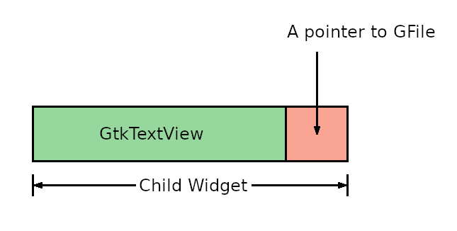

# Defining a final class

## A very simple editor

We made a very simple file viewer in the previous section.
Now we go on to rewrite it and turn it into very simple editor.
Its source file is `tfe1.c` (text file editor 1) under `tfe` directory.

GtkTextView is a multi-line editor.
So, we don't need to write the editor from scratch.
We just add two things to the file viewer:

- Pointers to GFile instances.
- A text-save function.

There are a couple of ways to store the pointers.

- Use global variables
- Make a child class of GtkTextView and its each instance holds a pointer to the GFile instance.

Using global variables is easy to implement.
Define a sufficient size pointer array to GFile.
For example,

~~~C
GFile *f[20];
~~~

The variable `f[i]` corresponds to the file associated with the i-th GtkNotebookPage.

However, There are two problems.
The first is the size of the array.
If a user gives too many arguments (more than 20 in the example above), it is impossible to store all the pointers to the GFile instances.
The second is difficulty to maintain the program.
We have a small program so far.
But, the more you develop the program, the bigger its size grows.
Generally speaking, it is very difficult to maintain global variables in a big program.
When you check the global variable, you need to check all the codes that use the variable.

Making a child class is a good idea in terms of maintenance.
And we prefer it rather than a global variable.

Be careful that we are thinking about "child class", not "child widget".
Child class and child widget are totally different.
Class is a term of GObject system.
If you are not familiar with GObject, see:

- [GObject API reference](https://docs.gtk.org/gobject/)
- [GObject tutorial for beginners](https://toshiocp.github.io/Gobject-tutorial/)

A child class inherits everything from the parent and, in addition, extends its performance.
We will define TfeTextView as a child class of GtkTextView.
It has everything that GtkTextView has and adds a pointer to a GFile.

{width=9.675cm height=4.89cm}

## How to define a child class of GtkTextView

You need to know GObject system convention.
First, look at the program below.

~~~C
#define TFE_TYPE_TEXT_VIEW tfe_text_view_get_type ()
G_DECLARE_FINAL_TYPE (TfeTextView, tfe_text_view, TFE, TEXT_VIEW, GtkTextView)

struct _TfeTextView
{
  GtkTextView parent;
  GFile *file;
};

G_DEFINE_TYPE (TfeTextView, tfe_text_view, GTK_TYPE_TEXT_VIEW);

static void
tfe_text_view_init (TfeTextView *tv) {
}

static void
tfe_text_view_class_init (TfeTextViewClass *class) {
}

void
tfe_text_view_set_file (TfeTextView *tv, GFile *f) {
  tv -> file = f;
}

GFile *
tfe_text_view_get_file (TfeTextView *tv) {
  return tv -> file;
}

GtkWidget *
tfe_text_view_new (void) {
  return GTK_WIDGET (g_object_new (TFE_TYPE_TEXT_VIEW, NULL));
}
~~~

- TfeTextView is divided into two parts.
Tfe and TextView.
Tfe is called prefix or namespace.
TextView is called object.
- There are three differnet identifier patterns.
TfeTextView (camel case), tfe\_text\_view (this is used for functions) and TFE\_TEXT\_VIEW (This is used to cast a object to TfeTextView).
- First, define TFE\_TYPE\_TEXT\_VIEW macro as tfe\_text\_view\_get\_type ().
The name is always (prefix)\_TYPE\_(object) and the letters are upper case.
And the replacement text is always (prefix)\_(object)\_get\_type () and the letters are lower case.
This definition is put before G\_DECLARE\_FINAL\_TYPE macro.
- The arguments of G\_DECLARE\_FINAL\_TYPE macro are the child class name in camel case, lower case with underscore, prefix (upper case), object (upper case with underscore) and parent class name (camel case).
The following two C structure is declared in the expansion of the macro.
  - `typedef struct _TfeTextView TfeTextView`
  - `typedef struct {GtkTextViewClass parent_class; } TfeTextViewClass;`
- These declaration tells us that TfeTextView and TfeTextViewClass are C structures.
"TfeTextView" has two meanings, class name and C structure name.
The C structure TfeTextView is called object.
Similarly, TfeTextViewClass is called class.
- Declare the structure \_TfeTextView.
The underscore is necessary.
The first member is the parent object (C structure).
Notice this is not a pointer but the object itself.
The second member and after are members of the child object.
TfeTextView structure has a pointer to a GFile instance as a member.
- G\_DEFINE\_TYPE macro.
The arguments are the child object name in camel case, lower case with underscore and parent object type (prefix)\_TYPE\_(module).
This macro is mainly used to register the new class to the type system.
Type system is a base system of GObject.
Every class has its own type.
The types of GObject, GtkWidget and TfeTextView are G\_TYPE\_OBJECT, GTK\_TYPE\_WIDGET and TFE\_TYPE\_TEXT\_VIEW respectively.
Such type (for example, TFE\_TYPE\_TEXT\_VIEW) is a macro and it is expanded to a function (tfe\_text\_view\_get\_type()).
It returns a integer which is unique among all GObject system classes.
- Instance init function (tfe\_text\_view\_init) is called when the instance is created.
It is the same as a constructor in other object oriented languages.
- Class init function (tfe\_text\_view\_class\_init) is called when the class is created.
- Two functions tfe\_text\_view\_set\_file and tfe\_text\_view\_get\_file are public functions.
Public functions are open and you can call them anywhere.
They are the same as public method in other object oriented languages.
`tv` is a pointer to the TfeTextView object (C structure).
It has a member `file` and it is pointed by `tv->file`.
- TfeTextView instance creation function is `tfe_text_view_new`.
Its name is (prefix)\_(object)\_new.
It uses g\_object\_new function to create the instance.
The arguments are (prefix)\_TYPE\_(object), a list to initialize properties and NULL.
NULL is the end mark of the property list.
No property is initialized here.
And the return value is casted to GtkWidget.

This program shows the outline how to define a child class.

## Close-request signal

Imagine that you are using this editor.
First, you run the editor with arguments.
The arguments are filenames.
The editor reads the files and shows the window with the text of files in it.
Then you edit the text.
After you finish editing, you exit the editor.
The editor updates files just before the window closes.

GtkWindow emits the "close-request" signal before it closes.
We will connect the signal and the handler `before_close`.
(A handler is a C function which is connected to a signal.)
The function `before_close` is called when the signal "close-request" is emitted.

~~~C
g_signal_connect (win, "close-request", G_CALLBACK (before_close), NULL);
~~~

The argument `win` is a GtkApplicationWindow, in which the signal "close-request" is defined, and `before_close` is the handler.
`G_CALLBACK` cast is necessary for the handler.
The program of `before_close` is as follows.

@@@include
tfe/tfe1.c before_close
@@@

The numbers on the left of items are line numbers in the source code.

- 14: The number of pages of `nb` is assigned to `n`.
- 15-31: For loop with regard to the index to each pages.
- 16-18: `scr`, `tv` and `file` is assigned pointers to the GtkScrolledWindow, TfeTextView and GFile.
The GFile of TfeTextView was stored when `app_open` handler was called. It will be shown later.
- 19-21: `tb` is assigned the GtkTextBuffer of the TfeTextView.
The buffer is accessed with iterators.
Iterators points somewhere in the buffer.
The function `gtk_text_buffer_get_bounds` assigns the start and end of the buffer to `start_iter` and `end_iter` respectively.
Then the function `gtk_text_buffer_get_text` returns the text between `start_iter` and `end_iter`, which is the whole text in the buffer.
- 22-28: The text is saved to the file.
If it fails, error messages are displayed.
- 29: `contents` are freed.
- 30: GFile is useless. `g_object_unref` decreases the reference count of the GFile.
Reference count will be explained in the later section.
The reference count will be zero in this program and the GFile instance will destroy itself.

## Source code of tfe1.c

The following is the whole source code of `tfe1.c`.

@@@include
tfe/tfe1.c
@@@

- 110: The GFile pointer of the TfeTextView is set with `files[i]`, which is a GFile created with the command line argument.
But the GFile will be destroyed by the system later.
So it needs to be copied before the assignment.
`g_file_dup` duplicates the GFile.
- 126: The "close-request" signal is connected to `before_close` handler.
The fourth argument is called "user data" and it will be the second argument of the signal handler.
So, `nb` is given to `before_close` as the second argument.

Now it's time to compile and run.

~~~
$ cd src/tfe
$ comp tfe1
$ ./a.out taketori.txt`.
~~~

Modify the contents and close the window.
Make sure that the file is modified.

Now we got a very simple editor.
It's not smart.
We need more features like open, save, saveas, change font and so on.
We will add them in the next section and after.
