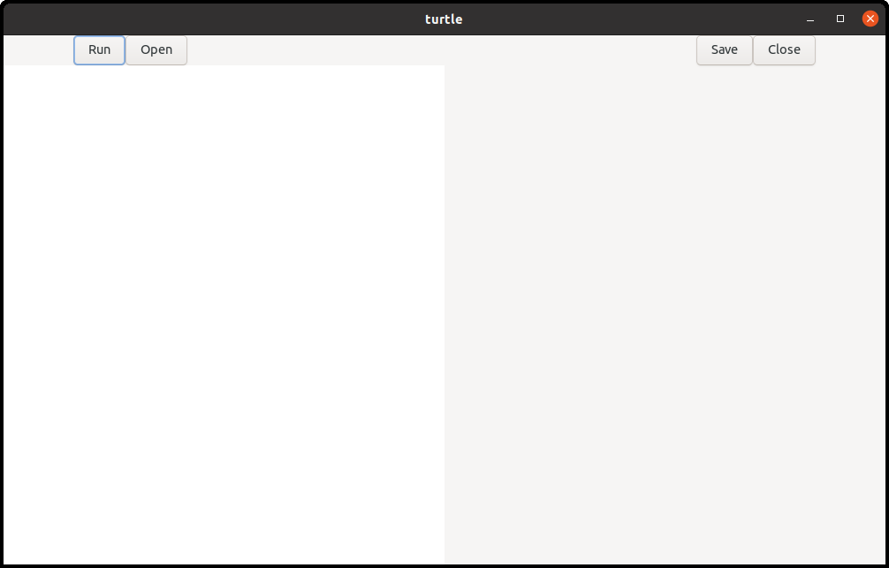
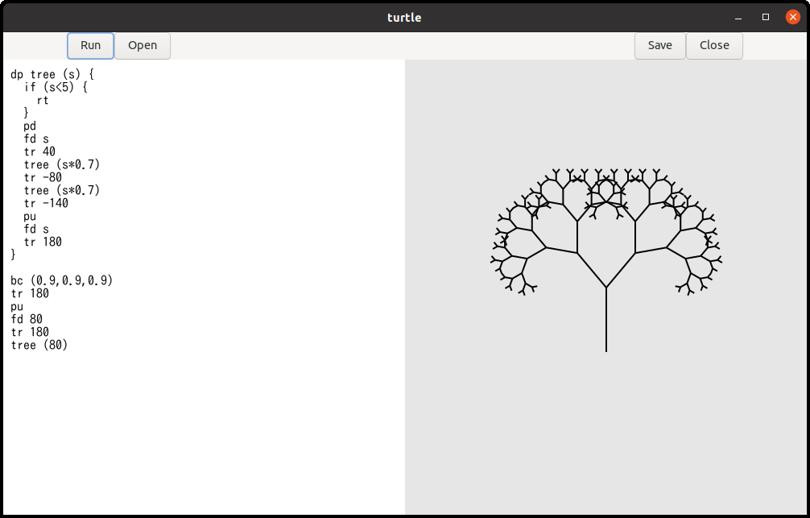
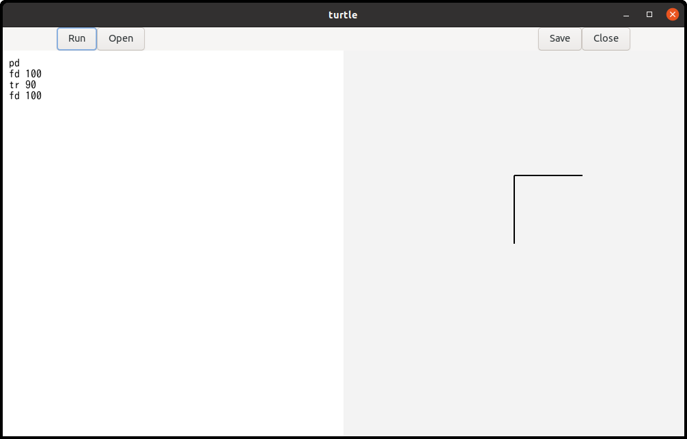
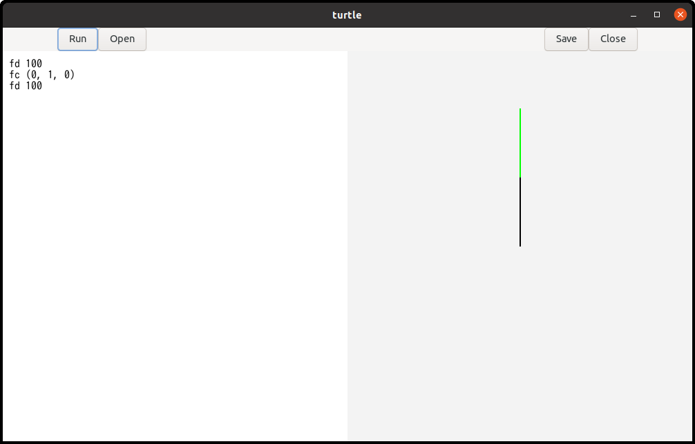
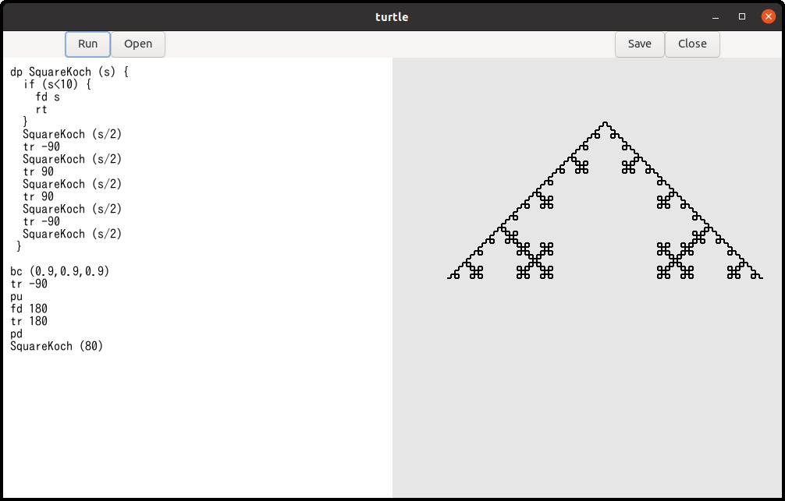

# Turtle's manual

Turtle is a simple interpreter for turtle graphics.

## Prerequisite and compiling

Turtle is written in C language.
You need:

- Linux. Turtle is tested on ubuntu 20.10
- gcc, meson and ninja
- gtk4

It is easy to compile the source file of turtle.
If you have installed gtk4 with an option `--prefix=$HOME/local`, put the same option to meson so that you can install `turtle` under the directory `$HOME/local/bin`.
The instruction is:

~~~
$ meson --prefix=$HOME/local _build
$ ninja -C _build
$ ninja -C _build install
~~~

Type the following command then turtle shows the following window.

~~~
$ turtle
~~~

{width=8cm height=5.11cm}

The left half is a text editor and the right half is a surface.
Surface is like a canvas to draw shapes.

Write turtle language in the text editor and click on `run` button, then the program will be executed and it draws shapes on the surface.

{width=8cm height=5.11cm}

If you add the following line in `turtle.h`, then codes to inform the status will also be compiled.
However, the speed will be quite slow because of the output messages.

~~~
# define debug 1
~~~

## Example

Imagine a turtle.
The turtle has a pen and initially he is at the center of the screen, facing to the north (to the north means up on the screen).
You can let the turtle down the pen or up the pen.
You can order the turtle to move forward.

~~~
pd
fd 100
~~~

- pd: Pen Down. The turtle put the pen down so that the turtle will draw a line if he/she moves.
- fd 100: move ForwarD 100. The turtle goes forward 100 pixels.

If you click on `run` button, then a line segment appears on the screen.
One of the endpoints of the line segment is at the center of the surface and the other is at 100 pixels up from the center.
The point at the center is the start point of the turtle and the other endpoint is the end point of the movement.

If the turtle picks the pen up, then no line segment appears.

~~~
pu
fd 100
~~~

The command `pu` means "Pen Up".

The turtle can change the direction.

~~~
pd
fd 100
tr 90
fd 100
~~~

The command `tr` is "Turn Right".
The argument is angle with degrees.
Therefore, `tr 90` means "Turn right by 90 degrees".
If you click on the `run`button, then two line segments appears.
One is vertical and the other is horizontal.

{width=8cm height=5.11cm}

## Background and foreground color

Colors are specified with RGB.
A vector (r, g, b) denotes RGB color.
Each of the elements is a real number between 0 and 1.

- Red is (1.0, 0.0, 0.0).
You can write (1, 0, 0) instead.
- Green is (0.0, 1.0, 0.0)
- Blue is (0.0, 0.0, 1.0)
- Black is (0.0, 0.0, 0.0)
- White is (1.0, 1.0, 1.0)

You can express a variety of colors by changing each element.

There are two commands to change colors.

- bc: Background Color. `bc (1,0,0)` changes the background color to red.
This command clear the surface and change the background color.
So, the shapes on the surface disappears.
- fc: Foreground Color. `fc (0,1,0)` changes the foreground color to green.
This command changes the pen color.
The prior shapes on the surface aren't affected.
After this command, the turtle draws lines with the new color.

{width=8cm height=5.11cm}

## Other simple commands

- pw: Pen Width. This is the same as pen size or line width.
For example, `pw 5` makes lines thick and `pw 1` makes it thin.
- rs: ReSet. The turtle moves back to the initial position and direction.
In addition, The command initialize the pen, line width (pen size), and foreground color.
The pen is down, the line width is 2 and the foreground color is black.

An order such as `fd 100`, `pd` and so on is a statement.
Statements are executed in the order from the top to the end

## Comment and spaces

Characters between `#` (hash mark) and `\n` (new line) inclusive are comment.
If the comment is at the end of the file, the trailing new line can be left out.
Comments are ignored.

~~~
# draw a triangle
fd 100 # forward 100 pixels<NEW LINE>
tr 120 # turn right by 90 degrees<NEW LINE>
fd 100<NEW LINE>
tr 120<NEW LINE>
fd 100 # Now a triangle appears.<EOF>
~~~

\<NEW LINE\> and \<EOF\> indicate newline code and end of file respectively.
The comments in the line 1, 2, 3 and 6 are correct syntactically.

Spaces (white space, tab and new line) are ignored.
They are used only as delimiters.
Tabs are recognized as eight spaces to calculate the column number.

## Variables and expressions

Variable begins alphabet followed by alphabet or digit.
Key words like `fd`, `tr` can't be variables.
`Distance` and `angle5` are variables, but `1step` isn't a variable because the first character isn't alphabet.
Variable names are case sensitive.
Variables keep real numbers.
Their type is the same as `double` in C language.
Integers are casted to real numbers automatically.
So 1 and 1.0 are the same value.
Numbers begin digits, not signs (`+` or `-`).

- 100, 20.34 and 0.01 are numbers
- +100 isn't a number. It causes syntax error. Use 100 instead.
- -100 isn't a number. But turtle recognizes it unary minus and a number 100.
So turtle calculate it and the result is -100.
- 100 + -20: This is recognized 100 + (- 20).
However, using bracket, 100 + (-20), is better for easy reading.

~~~
distance = 100
fd distance
~~~

A value 100 is assigned to the variable `distance` in the first line.
Assignment is a statement.
Most of statements begin with commands like `fd`.
Assignment is the only exception.

The example above draws a line segment of 100 pixels long.

You can use variables in expressions.
There are 8 kinds of calculations available.

- addition: x + y
- subtraction: x - y
- multiplication: x * y
- division: x / y
- unary minus: - x
- logical equal: x = y. This symbol `=` works as `==` in C language.
- greater than: x > y
- less than: x < y

The last three symbols are mainly used in the condition of if statement.

Variables are registered to a symbol table when it is assigned a value for the first time.
Evaluating a variable before the registration isn't allowed and occurs an error.

## If statement

Turtle language has very simple if statement.

~~~
if (x > 50) {
  fd x
}
~~~

There is no else part.

## Procedures

Procedures are similar to functions in C language.
The difference is that procedures don't have return values.

~~~
dp triangle (side) {
  fd side
  tr 120
  fd side
  tr 120
  fd side
}

triangle (100)
~~~

`dp` (Define Procedure) is a key word followed by procedure name, parameters, and body.
Procedure names start alphabet followed by alphabet or digit.
Parameters are a list of variables.
For example

~~~
dp abc (a) { ... ... }
dp abc (a, b) { ... ... }
dp abc (a, b, c) { ... ... }
~~~

Body is a sequence of statements.
The statements aren't executed when the procedure is defined.
They will be executed when the procedure is called later.

Procedures are called by the name followed by arguments.

~~~
dp proc (a, b, c) { ... ... }

proc (100, 0, -20*3)
~~~

The number of parameters and arguments must be the same.
Arguments can be any expressions.
When you call a procedure, brackets following the procedure name must exist even if the procedure has no argument.

Procedure names and variable names don't conflict.

~~~
dp a () {fd a}
a=100
a ()
~~~

This is a correct program.

- 1: Defines a procedure `a`.
A variable `a` is in its body.
- 2: Assigns 100 to a variable `a`.
- 3: Procedure `a` is called.

However, using the same name to a procedure and variable makes confusing.
You should avoid that.

## Recursive call

Procedures can be called recursively.

~~~
dp repeat (n) {
  n = n - 1
  if (n < 0) {
    rt
  }
  fd 100
  tr 90
  repeat (n)
}

repeat (4)
~~~

Repeat is called in the body of repeat.
The call to itself is a recursive call.
Parameters are created and set each time the procedure is called.
So, parameter `n` is 4 at the first call but it is 3 at the second call.
Each time the procedure is called, the parameter `n` decreases by one.
Finally, it becomes less than zero, then the procedures return.

The program above draws a square.

Turtle doesn't have any primary loop statements.
It should probably be added to the future version.
However, the program above shows that we can program loop with a recursive call.

## Fractal curves

Recursive call can be applied to draw fractal curves.
Fractal curves appear when a procedure is applied to it repeatedly.
The procedure replaces a part of the curve with the contracted curve.

{width=8cm height=5.11cm}

This shape is called tree.
The basic pattern of this shape is a line segment.
It is the first stage.
The second stage adds two shorter line segments at the endpoint of the original segment.
The new segment has 70 percent length to the original segment and the orientation is +30 or -30 degrees different.
The third stage adds two shorter line segments to the second stage line segments.
And repeats it several times.

This repeating is programmed by recursive call.
Two more examples are shown here.
They are Koch curve and Square Koch curve.

{width=8cm height=5.11cm}

{width=8cm height=5.11cm}

## Tokens and punctuations

The following is the list of tokens.

Keywords:

- pu: pen up
- pd: pen down
- pw: pen width = line width
- fd: forward
- tr: turn right
- bc: background color
- fc: foreground color
- if: if statement
- rt: return
- rs: reset
- dp: define procedure

identifiers and numbers:

- identifier: This is used for the name of variables, parameters and procedures.
It is expressed ` [a-zA-Z][a-zA-Z0-9]*` in regular expression.
- number: This is expressed `(0|[1-9][0-9]*)(\.[0-9]+)?` in regular expression.
It doesn't have `+` or `-` sign because they bring some syntactic confusion.
However negative number such as `-10` can be recognized as unary minus and a number.

Symbols for expression

- `=`
- `>`
- `<`
- `+`
- `-`
- `*`
- `/`
- `(`
- `)`

Delimiters

- `(`
- `)`
- `{`
- `}`
- `,`

Comments and spaces:

- comment: This is characters between `#` and new line inclusive.
If a comment is at the end of the file, the trailing new line can be left out.
- white space:
- horizontal tab: tab is recognized as eight spaces.
- new line: This is the end of a line.

These characters are used to separate tokens explicitly.
They doesn't have any syntactic meaning and are ignored by the parser.

## Grammar

~~~
program:
  statement
| program statement
;

statement:
  primary_procedure
| procedure_definition
;

primary_procedure:
  PU
| PD
| PW expression
| FD expression
| TR expression
| BC '(' expression ',' expression ',' expression ')'
| FC '(' expression ',' expression ',' expression ')'
| ID '=' expression
| IF '(' expression ')' '{' primary_procedure_list '}'
| RT
| RS
| ID '(' ')'
| ID '(' argument_list ')'
;

procedure_definition:
  DP ID '('  ')' '{' primary_procedure_list '}'
| DP ID '(' parameter_list ')' '{' primary_procedure_list '}'
;

parameter_list:
  ID
| parameter_list ',' ID
;

argument_list:
  expression
| argument_list ',' expression
;

primary_procedure_list:
  primary_procedure
| primary_procedure_list primary_procedure
;

expression:
  expression '=' expression
| expression '>' expression
| expression '<' expression
| expression '+' expression
| expression '-' expression
| expression '*' expression
| expression '/' expression
| '-' expression %prec UMINUS
| '(' expression ')'
| ID
| NUM
;
~~~
